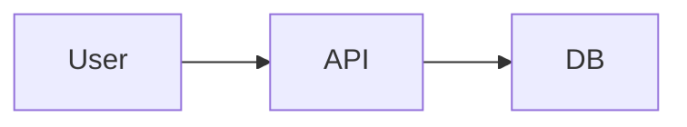

# Doxiq Docs

Internal documentation site for the [Doxiq](https://github.com/llamitai/doxiq) platform. Built with **Astro 5**, **React 19**, **TypeScript 5**, and **Tailwind CSS v4**.

The site is statically generated from Markdown / MDX content and renders **Mermaid** diagrams client-side. Authentication delegates to the existing **FastAPI backend** — no separate user store.

## Stack

- [Astro 5](https://astro.build/) — static site + islands
- [React 19](https://react.dev/) — interactive components (topbar, sidebar, mermaid)
- [TypeScript 5.7](https://www.typescriptlang.org/) — strict mode
- [Tailwind CSS v4](https://tailwindcss.com/) — `@theme inline` design tokens
- [Mermaid 11](https://mermaid.js.org/) — flowcharts, sequence, ER diagrams
- [Figtree + Geist Mono](https://fonts.google.com/specimen/Figtree) — typography

## Project structure

```
docs/
  src/
    components/
      auth/         LoginForm (React)
      layout/       Topbar, Sidebar, TableOfContents (React)
      mermaid/      Mermaid (React island)
    content/        Content collections
      docs/         Architecture & reference
      guides/       Tutorials & recipes
      api/          API endpoints
    layouts/        AuthLayout, DocsLayout
    lib/
      auth/
        server.ts   Server-side auth (uses FastAPI /auth/login)
        client.ts   Client-side fetch helpers
    pages/          File-based routes
      api/auth/     BFF: login, logout, session
      docs/         /docs/[...slug]
      guides/       /guides/[...slug]
      api/          /api/[...slug]
      index.astro   Home (after login)
      login.astro   Sign in
    middleware.ts   Auth guard for all non-public routes
    styles/
      globals.css   Tailwind v4 + design tokens
  public/           Static assets
  Dockerfile        Production image (static, served with `serve`)
  Dockerfile.dev    Dev image (live reload)
  docker-compose.yml
  docker-compose.dev.yml
  astro.config.mjs
  tsconfig.json
  package.json
```

## Develop

```bash
# 1. Install dependencies
pnpm install

# 2. Make sure the FastAPI backend is running on :8200
#    (otherwise login will fail)

# 3. Start the dev server
pnpm dev
```

The dev server runs on http://localhost:4321. Auth BFF routes (`/api/auth/*`) run inside Astro and talk to the FastAPI backend server-side via `BACKEND_API_HOST` (default `http://localhost:8200`).

## Build

```bash
pnpm build
```

Output goes to `dist/`. The site is **fully static** — authentication state is verified at build-time for routes that read `Astro.locals.session`, but since the middleware runs at request-time (in the Node server we use for the BFF), the production build is meant to be served from a Node/edge runtime that can execute middleware.

## Docker

### Production

```bash
docker compose up -d docs
```

The image is multi-stage: deps → build (Astro build) → runtime (static `serve`).

### Development (live reload)

```bash
docker compose -f docker-compose.dev.yml up
```

## Content collections

Three collections are defined in `src/content/config.ts`:

- **`docs`** — reference docs (architecture, modules, ops).
- **`guides`** — step-by-step tutorials (use case, SSE endpoint, BFF route).
- **`api`** — endpoint references (auto-tagged with method + version).

Add a new page by creating a new `.md` / `.mdx` file in the matching folder. The route is auto-generated.

### Mermaid

Inside any Markdown file, write a fenced code block with `mermaid`:

````md

````

The diagram is rendered client-side by a React island (`src/components/mermaid/Mermaid.tsx`).

### SVG

Drop an `.svg` file into `public/diagrams/` and reference it:

```md

```

## Authentication

This site is **not** publicly accessible. Every request goes through `src/middleware.ts`, which:

1. Reads the `doxiq_docs_session` HttpOnly cookie.
2. If present, calls `GET /v1/auth/session` on the FastAPI backend to validate it.
3. If absent or invalid, tries to refresh using the `doxiq_docs_refresh` cookie.
4. If refresh fails, redirects to `/login/?redirect=<original-path>` (or returns 401 for `/api/*`).

The login form posts to the **BFF route** at `/api/auth/login`, which calls the FastAPI `/v1/auth/login` endpoint and sets HttpOnly cookies. The browser never talks to the backend directly.

### Environment variables

| Var | Default | Notes |
|---|---|---|
| `BACKEND_API_HOST` | `http://localhost:8200` | Where the FastAPI API lives. **Server-side only** — never `NEXT_PUBLIC_*`. |
| `PUBLIC_SITE_URL` | `http://localhost:4321` | Public URL of this site. |

## Deployment

The image is meant to be deployed as a **standalone service**. It can run anywhere that can:

- Run a Node 22 container.
- Reach the FastAPI backend over the network.
- Issue/forward cookies (set `COOKIE_SECURE=1` and put it behind HTTPS).

The docs site does **not** need its own database, user store, or session backend. It piggybacks on the existing `auth` module of the FastAPI backend.
