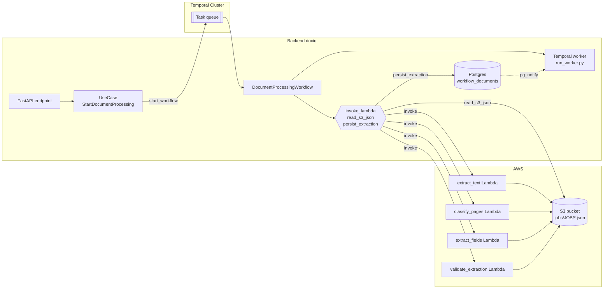

# DocumentProcessingWorkflow

Orquestador Temporal que corre el pipeline de extracción documental end-to-end: OCR → clasificación → extracción de campos → validación → persistencia. Delega el trabajo pesado a Lambdas de `vnext-tools` y guarda los artefactos intermedios en S3; el workflow solo coordina.

## 1. Ubicación en el código

| Pieza | Ruta |
|-------|------|
| Workflow | `backend/src/workflows/presentation/workflows/document_processing.py` |
| Activities | `backend/src/workflows/presentation/workflows/activities/{invoke_lambda,read_s3_json,persist_extraction}.py` |
| Worker entry point | `backend/run_worker.py` |
| Entidades (Pydantic) | `backend/src/common/domain/entities/workflows/document_processing.py` |
| Constantes (Lambda names, task queue) | `backend/src/workflows/domain/constants.py` |
| Use cases que lo disparan | `backend/src/workflows/application/use_cases/{start_document_processing,extract_file_into_case_documents,start_case_document_extraction}.py` |

## 2. Cómo se dispara

Tres use cases del backend arrancan el workflow:

- **`StartDocumentProcessing`** — ejecuta el pipeline sobre un `object_key` de S3 y devuelve el `workflow_id` (endpoint `POST /v1/workflow-documents/{id}/processing`).
- **`ExtractFileIntoCaseDocuments`** — flujo bulk: sube un archivo al caso, corre el workflow con un `job_id` determinista (`CASE#<caseId>_FILE#<fileId>`) y materializa **un `WorkflowDocument` por documento clasificado** dentro del PDF.
- **`StartCaseDocumentExtraction`** — re-extracción de un `WorkflowDocument` ya creado (solo documento SINGLE; BULK tumba siblings y reusa el flujo bulk).

Input del workflow (`DocumentProcessingInput`):

```python
object_key: str                              # "s3://assets/..." — PDF a procesar
extractor: str                               # "documentai" hoy
document_types: list[dict]                   # doctypes permitidos (con fields JSON Schema + validation_rules)
job_id: str | None                           # si se omite → UUID hex generado en el workflow
persist_target_document_id: str | None       # si se setea, persiste documents[0] sobre esta fila
persist_target_tenant_id: str | None
```

## 3. Diagrama de flujo

```mermaid
flowchart TD
    Start([Workflow start]) --> ExtractText[Activity: invoke_lambda<br/>→ extract_text Lambda]
    ExtractText --> S3_1[(S3: jobs/JOB/extract_text.json<br/>OCR layouts.pages[])]
    ExtractText --> CP1{checkpoint}
    CP1 -->|cancel signal| Raise1([raise ApplicationError])
    CP1 --> ClassifyPages[Activity: invoke_lambda<br/>→ classify_pages Lambda]
    ClassifyPages --> S3_2[(S3: jobs/JOB/classify_pages.json<br/>documents[] con pages OCR asignadas)]
    ClassifyPages --> CP2{checkpoint}
    CP2 -->|cancel signal| Raise2([raise ApplicationError])
    CP2 --> Loop{{for each classified document}}
    Loop --> ExtractFields[Activity: invoke_lambda<br/>→ extract_fields Lambda]
    ExtractFields --> S3_3[(S3: jobs/JOB/extract_fields.json<br/>output + mapped_output)]
    ExtractFields --> CP3{checkpoint}
    CP3 --> ValidateExtraction[Activity: invoke_lambda<br/>→ validate_extraction Lambda]
    ValidateExtraction --> S3_4[(S3: jobs/JOB/validate_extraction.json<br/>validation_results[])]
    ValidateExtraction --> CP4{checkpoint}
    CP4 --> ReadS3[Activity: read_s3_json]
    ReadS3 --> Build[Build DocumentResult]
    Build --> Loop
    Loop -->|todos procesados| Persist{persist_target_*?}
    Persist -->|sí| PersistAct[Activity: persist_extraction<br/>→ UPDATE workflow_documents<br/>+ pg_notify]
    Persist -->|no| Done
    PersistAct --> Done([DocumentProcessingOutput])
```

> Los signals `pause` y `resume` actúan sobre cada `checkpoint`: bloquean hasta que la ejecución se reanude (ver §7).

## 4. Pasos del pipeline

### 4.1 `extract_text` (OCR)
- **Lambda**: `vnext-tools-extract_text-<stage>`.
- **Input**: `{object_key, extractor, job_id, inline_response: false}`.
- **Qué hace**: corre OCR (DocumentAI hoy) sobre el PDF y genera la estructura `layouts.pages[]` con `page_number`, `text`, `width`, `height`, y bloques OCR (`line`/`token` con polígonos de 4 puntos normalizados, `confidence`, `text_segments`).
- **Output del invoke**: `{status, metadata, source: "s3://…/extract_text.json"}`.
- **Timeout**: 5 minutos.
- **Label Temporal**: `extract_text`.

### 4.2 `classify_pages` (clasificación por documento)
- **Lambda**: `vnext-tools-classify_pages-<stage>`.
- **Input**: `{source: <extract_text source>, document_types, job_id, inline_response: false}`.
- **Qué hace**: agrupa las páginas del PDF en **documentos** usando un LLM con los `document_types` permitidos; cada doc recibe un `document_type` y una sub-lista de `pages[]` (preservando `page_number` del PDF original y todos los bloques OCR).
- **Output del invoke**: `{status, metadata: {total, job_id}, source: "s3://…/classify_pages.json"}`.
- **Timeout**: 3 minutos.
- **Label Temporal**: `classify_pages`.
- **Uso del output**: el workflow lee `metadata.total` para saber cuántos documentos iterar.

### 4.3 `extract_fields` (por documento, loop)

> ⚠️ Hoy el workflow itera `for doc_index in range(total_documents)` y llama la Lambda una vez por documento. La Lambda ya soporta batch; el refactor para usar batch está en `product/plans/extraction/enriched_extraction.md`. Esta doc refleja el estado **actual** en producción.

- **Lambda**: `vnext-tools-extract_fields-<stage>`.
- **Input**: `{source: <classify_pages source>, document_index, job_id, inline_response: false}`.
- **Qué hace**: invoca el LLM para extraer valores conforme al JSON Schema del `document_type`. Devuelve `output` (dict plano `{campo: valor}`) y `mapped_output` (mismo árbol con hojas `{value, source_text, page_number, bbox, inferred}` incluyendo el bbox ya resuelto contra los tokens OCR).
- **Output del invoke**: `{status, metadata, source: "s3://…/extract_fields.json"}`.
- **Timeout**: 3 minutos.
- **Label Temporal**: `extract_fields#<doc_index>`.

### 4.4 `validate_extraction` (por documento, loop)
- **Lambda**: `vnext-tools-validate_extraction-<stage>`.
- **Input**: `{source: <extract_fields source>, job_id, inline_response: false}`.
- **Qué hace**: corre las `validation_rules` del `document_type` sobre el `output` extraído. Cada regla tiene un prompt con placeholders `{{field}}` que el LLM evalúa; devuelve `validation_results[]` con `{rule_id, field, status, severity, value_analyzed, reason}`.
- **Output del invoke**: `{status, metadata, source: "s3://…/validate_extraction.json"}`.
- **Timeout**: 5 minutos.
- **Label Temporal**: `validate_extraction#<doc_index>`.

### 4.5 Lectura del artefacto y construcción del `DocumentResult`
El workflow llama `read_s3_json` sobre el `source` de `validate_extraction` y arma:

```python
DocumentResult(
    document_index=doc_index,
    document_type=validation_data["document_type"],
    extraction=validation_data.get("extracted_values") or validation_data.get("extraction") or {},
    validation=validation_data.get("validation_results") or validation_data.get("validation") or [],
)
```

Los fallback `or` son shims históricos (pre-refactor); el contrato actual entrega `output` directo.

### 4.6 `persist_extraction` (opcional)
Si el input trae `persist_target_document_id` y `persist_target_tenant_id`, persiste **solo `documents[0]`** sobre la fila `workflow_documents` apuntada. Pasos:

1. Abre sesión SQL async.
2. `SQLDocumentRepository.find_by_id(document_id, tenant_id)` → si no existe devuelve `{"persisted": false, "reason": "document_not_found"}` (no raises).
3. Setea `document.extraction`, `document.validation`, `document.status = WorkflowDocumentStatus.EXTRACTED`.
4. `repo.update(document)`.
5. `pg_notify('workflow_events', <payload>)` con `{type: "document.extraction.completed", caseId, documentId, status}`.
6. `session.commit()` y devuelve `{"persisted": true, "documentId": <uuid>}`.

- **Timeout**: 30 segundos.
- **Label Temporal**: `persist_extraction`.

## 5. Activities

| Activity | Archivo | Responsabilidad |
|----------|---------|-----------------|
| `invoke_lambda` | `activities/invoke_lambda.py` | Llama a una Lambda por nombre (boto3 `lambda.invoke`, `RequestResponse`), traduce `FunctionError` a `ApplicationError(non_retryable=False)` y `body.status == "error"` a `ApplicationError` con `non_retryable=error_code in NON_RETRYABLE_CODES`. Devuelve `body["data"]` si existe, si no el body completo. |
| `read_s3_json` | `activities/read_s3_json.py` | Parsea `s3://bucket/key`, baja el objeto con boto3 S3, decodifica JSON. |
| `persist_extraction` | `activities/persist_extraction.py` | Ver §4.6. |

Todas se registran en `run_worker.py` con un `ThreadPoolExecutor(5)` como `activity_executor`.

## 6. Dónde se guardan los resultados

### 6.1 S3 (intermedios por job)
Bucket: `vnext-assets-<stage>` (por `domain.constants.ASSETS_BUCKET` de `vnext-tools`). Todas las Lambdas siguen el patrón `s3://<bucket>/jobs/<job_id>/<step>.json`:

| Archivo | Contenido |
|---------|-----------|
| `jobs/<job>/extract_text.json` | OCR: `{layouts: {pages: [...]}}` |
| `jobs/<job>/classify_pages.json` | Clasificación: `{documents: [{document_type, pages[]}, ...]}` (solo el objeto `classification`, sin wrapper) |
| `jobs/<job>/extract_fields.json` | Lista de extracciones: `[{document_type, output, mapped_output, document_index}, ...]` (solo la lista, sin wrapper) |
| `jobs/<job>/validate_extraction.json` | Lista de validaciones: `[{document_type, output, document_index, validation_results[]}, ...]` |

> **Nota**: `persist_result` en `vnext-tools/src/infrastructure/services/s3_job_result_store.py` escribe únicamente el **content** (lista o sub-objeto), no el wrapper `{status, errors, metadata}`. Esos siguen en la respuesta directa de la Lambda.

### 6.2 Base de datos (`workflow_documents`)
Modelo: `backend/src/common/database/models/workspace_document.py` (nombre de archivo heredado; la tabla es `workflow_documents`).

| Columna | Tipo | Origen |
|---------|------|--------|
| `extraction` | JSONB (`{}`) | `output` (dict plano de la Lambda) |
| `validation` | JSONB (`[]`) | `validation_results[]` |
| `status` | String | `WorkflowDocumentStatus.EXTRACTED` |
| `extracted_text` | Text | (no se setea hoy por el workflow; reservado para OCR concatenado) |
| `ocr_provider_used` | String | (no se setea hoy) |
| `confidence` | Numeric(4,3) | (no se setea hoy) |

> Hay un refactor en `product/plans/extraction/enriched_extraction.md` que añade `mapped_extraction JSONB` y `extraction_pages INT[]` como columnas nuevas.

### 6.3 Notificaciones (pg_notify)
Canal: `workflow_events` (constante `CHANNEL` en `src/common/infrastructure/notifications/pg_notifier.py`).

Payload emitido tras `persist_extraction`:
```json
{
  "type": "document.extraction.completed",
  "caseId": "<uuid>",
  "documentId": "<uuid>",
  "status": "EXTRACTED"
}
```
Un listener de Postgres (fuera del workflow) traduce esto a eventos de dominio / websocket.

### 6.4 Output del workflow
Devuelto al caller (`DocumentProcessingOutput`):
```python
{
  "job_id": "<uuid hex o el recibido>",
  "documents": [
    DocumentResult(document_index, document_type, extraction, validation),
    ...
  ]
}
```

## 7. Signals del workflow

Declarados en `DocumentProcessingWorkflow`:

| Signal | Efecto |
|--------|--------|
| `cancel()` | Setea `_cancel_requested = True`. En el siguiente `_checkpoint()` (entre pasos) raises `ApplicationError("Workflow cancelled by signal", non_retryable=True)`. |
| `pause()` | Setea `_paused = True`. El siguiente `_checkpoint()` bloquea con `workflow.wait_condition(lambda: not self._paused)`. |
| `resume()` | Setea `_paused = False`, desbloquea el `wait_condition`. |

`_checkpoint()` se invoca después de cada paso del pipeline (tras extract_text, classify_pages, y cada extract_fields / validate_extraction dentro del loop).

## 8. Política de reintentos y errores

### 8.1 Retry policy default
Aplicada a todas las activities:
```python
RetryPolicy(
  initial_interval=timedelta(seconds=2),
  backoff_coefficient=2.0,
  maximum_interval=timedelta(minutes=5),
  maximum_attempts=2,
)
```
→ máximo **2 intentos** por activity (uno inicial + uno de reintento).

### 8.2 Cómo se traducen errores de las Lambdas
En `invoke_lambda` activity:
1. Si la invocación devuelve `FunctionError` (timeout, exception no atrapada en la Lambda) → `ApplicationError(non_retryable=False)` → Temporal reintenta según retry policy.
2. Si el body tiene `{status: "error", error_code, message}` → `ApplicationError(message, error_code, non_retryable=error_code in NON_RETRYABLE_CODES)`.
3. `NON_RETRYABLE_CODES` = `{"document_type.not_found"}` hoy.

### 8.3 Fallos de pipeline
- Si cualquier activity agota reintentos → el workflow falla. No hay cleanup automático.
- Si `persist_extraction` no encuentra el `document_id` → no raises, devuelve `{persisted: False, reason: "document_not_found"}` y el workflow completa OK. El caller (bulk use case) detecta esto por el `WorkflowDocument` que nunca cambió de estado.

## 9. Configuración y constantes

| Constante | Valor | Fuente |
|-----------|-------|--------|
| `TEMPORAL_HOST` | `settings.TEMPORAL_HOST` | env |
| `TASK_QUEUE` | `settings.TEMPORAL_TASK_QUEUE` | env |
| `STAGE` | `dev` / `staging` / `prod` | `settings.STAGE` |
| `LAMBDA_PREFIX` | `vnext-tools` | hardcoded |
| `EXTRACT_TEXT_FUNCTION_NAME` | `vnext-tools-extract_text-<stage>` | derived |
| `CLASSIFY_PAGES_FUNCTION_NAME` | `vnext-tools-classify_pages-<stage>` | derived |
| `EXTRACT_FIELDS_FUNCTION_NAME` | `vnext-tools-extract_fields-<stage>` | derived |
| `VALIDATE_EXTRACTION_FUNCTION_NAME` | `vnext-tools-validate_extraction-<stage>` | derived |
| `ASSETS_BUCKET` | `vnext-assets-<stage>` | derived |
| `NON_RETRYABLE_CODES` | `{"document_type.not_found"}` | hardcoded |
| `EXTRACTOR` | `"documentai"` | hardcoded |

El worker corre con `activity_executor=ThreadPoolExecutor(5)`. El data converter es `pydantic_data_converter` (serializa/deserializa modelos Pydantic sin pydantic-adapter custom).

## 10. Arrancar el worker en local

```bash
just dev-backend                # sube Postgres + API + Temporal
# en otra terminal:
python -m backend.run_worker    # o `just temporal-worker` si existe el target
```

El worker conecta a `settings.TEMPORAL_HOST`, registra el workflow + las 3 activities, y bloquea en `asyncio.Future()` esperando tareas.

## 11. Diagrama de componentes



## 12. Referencias

- Contrato detallado de `extract_fields` (shape del `mapped_output`, algoritmo de bbox): `product/specs/extraction/extract_fields_v2.md`.
- Plan de refactor del workflow a modo batch + overlays de bbox: `product/plans/extraction/enriched_extraction.md`.
- Documentación del pipeline paso a paso (spec histórico): `product/plans/processing-jobs/temporal_lambda_processing.md`.
