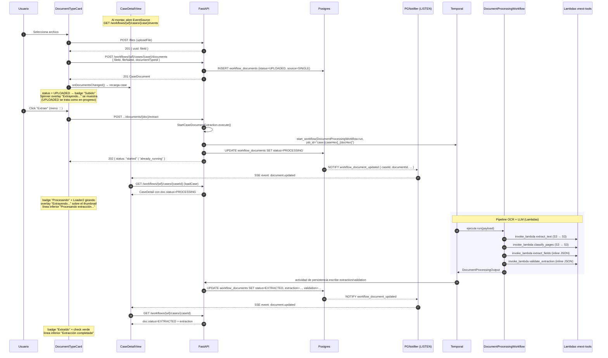
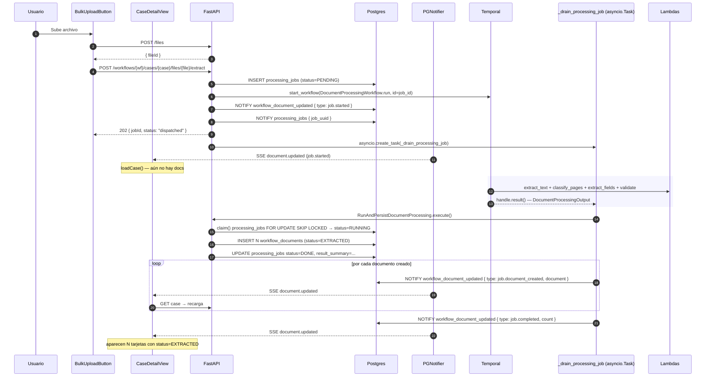
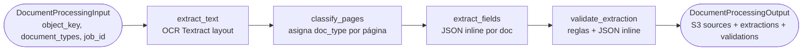

# Procesamiento de documentos en un Case

Este documento describe cómo, desde el detalle de un Case
(`/workflows/{workflowId}/cases/{caseId}`), un documento se sube, se extrae con
el workflow de Temporal, y cómo cada paso se ve reflejado en la UI.

## Componentes involucrados

| Capa | Pieza | Archivo |
|---|---|---|
| UI | Vista de detalle del case | `frontend/src/presentation/workflows/cases/case-detail-view.tsx` |
| UI | Tarjeta por document type | `frontend/src/presentation/workflows/cases/document-type.tsx` |
| UI | Cliente SSE | `frontend/src/infrastructure/http/sse.ts` |
| UI | Repo HTTP del case | `frontend/src/infrastructure/repositories/http-case.ts` |
| API | Crear/leer case documents | `backend/src/extraction/presentation/endpoints/document_endpoints.py` |
| API | Lanzar extracción single | `backend/src/workflows/application/use_cases/start_case_document_extraction.py` |
| API | SSE por case | `backend/src/workflows/presentation/endpoints/case_events_endpoint.py` |
| API | SSE por job (bulk) | `backend/src/workflows/presentation/endpoints/case_file_extract_endpoints.py` |
| Workflow | Temporal workflow | `backend/src/workflows/presentation/workflows/document_processing.py` |
| Notif | pg_notify fan-out | `backend/src/common/infrastructure/notifications/pg_notifier.py` |

## Estados de un `CaseDocument`

```
EMPTY ──┐
        │ (POST /workflows/{wf}/cases/{case}/documents)
        ▼
    UPLOADED ──┐
               │ (POST .../documents/{doc}/extract → Temporal)
               ▼
           PROCESSING ──┐
                        │ extract_text → classify_pages → extract_fields → validate_extraction
                        ▼
                    EXTRACTED          (camino feliz)
                        │
                        └──► ERROR     (cualquier actividad falla con non_retryable o agota retries)
```

Definidos en:
- Frontend: `frontend/src/domain/entities/case.ts` (`CaseDocumentStatus`).
- Backend: `WorkflowDocumentStatus` (mismo set).

## Flujo single-document (UI: tarjeta en `DocumentsTab`)

Este es el flujo que se dispara cuando el usuario arrastra/selecciona un archivo
sobre la zona de upload de un `DocumentTypeCard`.



### Notas del transporte SSE

- El endpoint `stream_case_events` se suscribe a la cola del `PGNotifier` con
  `case_id` como key y reenvía cada mensaje al cliente como
  `event: document.updated` (envoltorio único, sin importar el `type` interno
  del payload). Heartbeats `:ping` cada 20s para evitar que proxies cierren la
  conexión.
- En `case-detail-view.tsx`, `subscribeSSE` reabre la conexión con backoff
  exponencial si se cae. Cada evento `document.updated` o `job.document_created`
  dispara `loadCase()`, que recarga el case completo (no se intenta hacer merge
  parcial del payload — es la fuente de verdad).
- La tarjeta deriva su feedback visual de `document.status` (sin polling). El
  estado local `extractionStatus`/`extractionMessage` solo se usa cuando el
  usuario dispara la extracción desde el menú ⋮, para mensajes inmediatos
  ("Iniciando extracción...") antes de que llegue el primer evento SSE.

## Flujo bulk (UI: `BulkUploadButton` → un archivo, N documentos)

Cuando el usuario sube un PDF combinado y se quiere clasificar/dividir en N
case documents, se usa el endpoint de bulk. La extracción se dispara
automáticamente; no hay paso manual de "Extraer".



`_drain_processing_job` corre como `asyncio.Task` en el mismo proceso del API
que recibió el POST. Si ese proceso muere antes de que el workflow termine, el
canal `processing_jobs` (`pg_notify`) sirve para que cualquier otra réplica del
API tome el job pendiente (`SELECT … FOR UPDATE SKIP LOCKED` garantiza que
solo una gana). Ver `backend/src/workflows/domain/constants.py`.

### Estados de un `processing_jobs`

```
PENDING ──► RUNNING ──► DONE
                   └──► FAILED
```

Definidos en `backend/src/workflows/domain/enums/processing_job_status.py`.

## Mapping a la UI

`document-type.tsx` deriva un `feedbackKind` unificado a partir del
estado del documento + el estado local de la extracción manual:

| Estado del doc | `feedbackKind` | Visual |
|---|---|---|
| `EMPTY` | `null` | Zona de upload (drop zone) con icono Upload |
| `UPLOADED` | `processing` | Badge "Subido", overlay spinner, "Procesando extracción..." |
| `PROCESSING` | `processing` | Badge "Procesando" con `Loader2` girando, overlay spinner, "Procesando extracción..." |
| `EXTRACTED` | `completed` | Badge "Extraído" con check, línea verde "Extracción completada" |
| `ERROR` | `failed` | Badge "Error", línea destructiva "Error en la extracción" |

`UPLOADED` se trata como en-progreso para cubrir la ventana entre que el row se
crea y la actividad de persistencia mueve a `PROCESSING`/`EXTRACTED`. Esto
evita un parpadeo donde el usuario ve "Subido" sin feedback de actividad.

## Detalles del Temporal workflow

`DocumentProcessingWorkflow.run` (`presentation/workflows/document_processing.py`)
ejecuta cuatro lambdas vnext-tools en serie a través de la actividad
`invoke_lambda`. Entre cada paso se llama `_checkpoint()` que respeta señales
`pause`/`resume`/`cancel`.



Retry policy: 2 intentos, backoff exponencial, máx 5 min entre reintentos. La
persistencia (write a `workflow_documents`) está fuera del workflow para
mantener Temporal puro/determinista — la maneja `RunAndPersistDocumentProcessing`
en el path bulk, y una capa equivalente disparada por la finalización del
workflow en el path single.

## Endpoints relevantes

| Método | Path | Para |
|---|---|---|
| POST | `/workflows/{wf}/cases/{case}/documents` | Crear case document (status=UPLOADED) |
| POST | `/workflows/{wf}/cases/{case}/documents/{doc}/extract` | Lanzar extracción single |
| GET  | `/workflows/{wf}/cases/{case}/documents/{doc}/extract/status` | Polling fallback |
| POST | `/workflows/{wf}/cases/{case}/files/{file}/extract` | Bulk: 1 archivo → N docs |
| GET  | `/workflows/{wf}/cases/{case}/events` | SSE de updates por case |
| GET  | `/workflows/{wf}/cases/{case}/jobs/{job}/events` | SSE de progreso de un job bulk |

Registrados en `backend/src/workflows/presentation/router.py`.
