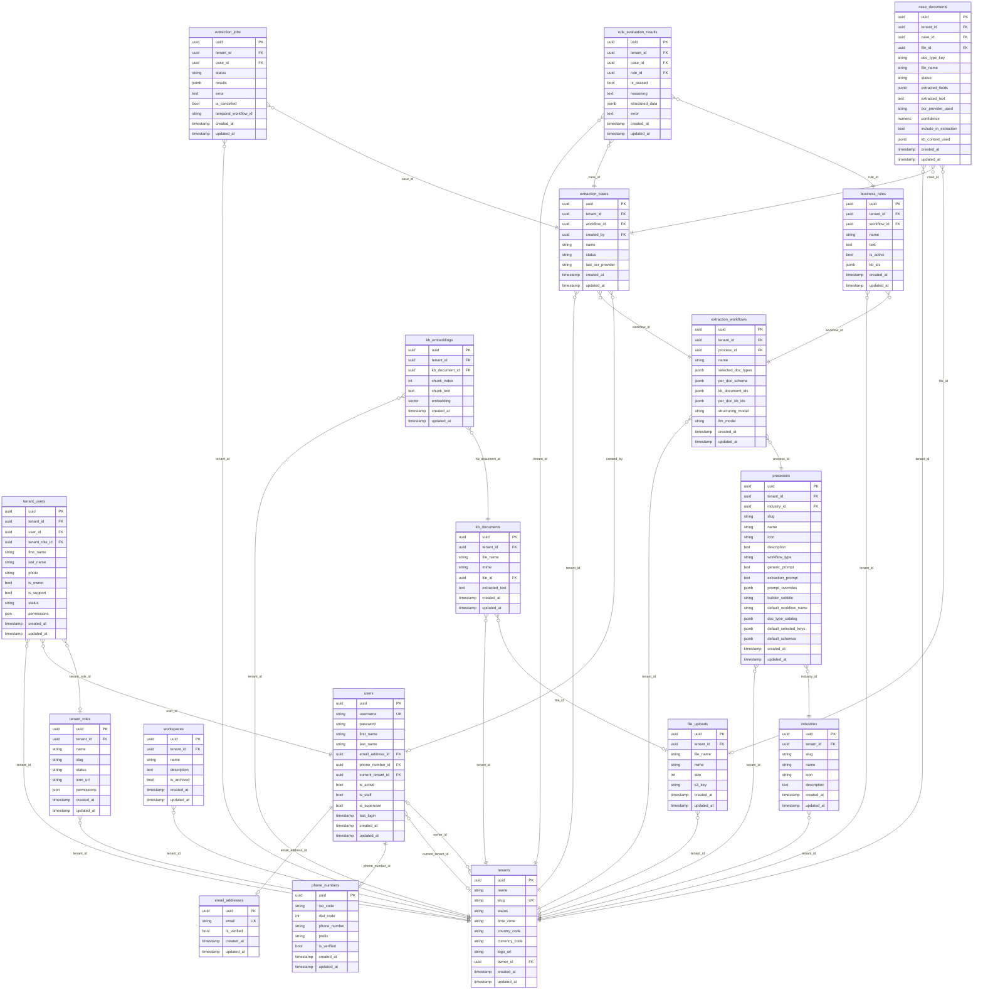

# Diagrama Entidad-Relación — Llamitai

> Todos los modelos con `UUIDTenantTimestampMixin` heredan: `uuid (PK)`, `tenant_id (FK→tenants)`, `created_at`, `updated_at`.
> Los modelos con `UUIDTimestampMixin` heredan: `uuid (PK)`, `created_at`, `updated_at` (sin tenant).



---

## Uso de cada modelo

### Auth & Users

| Modelo | Tabla | Uso |
|--------|-------|-----|
| **EmailAddressORM** | `email_addresses` | Almacena emails únicos verificables. Referenciado por `users` para login/contacto. |
| **PhoneNumberORM** | `phone_numbers` | Almacena teléfonos con código de país. Referenciado por `users` para contacto/verificación. |
| **UserORM** | `users` | Usuario del sistema. Tiene credenciales (username/password), flags de permisos (staff/superuser), y referencia al tenant activo. Base para autenticación JWT. |

### Tenants & Roles

| Modelo | Tabla | Uso |
|--------|-------|-----|
| **TenantORM** | `tenants` | Organización/empresa. Aísla todos los datos por tenant (multi-tenancy). Configura localización (timezone, país, moneda). |
| **TenantRoleORM** | `tenant_roles` | Roles dentro de un tenant (ej: Admin, Viewer). Contiene array JSON de permisos granulares. |
| **TenantUserORM** | `tenant_users` | Membresía usuario↔tenant. Asigna rol, permisos específicos, perfil (nombre/foto) dentro del tenant. Un usuario puede pertenecer a múltiples tenants. |

### Workspaces

| Modelo | Tabla | Uso |
|--------|-------|-----|
| **WorkspaceORM** | `workspaces` | Espacios de trabajo dentro de un tenant para organizar recursos. Puede archivarse. Actualmente no tiene FK hacia otros modelos de extracción. |

### Industries & Processes

| Modelo | Tabla | Uso |
|--------|-------|-----|
| **IndustryORM** | `industries` | Catálogo de industrias por tenant (ej: Inmobiliaria, Salud, Financiera). Agrupa procesos relacionados. |
| **ProcessORM** | `processes` | Template de proceso de extracción. Define el catálogo de tipos de documento (`doc_type_catalog`), schemas por defecto, prompts de extracción, y configuración del builder UI. Un process = un tipo de workflow (ej: "Análisis de crédito hipotecario"). Unique por `(tenant_id, workflow_type)`. |

### Extraction Pipeline

| Modelo | Tabla | Uso |
|--------|-------|-----|
| **ExtractionWorkflowORM** | `extraction_workflows` | Instancia configurada de un Process. El usuario selecciona doc types, personaliza schemas, asigna KBs, y elige modelos LLM. Es el "template activo" sobre el que se crean casos. |
| **ExtractionCaseORM** | `extraction_cases` | Un caso de análisis (ej: un expediente de crédito). Contiene documentos subidos, pasa por estados (DRAFT → PROCESSING → DONE). Vinculado al workflow y al usuario que lo creó. |
| **ExtractionJobORM** | `extraction_jobs` | Job de extracción OCR+LLM para un caso. Trackea status (PENDING/RUNNING/DONE/FAILED), resultados JSON, errores, y el workflow_id de Temporal. Permite cancelación. |
| **CaseDocumentORM** | `case_documents` | Documento individual dentro de un caso. Almacena el archivo subido, tipo de documento, campos extraídos (`extracted_fields` JSONB), texto OCR, confianza, y contexto KB usado. Unique por `(case_id, doc_type_key)`. |

### Business Rules & Evaluation

| Modelo | Tabla | Uso |
|--------|-------|-----|
| **BusinessRuleORM** | `business_rules` | Regla de negocio vinculada a un workflow. Contiene la lógica en texto natural (ej: "Verificar que @receta.medicamentos incluya..."). Puede referenciar KBs para contexto adicional. Toggle `is_active` para incluir/excluir del análisis. |
| **RuleEvaluationResultORM** | `rule_evaluation_results` | Resultado de evaluar una regla contra un caso. Almacena pass/fail, razonamiento del LLM, datos estructurados opcionales, y errores. Vincula `case_id` ↔ `rule_id`. |

### File Storage

| Modelo | Tabla | Uso |
|--------|-------|-----|
| **FileUploadORM** | `file_uploads` | Registro de archivo subido a S3. Metadata (nombre, MIME, tamaño) + `s3_key` para descarga. Referenciado por `case_documents` y `kb_documents`. |

### Knowledge Base

| Modelo | Tabla | Uso |
|--------|-------|-----|
| **KBDocumentORM** | `kb_documents` | Documento de knowledge base. Almacena el archivo fuente y su texto extraído. Se usa como contexto de referencia para extracción y evaluación de reglas. |
| **KBEmbeddingORM** | `kb_embeddings` | Chunk vectorizado de un KB document. Usa pgvector (768 dims) para búsqueda semántica. Unique por `(kb_document_id, chunk_index)`. Permite RAG sobre la base de conocimiento. |

---

## Flujo principal de datos

```
Industry → Process → ExtractionWorkflow → ExtractionCase → CaseDocument
                          ↓                      ↓
                    BusinessRule          RuleEvaluationResult
                          ↓                      ↑
                      (evalúa)  ─────────────────┘

FileUpload ← CaseDocument (archivo del caso)
FileUpload ← KBDocument → KBEmbedding (knowledge base para RAG)
```

## Referencias lógicas (no FK, via JSONB)

| Campo | En tabla | Referencia lógica |
|-------|----------|-------------------|
| `kb_document_ids` | `extraction_workflows` | → `kb_documents.uuid[]` |
| `per_doc_kb_ids` | `extraction_workflows` | → `kb_documents.uuid[]` por doc_type |
| `kb_ids` | `business_rules` | → `kb_documents.uuid[]` |
| `kb_context_used` | `case_documents` | → chunks de KB usados en extracción |
| `doc_type_catalog` | `processes` | Catálogo de tipos de documento (JSON) |
| `default_schemas` | `processes` | Schemas de extracción por defecto (JSON) |
| `selected_doc_types` | `extraction_workflows` | Doc types seleccionados del catálogo |
| `per_doc_schema` | `extraction_workflows` | Schemas personalizados por doc type |
| `extracted_fields` | `case_documents` | Campos extraídos del documento (JSON) |
