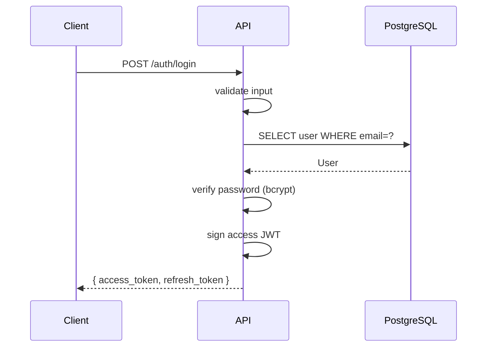

Exchanges a valid `email` + `password` pair for a short-lived **access token** and a longer-lived **refresh token**.

## Request

```http
POST /api/v1/auth/login
Content-Type: application/json

{
  "email": "user@example.com",
  "password": "••••••••"
}
```

| Field | Type | Required | Notes |
|---|---|---|---|
| `email` | string | yes | Validated against RFC 5322. |
| `password` | string | yes | Min 8 chars. |

## Response — 200 OK

```json
{
  "access_token": "eyJhbGciOiJIUzI1NiIsInR5cCI6IkpXVCJ9...",
  "refresh_token": "rt_4f2c8e1b...",
  "token_type": "bearer",
  "expires_in": 3600
}
```

| Field | Type | Notes |
|---|---|---|
| `access_token` | string | JWT signed with HS256. Send as `Authorization: Bearer <token>`. |
| `refresh_token` | string | Opaque, 32+ chars. Used by `/auth/refresh`. |
| `token_type` | string | Always `bearer`. |
| `expires_in` | integer | Seconds until the access token expires. |

## Errors

| Status | Code | When |
|---|---|---|
| `400` | `validation_error` | Missing or malformed fields. |
| `401` | `invalid_credentials` | Email or password is wrong. |
| `423` | `account_locked` | Too many failed attempts. Try again in 15 min. |

## Example

```bash
curl -X POST http://localhost:8200/api/v1/auth/login \
  -H 'Content-Type: application/json' \
  -d '{"email":"user@example.com","password":"hunter2"}'
```

## Sequence


