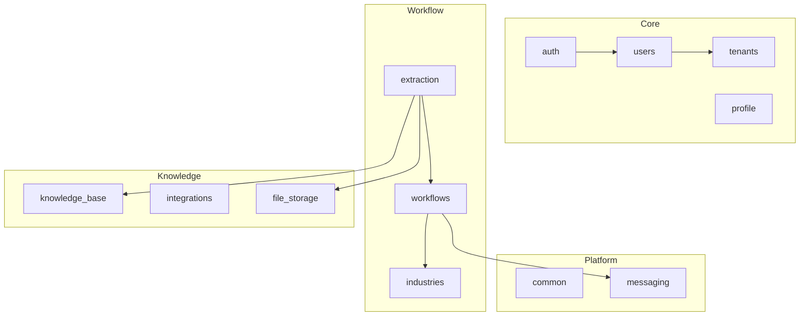
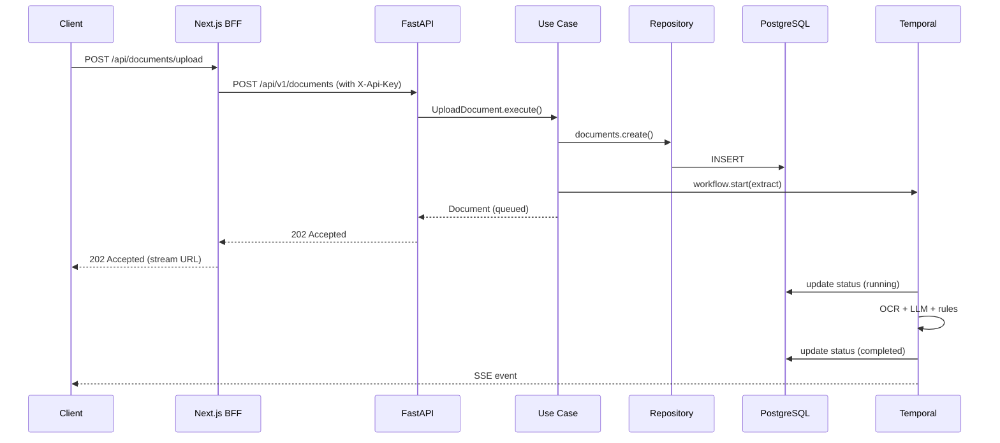

Doxiq backend follows **Clean Architecture + DDD**. Every module is laid out as `domain → application → infrastructure → presentation`.

## Module layout

Each backend module has the same shape:

```
backend/src/<module>/
  domain/         # Pure business logic: entities, value objects, repository interfaces
  application/    # Use cases (commands + queries), DTOs
  infrastructure/ # SQL repositories, external adapters
  presentation/   # FastAPI routers, presenters
```

## Bounded contexts



## Request lifecycle



## Key patterns

### Use cases

A use case is a dataclass that implements a `UseCase` protocol and exposes `execute()`. It depends on **repository interfaces** declared in `domain/`, never on SQLAlchemy or HTTP clients.

```python
@dataclass
class UploadDocument(UseCase[UploadDocumentCommand, Document]):
    documents: DocumentRepository
    workflows: WorkflowRunner

    async def execute(self, command: UploadDocumentCommand) -> Document:
        doc = await self.documents.create(command.tenant_id, command.file)
        await self.workflows.start("extract", doc.id)
        return doc
```

### Repositories

Domain declares an abstract `Repository`; infrastructure provides the SQLAlchemy implementation. The use case receives the concrete instance through DI in `composition.py`.

### Presenters

Routers never return ORM models. They call a presenter that converts the domain entity into a camelCase response dict.

### Multi-tenant

Every query is scoped by `tenant_id` extracted from the JWT. The `tenant` module owns the JWT-issuing route; every other module reads `current_tenant` from a FastAPI dependency.

## Where to go next

- [Backend modules](/docs/backend/modules)
- [Add a Use Case](/guides/add-a-use-case)
- [Temporal Workflows](/guides/temporal-workflow)
