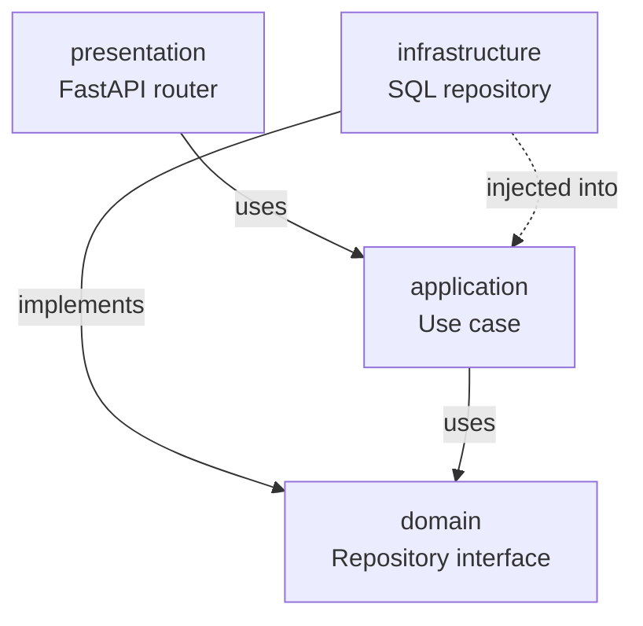

This page shows two diagrams of the same architecture: one rendered as **Mermaid** (client-side) and one as a **static SVG** (inlined into the page at build time).

## Dependency direction

The dependency arrow always points **inward** — from `presentation` toward `domain`. The domain layer has zero knowledge of FastAPI, SQLAlchemy, or any I/O concern.

## Static SVG version

The same idea, drawn by hand and committed as a static asset — useful when you need pixel-precise control or want to avoid the Mermaid runtime cost.

## When to use which

| Use Mermaid when… | Use static SVG when… |
|---|---|
| The diagram is data-driven (entity tables, flow steps) | The diagram has bespoke illustrations |
| You want edits to be a 1-line diff in a `.md` file | The diagram is part of a brand or marketing surface |
| You're sketching a flow early in design | You need a specific visual style / typography |
| The diagram is small enough to render in <200ms | The diagram is complex (>50 nodes) |

## Where to go next

- [Backend modules](/docs/backend/modules)
- [Add a Use Case](/guides/add-a-use-case)
