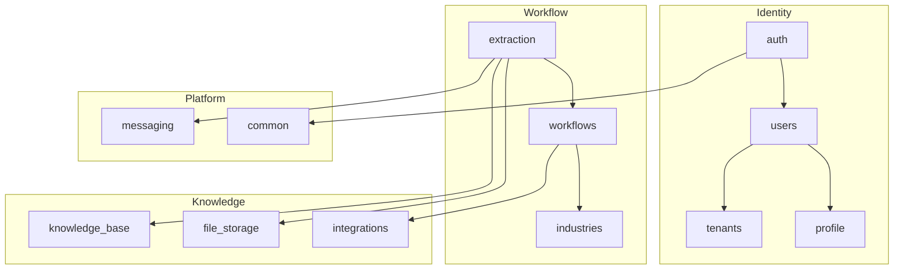

The backend is split into 12 modules. Each one owns a single bounded context and follows the same `domain → application → infrastructure → presentation` layout.

## Module map

## Ownership table

| Module | Owns | Depends on |
|---|---|---|
| `auth` | login, refresh, JWT issuance | `users`, `tenants` |
| `users` | user accounts, roles | — |
| `profile` | per-user preferences, settings | `users` |
| `tenants` | organizations, memberships | `users` |
| `workflows` | Temporal workflow definitions | `industries` |
| `industries` | vertical configs (fields, rules, prompts) | — |
| `extraction` | OCR + LLM + rule evaluation | `workflows`, `file_storage`, `knowledge_base`, `messaging` |
| `knowledge_base` | embeddings, RAG retrieval (pgvector) | `file_storage` |
| `integrations` | third-party connectors | `file_storage` |
| `file_storage` | object storage abstraction (S3, GCS, local) | — |
| `messaging` | Redis pub/sub for SSE | — |
| `common` | shared utils (use case, repositories, errors) | — |

## Inter-module rules

- A module **may** depend on `common`, `messaging`, and the module it directly owns (e.g. `auth` → `users`).
- A module **must not** reach into another module's `infrastructure/` or `presentation/` layers — talk to the other module's public use cases instead.
- A module **must not** import SQLAlchemy, FastAPI, or any I/O concern from `domain/`. Domain is pure Python.

## Where to go next

- [Use cases](/docs/backend/use-cases)
- [Repositories](/docs/backend/repositories)
- [Events & SSE](/docs/backend/events)
