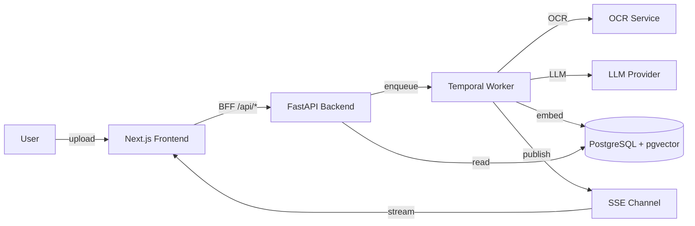

Doxiq is a document extraction and business rule analysis platform. It uses OCR + LLM to extract structured data from documents and evaluate configurable business rules against the extracted data.

## What is Doxiq?

Doxiq is built for organizations that process high volumes of semi-structured documents — invoices, contracts, claims, KYC packets, compliance forms — and need to:

1. **Extract** structured fields from any document (PDF, image, scan).
2. **Validate** extracted values against configurable business rules.
3. **Route** the result to the right human or downstream system.

## Architecture overview



## Core concepts

- **Extraction**: the process of pulling structured fields from an unstructured document.
- **Rule**: a predicate over extracted data (e.g. `total > 10_000`).
- **Workflow**: a Temporal orchestration of the steps required to process a document.
- **Industry**: a vertical-specific configuration bundle (industries, fields, rules, prompts).
- **Knowledge Base**: a tenant-scoped collection of embedded reference documents used for RAG.

## Repository layout

```
doxiq/
  backend/      FastAPI service (Python 3.12, async SQLAlchemy, PostgreSQL)
  frontend/     Next.js 15 application
  docs/         This Astro site
  specs/        Specifications & implementation notes
  fixtures/     Test fixtures
```

## Where to go next

- [Quickstart](/docs/quickstart) — get the platform running locally in 5 minutes.
- [Architecture](/docs/architecture) — deep dive into the modules and their boundaries.
- [Add a Use Case](/guides/add-a-use-case) — the most common contribution flow.
