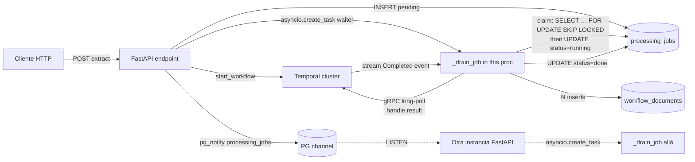

# Workflow Persistence — capa desacoplada del lado FastAPI

> Spec accionable. La persistencia de los resultados de `DocumentProcessingWorkflow` vive **fuera** del workflow Temporal, en el container de FastAPI. Sin activities nuevos, sin polling activo, recovery-safe, multi-instance safe.

## 1. Principios

1. **Workflow agnóstico de DB**: `DocumentProcessingWorkflow` solo orquesta lambdas y devuelve `DocumentProcessingOutput`. No conoce el modelo `WorkflowDocumentORM` ni la sesión SQL.
2. **Sin polling activo**: el waiter usa `handle.result()` (server-streaming gRPC con long-poll, parte del SDK de Temporal). La conexión TCP queda dormida hasta que el server empuja el evento `WorkflowExecutionCompleted`.
3. **Recovery-safe**: una tabla `processing_jobs` registra cada job; si FastAPI se reinicia mientras un waiter espera, el `lifespan` hook re-spawnea waiters para los jobs `pending`/`running`.
4. **Multi-instance safe**: el endpoint emite `pg_notify` tras crear el job; cualquier instancia FastAPI con `LISTEN` activo puede agarrar el waiter (con `SELECT … FOR UPDATE SKIP LOCKED` para evitar duplicados).
5. **N filas por workflow**: el use case itera `output.extract_fields["extractions"]` y crea una `WorkflowDocumentORM` por cada documento clasificado, mergeada con su `validations[]` por `document_index`.

## 2. Arquitectura



`SELECT … FOR UPDATE SKIP LOCKED` dentro de `claim()` garantiza que solo una instancia procesa cada job aunque varias reciban el `NOTIFY`. El waiter no emite `pg_notify` en el canal `processing_jobs` al terminar — la notificación de "trabajo terminado" hacia el frontend va por el canal SSE separado (`workflow_document_updated`, ver §5.1).

## 3. Tabla `processing_jobs`

| Columna | Tipo | Notas |
|---------|------|-------|
| `uuid` | `uuid` PK | id interno (de la fila, distinto del `job_id` Temporal) |
| `job_id` | `varchar(120)` UNIQUE | el id Temporal (ej. `CASE#…_FILE#…`) |
| `tenant_id` | `uuid` NOT NULL | scoping multi-tenant |
| `workflow_id` | `uuid` NOT NULL | doxiq workflow (no el Temporal id) |
| `case_id` | `uuid` NOT NULL | |
| `file_id` | `uuid` NOT NULL | |
| `status` | `varchar(20)` NOT NULL DEFAULT `'pending'` | `pending` \| `running` \| `done` \| `failed` |
| `attempts` | `int` NOT NULL DEFAULT `0` | incrementado cada vez que un waiter agarra el job |
| `error` | `text` NULL | mensaje del último fallo (si `status='failed'`) |
| `result_summary` | `jsonb` NULL | metadata útil para debugging (job_id, total docs creados, errores parciales del workflow) |
| `created_at` / `updated_at` | timestamps | mixin estándar |

Índices:
- `ix_processing_jobs_status` en `(status)` — para que el lifespan recovery filtre rápido.
- UNIQUE en `job_id` — idempotencia: el endpoint puede llamarse 2 veces con el mismo job_id sin duplicar. Postgres crea un índice unique implícito al respaldar la `UniqueConstraint`, así que **no** declares otro índice secundario sobre `job_id`.

## 4. Cambios concretos

### 4.1 Migración Alembic

Archivo nuevo: `backend/src/common/database/versions/<ts>_<rev>_add_processing_jobs.py`. Generar con:

```bash
just migrate-backend-new "add_processing_jobs"
```

`down_revision = "f7a8b9c0d1e2"` (el head actual del chain — la última migración aplicada en el repo). Convención del proyecto: `sa.UUID()` (no `postgresql.UUID(as_uuid=True)`), índices nombrados con prefijo `ix_<table>_<col>`, `func.now()` vía `sa.func.now()`.

Reemplazar `upgrade()` / `downgrade()`:

```python
import sqlalchemy as sa
from alembic import op
from sqlalchemy.dialects import postgresql


def upgrade() -> None:
    op.create_table(
        "processing_jobs",
        sa.Column("uuid", sa.UUID(), primary_key=True, nullable=False),
        sa.Column("job_id", sa.String(length=120), nullable=False),
        sa.Column("tenant_id", sa.UUID(), nullable=False),
        sa.Column("workflow_id", sa.UUID(), nullable=False),
        sa.Column("case_id", sa.UUID(), nullable=False),
        sa.Column("file_id", sa.UUID(), nullable=False),
        sa.Column("status", sa.String(length=20), nullable=False, server_default="pending"),
        sa.Column("attempts", sa.Integer(), nullable=False, server_default="0"),
        sa.Column("error", sa.Text(), nullable=True),
        sa.Column("result_summary", postgresql.JSONB(astext_type=sa.Text()), nullable=True),
        sa.Column("created_at", sa.DateTime(timezone=True), server_default=sa.func.now(), nullable=False),
        sa.Column("updated_at", sa.DateTime(timezone=True), server_default=sa.func.now(), nullable=False),
        sa.ForeignKeyConstraint(["tenant_id"], ["tenants.uuid"], ondelete="CASCADE"),
        sa.ForeignKeyConstraint(["workflow_id"], ["workflows.uuid"], ondelete="CASCADE"),
        sa.ForeignKeyConstraint(["case_id"], ["workflow_cases.uuid"], ondelete="CASCADE"),
        sa.ForeignKeyConstraint(["file_id"], ["documents.uuid"], ondelete="CASCADE"),
        sa.UniqueConstraint("job_id", name="uq_processing_jobs_job_id"),
    )
    op.create_index("ix_processing_jobs_status", "processing_jobs", ["status"])


def downgrade() -> None:
    op.drop_index("ix_processing_jobs_status", table_name="processing_jobs")
    op.drop_table("processing_jobs")
```

Las cuatro FKs (`tenant_id`, `workflow_id`, `case_id`, `file_id`) usan `ondelete="CASCADE"` porque `processing_jobs` es una tabla **operacional**, no un audit log permanente: si el tenant/workflow/case/file desaparece, los jobs asociados se vuelven irrelevantes.

### 4.2 Domain enum + entity

`backend/src/workflows/domain/enums/processing_job_status.py`:
```python
from src.common.domain.enums.base_enum import BaseEnum


class ProcessingJobStatus(BaseEnum):
    PENDING = "pending"
    RUNNING = "running"
    DONE = "done"
    FAILED = "failed"
```

`backend/src/workflows/domain/entities/processing_job.py`:
```python
from datetime import datetime
from uuid import UUID

from pydantic import BaseModel, ConfigDict, Field

from src.workflows.domain.enums.processing_job_status import ProcessingJobStatus


class ProcessingJob(BaseModel):
    uuid: UUID
    job_id: str
    tenant_id: UUID
    workflow_id: UUID
    case_id: UUID
    file_id: UUID
    status: ProcessingJobStatus = Field(default=ProcessingJobStatus.PENDING)
    attempts: int = 0
    error: str | None = None
    result_summary: dict | None = None
    created_at: datetime | None = None
    updated_at: datetime | None = None

    model_config = ConfigDict(from_attributes=True, extra="ignore")
```

### 4.3 Modelo ORM

`backend/src/common/database/models/processing_job.py`. Usa `UUIDTenantTimestampMixin` (que ya aporta `uuid` PK + `tenant_id` con FK a `tenants.uuid` ondelete CASCADE + `created_at` / `updated_at`) — patrón consistente con `WorkflowDocumentORM` y demás modelos tenant-scoped:

```python
from uuid import UUID

from sqlalchemy import ForeignKey, Index, Integer, String, Text
from sqlalchemy.dialects.postgresql import JSONB, UUID as PostgreSQLUUID
from sqlalchemy.orm import Mapped, mapped_column

from src.common.database.mixins.common import Base
from src.common.database.mixins.tenants import UUIDTenantTimestampMixin


class ProcessingJobORM(Base, UUIDTenantTimestampMixin):
    __tablename__ = "processing_jobs"
    __table_args__ = (Index("ix_processing_jobs_status", "status"),)

    # tenant_id, uuid, created_at, updated_at vienen del mixin

    job_id: Mapped[str] = mapped_column(String(120), nullable=False, unique=True)
    workflow_id: Mapped[UUID] = mapped_column(
        PostgreSQLUUID(as_uuid=True),
        ForeignKey("workflows.uuid", ondelete="CASCADE"),
        nullable=False,
    )
    case_id: Mapped[UUID] = mapped_column(
        PostgreSQLUUID(as_uuid=True),
        ForeignKey("workflow_cases.uuid", ondelete="CASCADE"),
        nullable=False,
    )
    file_id: Mapped[UUID] = mapped_column(
        PostgreSQLUUID(as_uuid=True),
        ForeignKey("documents.uuid", ondelete="CASCADE"),
        nullable=False,
    )
    status: Mapped[str] = mapped_column(String(20), nullable=False, server_default="pending")
    attempts: Mapped[int] = mapped_column(Integer, nullable=False, server_default="0")
    error: Mapped[str | None] = mapped_column(Text, nullable=True)
    result_summary: Mapped[dict | None] = mapped_column(JSONB, nullable=True)
```

Registrar en `backend/src/common/database/models/__init__.py`:
```python
from src.common.database.models.processing_job import ProcessingJobORM
# ... y agregar "ProcessingJobORM" a __all__
```

### 4.4 Repositorio

`backend/src/workflows/domain/repositories/processing_job_repository.py` (interfaz):
```python
from abc import ABC, abstractmethod
from uuid import UUID

from src.workflows.domain.entities.processing_job import ProcessingJob


class ProcessingJobRepository(ABC):
    @abstractmethod
    async def create(self, job: ProcessingJob) -> ProcessingJob: ...

    @abstractmethod
    async def find_by_uuid(self, uuid: UUID) -> ProcessingJob | None: ...

    @abstractmethod
    async def find_by_job_id(self, job_id: str) -> ProcessingJob | None: ...

    @abstractmethod
    async def claim(self, uuid: UUID) -> ProcessingJob | None:
        """Marca el job como `running` con SELECT … FOR UPDATE SKIP LOCKED.
        Devuelve None si otro worker ya lo agarró."""

    @abstractmethod
    async def mark_done(self, uuid: UUID, summary: dict | None) -> None: ...

    @abstractmethod
    async def mark_failed(self, uuid: UUID, error: str) -> None: ...

    @abstractmethod
    async def reset_to_pending(self, uuid: UUID) -> None:
        """Llevar un job de `failed` (o cualquier estado) de vuelta a `pending`,
        limpiando `error` y dejando `attempts` para auditoría. Usado en re-extract."""

    @abstractmethod
    async def list_unfinished(self) -> list[ProcessingJob]:
        """Para el recovery on-startup. Filtra status IN ('pending', 'running')."""
```

`backend/src/workflows/infrastructure/repositories/sql_processing_job.py` — implementación SQLAlchemy. Patrón estándar del proyecto: `__init__(self, session: AsyncSession)`. El método `claim()` es el único non-trivial:

```python
from uuid import UUID

from sqlalchemy import select
from sqlalchemy.ext.asyncio import AsyncSession

from src.common.database.models.processing_job import ProcessingJobORM
from src.workflows.domain.entities.processing_job import ProcessingJob
from src.workflows.domain.enums.processing_job_status import ProcessingJobStatus
from src.workflows.domain.repositories.processing_job_repository import (
    ProcessingJobRepository,
)


class SQLProcessingJobRepository(ProcessingJobRepository):
    def __init__(self, session: AsyncSession):
        self.session = session

    async def claim(self, uuid: UUID) -> ProcessingJob | None:
        stmt = (
            select(ProcessingJobORM)
            .where(
                ProcessingJobORM.uuid == uuid,
                ProcessingJobORM.status.in_(
                    [ProcessingJobStatus.PENDING.value, ProcessingJobStatus.RUNNING.value]
                ),
            )
            .with_for_update(skip_locked=True)
        )
        row = (await self.session.execute(stmt)).scalar_one_or_none()
        if row is None:
            return None
        row.status = ProcessingJobStatus.RUNNING.value
        row.attempts += 1
        await self.session.flush()
        return ProcessingJob.model_validate(row)
```

`SKIP LOCKED` hace que otra transacción concurrente que pida la misma fila reciba `None` (en vez de bloquearse esperando) — es lo que evita el doble procesamiento. La conversión ORM → entity usa `ProcessingJob.model_validate(row)` (Pydantic con `from_attributes=True`).

### 4.5 Use case `RunAndPersistDocumentProcessing`

`backend/src/workflows/application/use_cases/run_and_persist_document_processing.py`:

```python
import logging
from dataclasses import dataclass
from datetime import timedelta
from uuid import UUID, uuid4

from temporalio.client import Client as TemporalClient

from src.common.domain.entities.workflows.document_processing import (
  DocumentProcessingOutput,
)
from src.common.domain.entities.processing import WorkflowDocument
from src.processing.domain.enums.workflow_document_source import WorkflowDocumentSource
from src.processing.domain.enums.workflow_document_status import WorkflowDocumentStatus
from src.processing.domain.repositories.document_repository import DocumentRepository
from src.workflows.domain.entities.processing_job import ProcessingJob
from src.workflows.domain.repositories.processing_job_repository import (
  ProcessingJobRepository,
)

logger = logging.getLogger(__name__)


@dataclass
class RunAndPersistDocumentProcessing:
  """Espera el resultado del workflow Temporal (gRPC long-poll) y persiste
  N WorkflowDocument. NO arranca el workflow — eso ya lo hizo el endpoint."""

  job: ProcessingJob
  extraction_timeout_seconds: int
  temporal_client: TemporalClient
  job_repository: ProcessingJobRepository
  document_repository: DocumentRepository

  async def execute(self) -> list[WorkflowDocument]:
    # 1) Claim atómico — si otro worker ya lo agarró, abortamos
    claimed = await self.job_repository.claim(self.job.uuid)
    if claimed is None:
      logger.info("processing_job.skipped_already_claimed", extra={"job_id": self.job.job_id})
      return []

    try:
      # 2) gRPC long-poll: la conexión TCP queda dormida hasta que el workflow completa
      handle = self.temporal_client.get_workflow_handle(self.job.job_id)
      raw = await handle.result(
        rpc_timeout=timedelta(seconds=self.extraction_timeout_seconds),
      )
      output = DocumentProcessingOutput.model_validate(raw)

      # 3) Validar status global
      ef_status = (output.extract_fields or {}).get("status")
      vx_status = (output.validate_extraction or {}).get("status")
      if ef_status == "error":
        raise RuntimeError(
          f"extract_fields failed: {(output.extract_fields or {}).get('message')}"
        )

      # 4) Crear N WorkflowDocument
      created = await self._create_workflow_documents(output)

      # 5) Marcar done con un resumen
      summary = {
        "documents_created": len(created),
        "extract_fields_status": ef_status,
        "validate_extraction_status": vx_status,
        "extract_fields_errors": (output.extract_fields or {}).get("errors") or [],
        "validate_extraction_errors": (output.validate_extraction or {}).get("errors") or [],
      }
      await self.job_repository.mark_done(self.job.uuid, summary)
      return created

    except Exception as exc:
      logger.exception("processing_job.failed", extra={"job_id": self.job.job_id})
      await self.job_repository.mark_failed(self.job.uuid, str(exc))
      raise

  async def _create_workflow_documents(
          self, output: DocumentProcessingOutput
  ) -> list[WorkflowDocument]:
    extractions = (output.extract_fields or {}).get("extractions") or []
    validations_by_idx = {
      v["document_index"]: v
      for v in ((output.validate_extraction or {}).get("validations") or [])
      if v.get("document_index") is not None
    }

    created: list[WorkflowDocument] = []
    for ext in sorted(extractions, key=lambda e: e.get("document_index", 0)):
      idx = int(ext["document_index"])
      doctype = ext.get("document_type") or {}
      validation_entry = validations_by_idx.get(idx) or {}

      doc = WorkflowDocument(
        uuid=uuid4(),
        tenant_id=self.job.tenant_id,
        workflow_id=self.job.workflow_id,
        case_id=self.job.case_id,
        file_id=self.job.file_id,
        document_type_id=_safe_uuid(doctype.get("uuid")),
        file_name=doctype.get("name") or f"document #{idx + 1}",
        status=WorkflowDocumentStatus.EXTRACTED,
        source=WorkflowDocumentSource.BULK,
        extraction=ext.get("output") or {},
        mapped_extraction=ext.get("mapped_output") or None,
        extraction_pages=_collect_pages(ext.get("mapped_output")) or None,
        validation=validation_entry.get("validation_results") or [],
      )
      created.append(await self.document_repository.create(doc))
    return created


def _safe_uuid(value: object) -> UUID | None:
  if not value:
    return None
  try:
    return UUID(str(value))
  except (ValueError, TypeError):
    return None


def _collect_pages(mapped_output: dict | None) -> list[int]:
  """Camina el árbol y junta page_numbers únicos de las hojas con bbox."""
  if not mapped_output:
    return []
  pages: set[int] = set()

  def walk(node):
    if isinstance(node, dict):
      if "value" in node and "bbox" in node:
        pn = node.get("page_number")
        if isinstance(pn, int):
          pages.add(pn)
        for hit in node.get("bbox") or []:
          p = (hit or {}).get("page_number")
          if isinstance(p, int):
            pages.add(p)
        return
      for v in node.values():
        walk(v)
    elif isinstance(node, list):
      for v in node:
        walk(v)

  walk(mapped_output)
  return sorted(pages)
```

### 4.6 Endpoint dispatch — crear job + start_workflow + notify + spawn waiter

Adaptar `backend/src/workflows/presentation/endpoints/case_file_extract_endpoints.py`. La construcción de `document_types` y el lookup de `file_upload` ya existen ahí (vía `ListWorkflowDocumentTypes` + `S3FileRepository`); reusarlos. Reemplazar el `_run_extraction_job` actual por el endpoint y el draining más simples:

```python
import asyncio
import json
from uuid import UUID, uuid4

from fastapi import Depends, Request, status
from sqlalchemy import text
from temporalio.client import Client as TemporalClient
from temporalio.exceptions import WorkflowAlreadyStartedError

from src.common.database.config import get_database_config
from src.common.domain.entities.tenants.tenant import Tenant
from src.common.domain.entities.workflows.document_processing import DocumentProcessingInput
from src.common.infrastructure.dependencies.common import (
  AsyncSessionDep,
  TemporalClientDep,
)
from src.common.infrastructure.dependencies.tenant import get_required_tenant
from src.common.infrastructure.responses.api_json import ApiJSONResponse
from src.common.settings import settings
from src.processing.application.use_cases.document_types.lister import (
  DocumentTypeLister,
)
from src.processing.infrastructure.repositories.sql_document_repository import SQLDocumentRepository
from src.processing.infrastructure.repositories.sql_document_type_repository import (
  SQLDocumentTypeRepository,
)
from src.file_storage.infrastructure.repositories.s3_file_repository import S3FileRepository
from src.workflows.application.use_cases.extract_file_into_case_documents import (
  build_job_id,
  doctype_to_temporal_dict,
)
from src.workflows.application.use_cases.run_and_persist_document_processing import (
  RunAndPersistDocumentProcessing,
)
from src.workflows.domain.constants import PROCESSING_JOBS_CHANNEL
from src.workflows.domain.entities.processing_job import ProcessingJob
from src.workflows.domain.enums.processing_job_status import ProcessingJobStatus
from src.workflows.infrastructure.repositories.sql_processing_job import SQLProcessingJobRepository
from src.workflows.presentation.workflows import DocumentProcessingWorkflow


async def start_case_file_extraction(
        workflow_id: UUID,
        case_id: UUID,
        file_id: UUID,
        request: Request,
        temporal_client: TemporalClientDep,
        session: AsyncSessionDep,
        tenant: Tenant = Depends(get_required_tenant),
) -> ApiJSONResponse:
  job_id = build_job_id(case_id, file_id)

  # 1. Crear / reusar la fila en processing_jobs
  job_repo = SQLProcessingJobRepository(session)
  existing = await job_repo.find_by_job_id(job_id)

  if existing and existing.status in (ProcessingJobStatus.DONE, ProcessingJobStatus.RUNNING):
    # Ya hecho o ya en progreso — idempotente
    return ApiJSONResponse(
      content={"jobId": job_id, "status": existing.status.value},
      status_code=status.HTTP_202_ACCEPTED,
    )

  if existing and existing.status == ProcessingJobStatus.FAILED:
    # Re-extract: reset a pending para que claim() lo agarre de nuevo
    await job_repo.reset_to_pending(existing.uuid)
    job = existing
  else:
    job = existing or await job_repo.create(
      ProcessingJob(
        uuid=uuid4(),
        job_id=job_id,
        tenant_id=tenant.uuid,
        workflow_id=workflow_id,
        case_id=case_id,
        file_id=file_id,
      )
    )

  # 2. Construir doctypes + file_upload usando los helpers existentes
  doctypes = await DocumentTypeLister(
    workflow_id=workflow_id,
    tenant_id=tenant.uuid,
    document_type_repository=SQLDocumentTypeRepository(session),
  ).execute()
  file_upload = await S3FileRepository(session).find_by_id(file_id, tenant.uuid)

  # 3. Arrancar Temporal (idempotente: si ya está corriendo, lo capturamos y seguimos)
  try:
    await temporal_client.start_workflow(
      DocumentProcessingWorkflow.run,
      DocumentProcessingInput(
        object_key=file_upload.s3_key,
        document_types=[doctype_to_temporal_dict(dt) for dt in doctypes],
        job_id=job_id,
      ),
      id=job_id,
      task_queue=settings.TEMPORAL_TASK_QUEUE,
    )
  except WorkflowAlreadyStartedError:
    pass

  # 4. Emitir pg_notify a otros pods + spawnear waiter local
  await session.execute(
    text("SELECT pg_notify(:channel, :payload)"),
    {
      "channel": PROCESSING_JOBS_CHANNEL,
      "payload": json.dumps({"job_uuid": str(job.uuid), "job_id": job_id}),
    },
  )
  await session.commit()

  asyncio.create_task(_drain_processing_job(job.uuid, temporal_client))

  return ApiJSONResponse(
    content={"jobId": job_id, "status": "dispatched"},
    status_code=status.HTTP_202_ACCEPTED,
  )


async def _drain_processing_job(job_uuid: UUID, temporal_client: TemporalClient) -> None:
  """Background coroutine: corre el use case con su propia DB session.

  Es seguro recibir múltiples invocaciones para el mismo `job_uuid` (NOTIFY +
  asyncio.create_task local en cada pod): el `claim()` del use case usa
  SKIP LOCKED y solo uno gana.
  """
  session_maker = get_database_config().session_maker
  async with session_maker() as session:
    job_repo = SQLProcessingJobRepository(session)
    doc_repo = SQLDocumentRepository(session)
    job = await job_repo.find_by_uuid(job_uuid)
    terminal = (ProcessingJobStatus.DONE, ProcessingJobStatus.FAILED)
    if job is None or job.status in terminal:
      return
    try:
      await RunAndPersistDocumentProcessing(
        job=job,
        extraction_timeout_seconds=settings.EXTRACTION_TIMEOUT,
        temporal_client=temporal_client,
        job_repository=job_repo,
        document_repository=doc_repo,
      ).execute()
    except Exception:
      # Ya quedó marcado como `failed` dentro del use case
      pass
    finally:
      await session.commit()
```

> Comparaciones con `ProcessingJobStatus.X` (no con strings): `BaseEnum` extiende `Enum`, no `StrEnum`, así que `job.status == "done"` retorna `False` aunque el value sea `"done"`. Siempre usar el enum member.

### 4.7 Listener pg_notify + recovery on startup

El proyecto **ya tiene** `backend/config/lifespan.py` (con Redis, arq, Temporal client, `PGNotifier` para SSE). **Hay que extenderlo, no reescribirlo**. Tres adiciones:

1. Una nueva conexión asyncpg dedicada con `LISTEN processing_jobs` (separada del `PGNotifier` SSE — distinto canal y distinto fan-out).
2. Recovery: al boot, listar `processing_jobs` con `status IN ('pending','running')` y spawnear `_drain_processing_job` por cada uno.
3. Cleanup en shutdown: cerrar la conexión + cancelar el listener task.

Patch sobre `backend/config/lifespan.py`:

```python
# Imports nuevos a agregar al tope:
import asyncio
import json
from uuid import UUID

import asyncpg

from src.common.infrastructure.notifications.pg_notifier import to_asyncpg_dsn  # ya existe
from src.workflows.domain.constants import PROCESSING_JOBS_CHANNEL
from src.workflows.infrastructure.repositories.sql_processing_job import (
    SQLProcessingJobRepository,
)
from src.workflows.presentation.endpoints.case_file_extract_endpoints import (
    _drain_processing_job,
)
```

```python
# Dentro del @asynccontextmanager lifespan(app), tras crear pg_notifier:

# --- processing_jobs persistence layer ---
processing_jobs_listener = await asyncpg.connect(
    to_asyncpg_dsn(str(settings.async_database_url))
)

def _on_job_notify(_conn, _pid, _channel, payload: str) -> None:
    try:
        data = json.loads(payload)
        job_uuid = UUID(data["job_uuid"])
    except (KeyError, ValueError, json.JSONDecodeError):
        logger.exception(f"processing_jobs.bad_notify_payload payload={payload!r}")
        return
    asyncio.create_task(_drain_processing_job(job_uuid, temporal_client))

await processing_jobs_listener.add_listener(PROCESSING_JOBS_CHANNEL, _on_job_notify)

# Recovery: jobs en vuelo de un crash anterior
async with database_config.session_maker() as recovery_session:
    repo = SQLProcessingJobRepository(recovery_session)
    unfinished = await repo.list_unfinished()
    for job in unfinished:
        asyncio.create_task(_drain_processing_job(job.uuid, temporal_client))

app_with_context.state.processing_jobs_listener = processing_jobs_listener
```

```python
# En la sección de shutdown, antes de pg_notifier.stop():
try:
    await processing_jobs_listener.remove_listener(
        PROCESSING_JOBS_CHANNEL, _on_job_notify
    )
finally:
    await processing_jobs_listener.close()
```

Notas importantes:
- **Reusar `app.state.temporal_client`**: el `temporal_client` ya está creado en el lifespan existente; capturarlo en el closure del callback (no crear uno nuevo).
- **`to_asyncpg_dsn` es obligatorio**: `str(settings.async_database_url)` produce `postgresql+asyncpg://…` que asyncpg rechaza. El helper ya existe en `pg_notifier.py`.
- **No mover el `PROCESSING_JOBS_CHANNEL`** a `lifespan.py` — vive en `domain/constants.py` (§4.8) como única fuente.
- No hace falta tocar `backend/config/main.py` — el `lifespan=lifespan` ya está wireado.

### 4.8 Constante del canal

`backend/src/workflows/domain/constants.py` (agregar al final):
```python
PROCESSING_JOBS_CHANNEL: str = "processing_jobs"
```

Es **un canal distinto** del que usa el `PGNotifier` para SSE (`workflow_document_updated` definido en `pg_notifier.py`). Razones para separarlos:
- Distinto fan-out: SSE es por `caseId`/`jobId`, el de persistencia es global (cualquier instancia agarra cualquier job).
- Distinto schema de payload: SSE espera `{caseId|jobId, type, …}`; este lleva `{job_uuid, job_id}`.
- Aislar fallos: una avería en el listener de persistencia no debe afectar el stream SSE.

## 5. Lo que se elimina / reorganiza del flujo actual

- **`ExtractFileIntoCaseDocuments` (use case)**: la lógica de `_persist_results` se mueve a `RunAndPersistDocumentProcessing._create_workflow_documents`. El use case viejo se borra o se reduce a un thin wrapper.
- **`_run_extraction_job` en `case_file_extract_endpoints.py`**: se borra. Su trabajo se redistribuye:
  - **Construcción de doctypes + lookup del file** → se mueve al endpoint (`start_case_file_extraction`).
  - **`start_workflow`** → endpoint.
  - **Espera + persistencia** → `_drain_processing_job` (background coroutine).
- **`StartCaseDocumentExtraction` (SINGLE doc re-extract)**: con el nuevo modelo, el flujo SINGLE también puede pasar por `processing_jobs` con un job_id distinto (ej. `single:{document_id.hex}`). Decisión separada de este spec.

### 5.1 Preservación de eventos SSE existentes

`_run_extraction_job` actual emite `job.started` / `job.document_created` / `job.completed` / `job.failed` por `pg_notify('workflow_document_updated', …)` — los consume el endpoint SSE `stream_job_events`. En el nuevo flujo, **toda la emisión SSE vive en `_drain_processing_job`** (no en el use case), para no acoplar `application/use_cases/` con la capa de presentation:

| Evento SSE | Dónde se emite |
|-----------|----------------|
| `job.started` | en el **endpoint** `start_case_file_extraction`, antes del `return 202` |
| `job.document_created` | en `_drain_processing_job` iterando los `WorkflowDocument` que devuelve `RunAndPersistDocumentProcessing.execute()` (uno por doc creado) |
| `job.completed` | en `_drain_processing_job` después del loop de `job.document_created` |
| `job.failed` | en `_drain_processing_job` dentro del `except`, tras el use case marcar `failed` en DB |

El use case se mantiene puro (no conoce `pg_notify` ni `_emit`). Los emisores reusan el helper `_emit(session, event)` ya existente en `case_file_extract_endpoints.py`. **No se mezclan canales**: SSE sigue por `workflow_document_updated`, persistencia sigue por `processing_jobs`.

Esquema concreto del `_drain_processing_job`:
```python
async with session_maker() as session:
    ...
    try:
        created = await use_case.execute()  # devuelve list[WorkflowDocument]
        for doc in created:
            await _emit(session, {"type": "job.document_created", "jobId": job.job_id, ...})
        await _emit(session, {"type": "job.completed", "jobId": job.job_id, "count": len(created)})
    except Exception as exc:
        await _emit(session, {"type": "job.failed", "jobId": job.job_id, "error": str(exc)})
    finally:
        await session.commit()
```

## 6. Criterios de aceptación

1. `processing_jobs` table existe; `just migrate-backend` la crea.
2. Endpoint `POST /v1/workflows/{wf}/cases/{case}/files/{file}/extract` crea exactamente UNA fila `processing_jobs` con status `pending` por cada `(case_id, file_id)`. Llamadas repetidas con el mismo par no duplican.
3. Tras crear la fila, el endpoint emite `pg_notify('processing_jobs', '{...}')` y devuelve `202` inmediato.
4. Una instancia FastAPI cualquiera con `LISTEN` activo recibe el NOTIFY y spawnea `_drain_processing_job(uuid)`.
5. El waiter llama `handle.result()` (gRPC long-poll, sin polling activo) y bloquea hasta que el workflow termina.
6. Tras `result()`, el use case crea N `WorkflowDocumentORM` (uno por `extractions[i]`) y deja `processing_jobs.status = 'done'` con `result_summary` populado.
7. Si dos instancias FastAPI agarran el mismo job (race en el NOTIFY), solo una persiste — gracias a `SELECT … FOR UPDATE SKIP LOCKED` en `claim()`.
8. Reiniciar el container `api` con jobs en vuelo: el lifespan hook lista `status IN ('pending','running')` y re-spawnea waiters. Temporal devuelve el mismo resultado de la historia → `result()` retorna instantáneamente y la persistencia procede.
9. Si `extract_fields.status == "error"`: el use case marca `processing_jobs.status = 'failed'` con el `message` y NO crea filas en `workflow_documents`.
10. Si una fila individual de `extract_fields.errors[]` aparece (caso `partial`): el use case crea filas para los exitosos y deja constancia en `result_summary.extract_fields_errors`.

## 7. Tests

### Unit
- `RunAndPersistDocumentProcessing`: con `temporal_client` mockeado (`handle.result()` devolviendo un `DocumentProcessingOutput` fixture), verificar que crea N filas correctas, mergeando validations por `document_index`. Casos: 1 doc, N docs, partial failures, status=error.
- `SQLProcessingJobRepository.claim`: con dos sesiones SQL paralelas, una agarra y la otra recibe `None`.
- `_collect_pages`: arbol con objetos anidados / arrays / nulls.

### Integration
- Endpoint → tabla → workflow stub (mock `temporal_client.start_workflow`) → `pg_notify` se dispara.
- Lifespan hook: con 2 jobs `pending` precreados, el startup re-spawnea 2 waiters.

### E2E (con worker Temporal real)
- Flujo completo: subir PDF → endpoint → workflow → persistencia. Verificar que se crearon N `workflow_documents`, `processing_jobs.status = 'done'`, y los SSE de progreso si aplican.

## 8. Riesgos y notas

- **Conexiones gRPC al Temporal cluster**: cada waiter mantiene 1 stream HTTP/2 abierto. Con 200 waiters concurrentes (peor caso a 100/5min), son 200 streams sobre ~1–2 conexiones TCP físicas (HTTP/2 multiplexa). Sin problema.
- **Memoria por waiter**: ~5–10 KB de asyncio task. 200 jobs = ~2 MB. Negligible.
- **Tasks zombies**: si un waiter crashea sin actualizar la tabla (proceso muere abruptamente), el row queda en `running`. El recovery on-startup lo retoma. Si nunca reinicia el container, podés agregar un timeout: `attempts < 5` y `updated_at < now() - interval '15 min'` → reagendar.
- **Múltiples NOTIFY por el mismo job**: el SKIP LOCKED en `claim` lo cubre. El primero en pasar lo agarra, el resto se va con `None`.
- **Conexión LISTEN se cae**: la conexión `processing_jobs_listener` que abre el lifespan no se reconecta automáticamente. Mitigación v1: el recovery on-startup actúa como fallback (al próximo redeploy se reagendan los pendientes). Si querés más resiliencia, envolver el `add_listener` en un loop con `tenacity`/`asyncio` que detecte caídas y reabra.
- **`asyncio.create_task` desde callback sync**: el callback `_on_job_notify` que pasamos a `add_listener` es síncrono (lo exige asyncpg), pero corre dentro del event loop (asyncpg lo dispatcha desde su read loop). `asyncio.create_task` funciona en ese contexto. Si por alguna razón el callback corriera en otro thread, habría que usar `loop.call_soon_threadsafe(loop.create_task, ...)`.

## 9. Plan de implementación

1. **Migración + ORM + entity + enum + constants** (schema y tipos).
2. **Repositorio** (interfaz + impl SQL con `claim` SKIP LOCKED + `list_unfinished` + `mark_done` / `mark_failed`).
3. **Use case** `RunAndPersistDocumentProcessing` con tests unit (mock `temporal_client`).
4. **Listener + lifespan hook**.
5. **Endpoint** dispatch (refactor del existente).
6. **Cleanup**: borrar `_run_extraction_job` viejo, ajustar `ExtractFileIntoCaseDocuments` (probable que se elimine o se vuelva un wrapper).
7. **Tests integration + E2E**.

## 10. Por qué esta arquitectura es óptima

- **Sin polling activo**: el único `await` que bloquea es `handle.result()` que es server-streaming gRPC con long-poll. Cero tráfico mientras espera.
- **Sin activities Temporal**: el workflow queda 100% agnóstico de la DB y del schema. Cambios en `WorkflowDocument` no obligan a redeploy del worker Temporal.
- **Recovery automático**: caída de FastAPI no pierde jobs gracias a la tabla.
- **Multi-instancia**: `pg_notify` distribuye los jobs nuevos; `SKIP LOCKED` garantiza no-duplicación.
- **Escalabilidad horizontal lineal**: más pods FastAPI = más capacidad de waiters paralelos sin coordinación adicional.
- **Cost**: ~5 KB/job pendiente en memoria + 1 stream HTTP/2 multiplexado. Para 100/5min está sobredimensionado.
