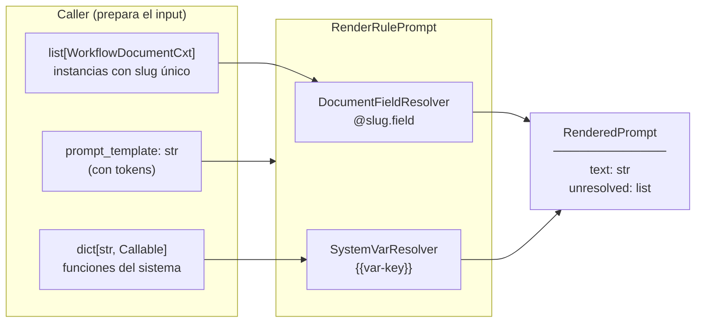

# Plan: Motor de Pre-rendering de Prompts

---

## Qué hace

Transforma un prompt template con tokens especiales en un prompt final listo para enviarse a un LLM.

```
"Verificar que @carnet.nombres no esté vacío y la fecha sea posterior a {{fecha-hoy}}."

                            ↓ PromptRenderer

"Verificar que \"Jimmy\" no esté vacío y la fecha sea posterior a 2026-04-29."
```

El use case es **agnóstico a la base de datos**: recibe los documentos ya cargados y el
mapeo de funciones del sistema. El caller decide qué traer y de dónde.

---

## Prerequisito: slugs únicos por instancia

Un doc-type (e.g. "carnet") puede aparecer múltiples veces en una misma extracción.
Referenciar por nombre del doc-type se rompe cuando hay dos instancias del mismo tipo.

Por eso, **antes del rendering ya debe existir una etapa que asigna un slug único a
cada instancia extraída**. Este spec asume que esa etapa ya existe y que los
`WorkflowDocumentCxt` que llegan al renderer ya tienen slugs únicos.

```
doc-type: carnet  →  instancias extraídas:  slug "carnet"      (primera)
                                             slug "carnet-2"    (segunda)
```

El token `@carnet.nombres` resuelve la instancia con slug `"carnet"`.
El token `@carnet-2.nombres` resuelve la segunda instancia.

---

## Dos tipos de token

| Símbolo | Ejemplo | Resuelve a |
|---|---|---|
| `@slug.field` | `@carnet.nombres` | Valor de un campo de la instancia con ese slug en el contexto |
| `{{var-key}}` | `{{fecha-hoy}}` | Resultado de una función del sistema |

> **Futuro (fuera de este PR):** tokens `#kb-slug` para Knowledge Base.

---

## Ejemplos

Los siguientes casos están cubiertos por los tests
(`backend/tests/workflows/infrastructure/services/prompt/`) y son la fuente de verdad
del comportamiento esperado.

### 1. Acceso simple a un campo

**Contexto:**
```python
WorkflowDocumentCxt(
    slug="carnet",
    extraction={"nombres": "Carlos", "fecha_emision": "2024-01-15"},
)
```

| Template | Render |
|---|---|
| `Titular: @carnet.nombres.` | `Titular: Carlos.` |
| `Emitido: @carnet.fecha_emision.` | `Emitido: 2024-01-15.` |

> El `.` final de la oración **no** forma parte del token; el parser lo recorta
> (regex `_DOC_FIELD_SCAN` + strip de `.,;:!?`).

### 2. Campos anidados

**Contexto:**
```python
WorkflowDocumentCxt(
    slug="dni",
    extraction={
        "nombres": {
            "completo": "Ana Garcia",
            "inicial": {"abreviacion": "A.G."},
        }
    },
)
```

| Template | Render |
|---|---|
| `Completo: @dni.nombres.completo.` | `Completo: Ana Garcia.` |
| `Abreviacion: @dni.nombres.inicial.abreviacion.` | `Abreviacion: A.G..` |

### 3. JMESPath: indexación, funciones, filtros

**Contexto:**
```python
WorkflowDocumentCxt(
    slug="factura",
    extraction={
        "items": [
            {"descripcion": "Laptop",  "precio": 1000, "tipo": "equipo"},
            {"descripcion": "Mouse",   "precio":   50, "tipo": "accesorio"},
            {"descripcion": "Monitor", "precio":  500, "tipo": "equipo"},
        ],
    },
)
```

| Template | Render |
|---|---|
| `Primer item: @factura.items[0].descripcion.` | `Primer item: Laptop.` |
| `Total items: @factura.length(items).` | `Total items: 3.` |
| `Total precio: @factura.sum(items[*].precio).` | `Total precio: 1550.` |
| `` Equipos: @factura.items[?tipo==`equipo`].descripcion. `` | `Equipos: ["Laptop", "Monitor"].` |

> Cualquier resultado no escalar (lista, dict, número) se serializa con
> `json.dumps(..., ensure_ascii=False)`. Por eso `["Laptop", "Monitor"]` aparece
> como JSON literal en el texto final.

### 4. Función `avg` y filtros con cálculos

**Contexto:**
```python
extraction={"items": [{"precio": 500}, {"precio": 750}, {"precio": 1000}]}
```

| Template | Render |
|---|---|
| `Promedio: @factura.avg(items[*].precio).` | `Promedio: 750.0.` |

**Otro caso (transacciones filtradas):**
```python
extraction={"transacciones": [
    {"tipo": "credito", "monto": 200},
    {"tipo": "debito",  "monto":  50},
    {"tipo": "credito", "monto": 300},
]}
```

| Template | Render |
|---|---|
| `` Creditos: @reporte.transacciones[?tipo==`credito`].monto. `` | `Creditos: [200, 300].` |

### 5. Variables del sistema y `extra_vars`

**Contexto:**
```python
SystemVarResolver(extra_vars={
    "fecha-hoy":     lambda: "2024-01-15",
    "nombre-tenant": lambda: "Empresa XYZ",
})
```

| Template | Render |
|---|---|
| `Hoy: {{fecha-hoy}}.` | `Hoy: 2024-01-15.` |
| `Tenant: {{nombre-tenant}}.` | `Tenant: Empresa XYZ.` |

> `extra_vars` puede sobrescribir entradas de `DEFAULT_SYSTEM_VARS` con el mismo nombre.

### 6. Tokens irresolubles → `unresolved_tokens`

**Contexto:**
```python
WorkflowDocumentCxt(slug="carnet", extraction={"apellido_materno": None})
```

```python
template = "Apellido: @carnet.apellido_materno. Otro: @noexiste.campo."
```

**Resultado:**

```python
RenderedPrompt(
    text="Apellido: @carnet.apellido_materno. Otro: @noexiste.campo.",
    unresolved_tokens=["@carnet.apellido_materno", "@noexiste.campo"],
)
```

Casos que generan token irresoluble:
- Slug no encontrado en `workflow_documents`.
- Campo cuyo valor es `None`, `""`, `{}` o `[]` (tratados como vacío por `_to_str`).
- Expresión JMESPath inválida (capturada por `try/except`).
- Variable de sistema cuya lambda lanza excepción.

En todos los casos el `token.raw` se conserva literal en el texto final y se acumula en `unresolved_tokens` para que el caller decida qué hacer (loggear, abortar, mostrar al usuario, etc.).

### 7. Múltiples documentos del mismo doc-type (slug único)

```python
workflow_documents = [
    WorkflowDocumentCxt(slug="carnet",   extraction={"nombres": "Carlos"}),
    WorkflowDocumentCxt(slug="carnet-2", extraction={"nombres": "Maria"}),
]
```

| Template | Render |
|---|---|
| `Titular 1: @carnet.nombres. Titular 2: @carnet-2.nombres.` | `Titular 1: Carlos. Titular 2: Maria.` |

> El renderer normaliza con `_normalise_key` (lower-case + `[\s\-\+]+ → "_"`),
> por lo que `@Carnet 2.nombres`, `@carnet-2.nombres` y `@carnet+2.nombres`
> se resuelven a la misma instancia.

### 8. Parser: tokens duplicados se deduplican

```python
extract_doc_field_tokens("@carnet.nombres y @carnet.nombres y @carnet.nombres.")
# → 1 solo Token(raw="@carnet.nombres")
```

```python
extract_system_var_tokens("{{fecha-hoy}} y también {{fecha-hoy}}.")
# → 1 solo Token(raw="{{fecha-hoy}}")
```

La sustitución por `text.replace(token.raw, value)` aplica a todas las ocurrencias
en una sola pasada.

### 9. Render combinado (caso completo de los tests)

Combinando todos los anteriores, este template:

```text
Titular: @carnet.nombres y @carnet.nombres.
Completo: @dni.nombres.completo.
Abreviacion: @dni.nombres.inicial.abreviacion.
Emitido: @carnet.fecha_emision.
Primer item: @factura.items[0].descripcion.
Total items: @factura.length(items).
Total precio: @factura.sum(items[*].precio).
Equipos: @factura.items[?tipo==`equipo`].descripcion.
Hoy: {{fecha-hoy}}.
Tenant: {{nombre-tenant}}.
```

renderiza a:

```text
Titular: Carlos y Carlos.
Completo: Ana Garcia.
Abreviacion: A.G..
Emitido: 2024-01-15.
Primer item: Laptop.
Total items: 3.
Total precio: 1550.
Equipos: ["Laptop", "Monitor"].
Hoy: 2024-01-15.
Tenant: Empresa XYZ.
```

con `unresolved_tokens == []`.

---

## Flujo de datos



---

## Forma de los datos de documento

Los campos de extracción llegan como dict plano sin wrappers. El schema de cada campo lo define el JSON Schema del `DocumentType`:

```json
{ "nombres": "Jimmy" }
{ "items": [{ "precio": 1000, "tipo": "equipo" }] }
```

No existe un campo `"value"` por defecto — si el JSON Schema lo define explícitamente, el token puede referenciarlo con JMESPath: `@carnet.nombres.value`.

---

## Archivos

Estado actual frente a la propuesta original:

```
src/workflows/
  domain/
    prompt.py                     # Token, TokenKind                            [✓ existe]
    services/
      prompt_renderer.py          # ABC PromptRenderer + RenderedPrompt          [✓ existe]
  infrastructure/
    services/
      prompt/
        token_parser.py           # extract_tokens / extract_doc_field_tokens / extract_system_var_tokens   [✓ existe]
        resolvers.py              # WorkflowDocumentCxt, DocumentFieldResolver, SystemVarResolver, _to_str  [✓ existe]
        renderer.py               # AnalysisRulePromptRenderer (implementa PromptRenderer)                 [✓ existe]
  application/
    analysis/
      render_rule_prompt.py       # RenderRulePrompt UseCase                                                [✗ pendiente]
```

> **Nota sobre la ruta del use case:** la propuesta original era `application/use_cases/analysis/`,
> pero la convención del proyecto coloca los use cases directamente en `application/<feature>/<file>.py`
> (ver `application/analysis_rules/`, `application/document_types/`, etc.). El spec se actualiza para
> seguir esa convención.

Solo `workflows/`. Nada en `common/` ni en otras capas.

---

## Código clave

### WorkflowDocumentCxt

```python
@dataclass
class WorkflowDocumentCxt:
    slug: str              # slug único por instancia: "carnet", "carnet-2", "dni"
    document_type: DocumentType
    extraction: dict       # dict plano, sin wrappers {"value": ...}
```

### TokenParser

El field key soporta expresiones JMESPath completas. La puntuación de fin de oración se elimina tras el match:

```python
_DOC_FIELD_SCAN = re.compile(r"@([\w-]+)\.([\w.\[\]*?()`!<>=|&]+)")
_SYSTEM_VAR_RE  = re.compile(r"\{\{([\w-]+)\}\}")

# Ejemplos de tokens válidos:
# @carnet.nombres
# @factura.items[0].descripcion
# @factura.avg(items[*].precio)
# @reporte.transacciones[?tipo==`credito`].monto
```

`extract_tokens()` se divide en `extract_doc_field_tokens()` y `extract_system_var_tokens()`.

### DocumentFieldResolver

```python
@dataclass
class DocumentFieldResolver:
    workflow_documents: list[WorkflowDocumentCxt]

    def resolve(self, slug: str, field_key: str) -> str | None:
        data = self._find_doc(slug)
        if data is None:
            return None
        try:
            result = jmespath.search(field_key, data)   # field_key es una expresión JMESPath
        except jmespath.exceptions.JMESPathError:
            return None                                  # expresión inválida → token irresoluble
        return _to_str(result)
```

**Comportamiento de `_to_str` (tal como está implementado):**

- `None` → `None`
- `str` → tal cual
- `""`, `{}`, `[]` → `None` (se tratan como "campo vacío" para que el renderer los marque como `unresolved`)
- cualquier otro tipo → `json.dumps(value, ensure_ascii=False)`

**Búsqueda de slug:** `_find_doc` normaliza ambos lados con `_normalise_key` (lower-case y `[\s\-\+]+ → "_"`),
así que `"Carnet 2"`, `"carnet-2"` y `"carnet+2"` resuelven a la misma instancia.

### SystemVarResolver

Estado actual del `DEFAULT_SYSTEM_VARS` en `resolvers.py`:

```python
DEFAULT_SYSTEM_VARS: dict[str, Callable[[], str]] = {
    "fecha-hoy":    lambda: datetime.now(timezone.utc).strftime("%Y-%m-%d"),
    "datetime-now": lambda: datetime.now(timezone.utc).isoformat(),
}
```

Pendientes (propuestos en la versión inicial del spec, **aún no implementados**):

```python
"formato-fecha": lambda: "YYYY-MM-DD",
"anio-actual":   lambda: str(datetime.now(timezone.utc).year),
```

El resolver además **captura cualquier excepción** de la lambda y devuelve `None`,
para que un fallo en una variable del sistema no tumbe el render.

El caller puede extender con `extra_vars` al instanciar el `SystemVarResolver` (en el spec se
referenciaba como `extra_system_vars` desde el use case).

### RenderRulePrompt — use case (PENDIENTE)

> ⚠ **No existe en el código.** No confundir con `AnalysisRulePromptRenderer`,
> que sí está implementado pero vive en `infrastructure/services/prompt/renderer.py`
> y es solo el adaptador del ABC `PromptRenderer` (recibe los resolvers ya construidos).
> El use case `RenderRulePrompt` es la pieza de aplicación que falta: orquesta la
> construcción de los resolvers + la instanciación del renderer + la ejecución del render.

Forma propuesta (sin cambios respecto al spec inicial):

```python
@dataclass
class RenderRulePrompt(UseCase):
    prompt_template: str
    workflow_documents: list[WorkflowDocumentCxt]   # slugs únicos, el caller los construye
    extra_system_vars: dict[str, Callable[[], str]] = field(default_factory=dict)

    async def execute(self) -> RenderedPrompt:
        renderer = AnalysisRulePromptRenderer(
            document_resolver=DocumentFieldResolver(self.workflow_documents),
            system_resolver=SystemVarResolver(extra_vars=self.extra_system_vars),
        )
        return await renderer.render(self.prompt_template)
```

No recibe repositorios. No accede a la base de datos.

### Cómo lo invoca el caller

```python
workflow_documents = [
    WorkflowDocumentCxt(
        slug=doc.instance_slug,
        document_type=doc.document_type,
        extraction=doc.extraction,
    )
    for doc in case_documents
]

rendered = await RenderRulePrompt(
    prompt_template=rule.content,
    workflow_documents=workflow_documents,
    extra_system_vars={"nombre-tenant": lambda: tenant.name},
).execute()
```

---

## Lo que NO cambia

- Schema de `AnalysisRule` (solo se usa `content`, ya existe)
- Pipeline de extracción (Temporal, `workflow_documents`)
- `AnalysisRunner` — el rendering se le inyecta desde afuera
- Ningún módulo fuera de `workflows/`

---

## Futuro (fuera de este PR)

- Etapa de asignación de slugs únicos por instancia (prerequisito, se asume existente)
- Tokens `#kb-slug` → `KBResolver` con búsqueda vectorial (pgvector)
- `KBDocumentRepository.find_by_slug()`
- `KBEmbeddingRepository.list_by_document()`

---

## Checklist de implementación

- [x] `domain/prompt.py` — `Token`, `TokenKind` (con `is_document_field` / `is_system_var`)
- [x] `domain/services/prompt_renderer.py` — `RenderedPrompt`, ABC `PromptRenderer`
- [x] `token_parser.py` — `extract_doc_field_tokens()`, `extract_system_var_tokens()`, `extract_tokens()` (con dedup vía `dict.fromkeys`) + tests
- [x] `resolvers.py` — `WorkflowDocumentCxt`, `DocumentFieldResolver` (JMESPath con captura de `JMESPathError`, normalización de slug, `_to_str` que trata `""`/`{}`/`[]` como vacío) + `SystemVarResolver` con captura de excepciones
- [x] `renderer.py` — `AnalysisRulePromptRenderer` (sustitución por `text.replace(token.raw, value)`, tokens no resueltos en `unresolved_tokens`)
- [ ] **`DEFAULT_SYSTEM_VARS` — faltan `formato-fecha` y `anio-actual`**
- [ ] **`application/analysis/render_rule_prompt.py` — `RenderRulePrompt` use case (pendiente; ver advertencia arriba: NO confundir con `AnalysisRulePromptRenderer`)**
- [ ] Tests del use case con datos en memoria (sin repos)
- [ ] Conectar en `AnalysisRunner._evaluate_rule()` cuando se implemente el LLM real
