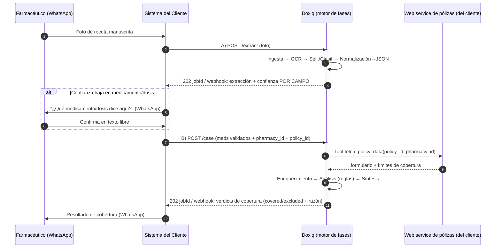
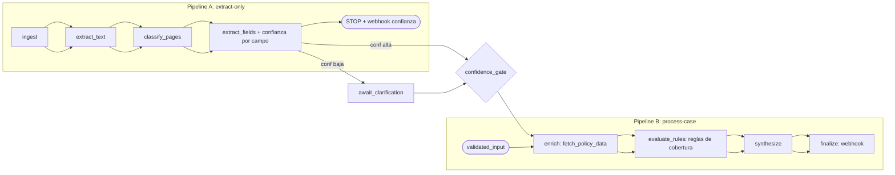

# Re-arquitectura: de "dos tipos de workflow" a FASES componibles

> Propuesta técnica interna · Doxiq (Llamitai) · Borrador para decisión del equipo de ingeniería
> Caso piloto: agregador de seguros que da servicio a farmacias (recetas manuscritas → cobertura por póliza)

---

## 1. Resumen ejecutivo

- **Veredicto: la arquitectura actual modela el caso solo parcialmente.** El *motor* (Temporal) y la *disciplina de artefactos por referencia a S3* ya son correctos, pero la *estructura* —dos tipos de workflow hardcodeados— pelea contra la flexibilidad que este caso (y casos análogos) exigen.
- **Sí existen "dos tipos de workflow" de verdad.** El enum `WorkflowType` (`backend/src/common/domain/enums/workflows.py`) define `STANDARD` vs `ANALYSIS`, y hay además workflows Temporal separados: `DocumentSetProcessingWorkflow`, `DocumentSetFieldReExtractionWorkflow` y `WorkflowAnalysisRunWorkflow`. La extracción es un coroutine lineal hardcodeado (`run_extraction_pipeline` en `backend/src/workflows/presentation/workflows/pipeline.py`).
- **La extracción NO es invocable de forma aislada hoy.** `StartCaseDocumentExtraction` (`backend/src/workflows/application/document_processing/extraction_starter.py`) corre el pipeline completo y solo se consulta por *polling*; no hay modo "extraer y parar" ni respuesta inmediata con confianza.
- **No hay score de confianza por campo persistido.** Solo existe confianza a nivel de `bbox` calculada al vuelo en `webhook_payload.py` (min de bboxes). El `confidence_threshold` del spec `product/specs/extraction/extra-fields.md` está definido pero **no implementado**.
- **La inyección de datos externos a las reglas está rota, no ausente.** El protocolo del evaluador *ya define* un campo `knowledge_context` (`EvalInputs` en `backend/src/workflows/domain/rules/kind_protocol.py`) pensado para llevar datos externos al `evaluate()`. El problema es que **llega vacío en runtime**: `analysis_run_activities.py` lo invoca con `knowledge_context=[]` hardcodeado (línea 230) — confirmado como el gap principal de `product/specs/knowledge-base/rag-flow.md` §4.1 ("el contenido de KB nunca llega a la evaluación de reglas"). Lo que **no existe** es un *Tool registry* de primera clase para *lookups* request-response (llamar al web service del cliente): no hay abstracción de "tool", ni motor de invocación, ni *scoping* de credenciales por tool. Solo existe `ConnectionAccount`, diseñado para `SEND`/`RECEIVE` de orígenes/destinos, no para servicios de consulta.
- **El mercado convergió de forma decisiva en FASES componibles**, no en "tipos de workflow": Hyperscience (Blocks/Flows), Reducto (Parse/Split/Extract/Edit), Nanonets, LlamaCloud, AWS BDA, Azure y Google Document AI modelan el trabajo como un grafo ordenado y ramificable de fases tipadas. La intuición del equipo es correcta.
- **Recomendación:** colapsar los tipos de workflow en **un único motor genérico que ejecuta PIPELINES versionados (definiciones de pipeline como dato)** sobre una librería de fases de primera clase. Los dos puntos de integración (Extract-only y Process-case) se vuelven **dos entradas distintas al mismo grafo**, no dos productos.
- **El HITL por WhatsApp lo opera el CLIENTE, no nosotros.** Doxiq expone confianza por campo + señales `needs_clarification` y un endpoint de re-entrada; no construye una UI de revisión para este tenant (sí queda disponible una fase `Review` interna opcional para otros).
- **Migración de bajo riesgo (strangler-fig):** envolver lo existente como fases sin romper nada, introducir la Tool de póliza, y exponer los 2 endpoints. Sin big-bang.

---

## 2. El caso de uso (farmacia → receta → cobertura)

Una farmacia fotografía una receta **manuscrita** (baja legibilidad) y la envía por WhatsApp a un número operado por el **sistema del cliente** (no nuestro). Doxiq interviene en dos puntos de integración (A: *Extract-only*, B: *Process-case*) y expone una *Tool* que consulta el web service del cliente para traer el formulario/cobertura de la póliza.



Puntos clave del topología de cuatro partes (agregador + farmacia + WhatsApp del cliente + Doxiq):

- **A (Extract-only)** y **B (Process-case)** son **subconjuntos / puntos de entrada distintos de UN solo pipeline**, no dos workflows.
- El **lazo HITL vive en el cliente**: Doxiq emite señales de aclaración; el cliente decide cómo preguntarle al farmacéutico.
- Los **datos validados re-entran por B**, lo que evita re-ejecutar OCR sobre la confirmación (pipeline re-entrante).

---

## 3. Diagnóstico de la arquitectura actual

### 3.1 ¿Existen de verdad "dos tipos de workflow"?

**Sí.** Tres evidencias concretas en el código real:

1. **Enum semántico**: `WorkflowType` (`backend/src/common/domain/enums/workflows.py`) → `STANDARD` (lote, emite webhooks, sin reglas) vs `ANALYSIS` (ligado a `workflow_case_id`, corre reglas, sin webhooks). El `WorkflowDocumentSetDispatcher` (`backend/src/workflows/application/document_sets/dispatcher.py`) valida y rechaza el tipo equivocado en el *dispatch*.
2. **Workflows Temporal separados** (registrados en `run_worker.py`, tres `@workflow.defn` en `presentation/workflows/`): `DocumentSetProcessingWorkflow` (extracción completa), `DocumentSetFieldReExtractionWorkflow` (re-extracción) y `WorkflowAnalysisRunWorkflow` (`analysis_run.py`, análisis). La re-extracción **no es un duplicado completo del pipeline**: su docstring lo dice explícitamente — corre **solo `extract_fields` + `validate_extraction`** sobre un set ya persistido (reusa el OCR/clasificación previos vía S3), no el `ingest → ocr → split → persist → extract → validate` entero. Es un workflow **especializado, escrito a mano y parametrizado en código** en vez de expresado como una *configuración de fases reusable* — lo que refuerza el diagnóstico: las fases son detalle de implementación, no unidades de primera clase reconfigurables.
3. **Pipeline lineal hardcodeado**: `run_extraction_pipeline` en `backend/src/workflows/presentation/workflows/pipeline.py` encadena `extract_text → classify_pages → persist → extract_fields → validate` vía `_invoke_lambda`. No hay registro de fases ni DAG builder.

**Matiz importante (buena noticia):** la pieza ya está latente. `run_extraction_pipeline` se extrajo como coroutine libre *precisamente* para reusarse sin subclasear el workflow. El análisis ya vive aparte (`application/analysis_runs/`, `analysis_run_summary/`) y las reglas ya son plugin-style (`backend/src/workflows/domain/rules/kind_protocol.py`, `WorkflowRuleKind`). Los bloques para fases componibles **existen**; falta formalizarlos.

### 3.2 ¿La extracción es invocable de forma aislada?

**No limpiamente.** `StartCaseDocumentExtraction` (`extraction_starter.py`) corre el pipeline completo (incluido `validate_extraction`), y se consulta por `ExtractionStatusGetter` (polling). **Matiz importante sobre `persist=False`:** ese flag *no* es un modo "parar tras extraer" — solo *gatea las escrituras de checkpoint (PG/Redis) y la emisión de webhooks*, no los pasos de cómputo. El pipeline **igual ejecuta `validate_extraction`** (`pipeline.py` líneas ~351-375): no existe un modo "parar después de `extract_fields`". Es exactamente el punto de integración A que el cliente necesita y hoy no existe como tal.

### 3.3 ¿Hay score de confianza por campo?

**Solo a nivel `bbox`, calculado al vuelo.** `webhook_payload.py` expone `extraction[field].confidence = min(bbox confidences)`. No hay campo `confidence` persistido en `WorkflowDocument`, ni umbral por campo. El `confidence_threshold` de `product/specs/extraction/extra-fields.md` está **especificado pero no cableado**. Para el HITL de farmacia necesitamos `{medication: {value, confidence}}` por campo, no un escalar por documento.

### 3.4 ¿Las reglas pueden leer datos externos (la Tool)?

**Parcialmente — y el matiz es importante para no diagnosticar mal la causa raíz.** Hay que separar dos cosas:

1. **Inyección de contexto al evaluador: la abstracción existe, el flujo está roto.** El protocolo del evaluador (`EvalInputs` en `kind_protocol.py`) ya declara un campo `knowledge_context: list[dict]` diseñado para llevar datos externos al `evaluate()`. Pero en runtime se invoca con `knowledge_context=[]` hardcodeado (`analysis_run_activities.py` línea 230). Por eso una regla hoy **no puede** razonar contra el texto real de la KB — no porque falte la abstracción, sino porque el dato nunca se puebla. Es la brecha 🔴 §4.1 de `product/specs/knowledge-base/rag-flow.md`; **basta poblar el campo** (`rag-flow.md` §5 propone un `RagKBProvider`/`RagflowProvider` para *mejorar* la calidad del retrieval, pero un retrieval naïve ya cerraría el gap básico — no es prerequisito).
2. **Tools de *lookup* request-response: la abstracción NO existe.** No hay registro de Tools, ni motor de invocación, ni *scoping* de credenciales por tool, ni *tool binding* en reglas para llamar al web service del cliente. El módulo `connections/` (`ConnectionAccount` + enums `ConnectionProvider`/`ConnectionCapability` en `backend/src/common/domain/enums/connections.py`) modela **orígenes/destinos** (`RECEIVE`/`SEND`) — no servicios de consulta síncrona. Hoy `WEBHOOK` solo declara `SEND` (`PROVIDER_CAPABILITIES`); `EMAIL`/`WHATSAPP` declaran `RECEIVE`+`SEND` y `DRIVE` solo `RECEIVE`. La capacidad `RECEIVE` **ya existe en el enum**, pero está pensada como *Origin de archivos entrantes*, no como *lookup de salida* request-response.

### 3.5 Tabla: Fortalezas / Brechas para el caso de farmacia

| Dimensión | Fortaleza actual (reusar) | Brecha para este caso (cambiar) |
|---|---|---|
| Orquestación | Temporal: durable, reintentos, replay, idempotencia por `processing_job_id` | Workflows hardcodeados; no hay pausa/resume HITL (`wait_condition` solo para cancel/pause de set) |
| Pipeline | `run_extraction_pipeline` ya extraído como coroutine reusable | No es DAG/pipeline; fases no son unidades de primera clase; re-extracción reconstruida aparte (workflow especializado `extract_fields`+`validate`) en vez de reusada como configuración de fases |
| Extracción aislada | `StartCaseDocumentExtraction` existe | Corre todo; `persist=False` es hack; sin "parar tras extract"; solo polling |
| Confianza | Confianza por `bbox` en `webhook_payload.py` | Sin confianza por campo persistida; `confidence_threshold` solo en spec |
| Reglas | `WorkflowRuleKind` plugin extensible; `EvalInputs.knowledge_context` ya en el protocolo; verdict aggregator desacoplado | KB no inyectada (`knowledge_context=[]` hardcodeado en runtime — el campo existe, el dato no se puebla); sin Tool de *lookup* externo; reglas corren *después* de extracción |
| Datos externos | `ConnectionAccount` + capability system (`SEND`/`RECEIVE`) pluggable | `WEBHOOK` solo `SEND`; las capacidades modelan orígenes/destinos, **no** *lookup* request-response; sin abstracción de Tool, sin motor de invocación ni *scoping* de credenciales por tool |
| Salida estructurada | `SynthesizerAgent` conforma a `output_schema` | El sintetizador recibe `verdict` + `rule_results` (outputs por kind), **no** los documentos extraídos de `WorkflowDocuments` (`_build_user_prompt`). El `input_hash` proyecta solo `(rule_id, kind, output)` y excluye `mapped_extraction` — **deliberado por spec** (`hashing.py` docstring, synthesis §16.6: nunca metadata/reasoning). Trade-off, no bug: si la síntesis debiera variar por contenido del documento, el `input_hash` quedaría incompleto y dos extracciones distintas con mismos veredictos reusarían síntesis stale |
| Webhooks | `WorkflowEvent` + HMAC + reintentos; entrada `source_webhooks` diseñada | El webhook saliente se dispara **solo desde el pipeline de extracción** (`pipeline.py`, gateado por `data.persist`); `WorkflowAnalysisRunWorkflow` (`analysis_run.py`) **no emite webhooks** — confirmado: no llama a `DISPATCH_DOCUMENT_SET_WEBHOOK_ACTIVITY`. Sin `analysis_run.completed` desde ANALYSIS; sin patrón request-response / re-entrada con datos validados |
| Auth B2B | JWT de usuario + middleware multi-tenant | Sin API key M2M tenant-scoped (hoy solo `ADMIN_API_KEY` global) |

---

## 4. Propuesta: arquitectura por FASES componibles

**Patrón:** *Pipes-and-Filters* sobre un **DAG/pipeline tipado**, interpretado por **un único workflow genérico de Temporal**. Cada fase es un *filter* con contrato `PhaseInput → PhaseOutput`; la secuencia es **datos versionados** (una "pipeline"), no código.

### 4.1 Fases de primera clase

| Fase | Responsabilidad | Input → Output | Implementación |
|---|---|---|---|
| `ingest` | Persistir blob en S3, crear `WorkflowDocumentSet` | `{file_ref}` → `{set_id, blob_ref}` | activity |
| `extract_text` | OCR (Textract/DocumentAI) | `{blob_ref}` → `{ocr_ref, legibility_score}` | Lambda activity |
| `classify_pages` | Particionar archivo en N docs lógicos + tipo | `{ocr_ref}` → `{documents[]: {type, page_range, conf}}` | Lambda activity |
| `extract_fields` | Extracción estructurada → JSON con **confianza por campo** | `{documents[], doctype.fields}` → `{fields: {name: {value, confidence}}}` | Lambda activity |
| `await_clarification` | Pausa HITL (opcional, gated por confianza) | `{low_conf_fields[]}` → `{validated_fields[]}` | signal + `wait_condition` + timer |
| `enrich` | Fetch externo (póliza/formulario) vía Tool | `{policy_id, pharmacy_id}` → `{policy_snapshot}` | activity (conector) |
| `evaluate_rules` | Reglas sobre (caso + snapshot externo) | `{documents[], policy_snapshot, rules}` → `{verdicts[], signals}` | fan-out activities |
| `synthesize` | Resultado final conforme a `output_schema` | `{documents[], verdicts[]}` → `{output_json}` | activity (LLM) |
| `finalize` | Webhooks, status, eventos | `{output_json}` → `{}` | activity |

Cada fase: **(1)** declara input/output schema (tipado → fases incompatibles no se pueden cablear); **(2)** es una Temporal activity reintentable; **(3)** emite los eventos estándar `document_set.*`; **(4)** es versionable y cacheable (registro de completitud + *skip-if-done*); **(5)** opcionalmente pausable para HITL.

### 4.2 El DAG y cómo reemplaza "dos tipos de workflow"



Un "tipo de workflow" se vuelve simplemente **un pipeline guardado** (un subconjunto ordenado de fases). El motor genérico itera `for phase in pipeline.phases: await execute_phase(phase, state)`. Ya no hay clases `@workflow.defn` por tipo: hay **una** y muchos pipelines.

> **Tres mecanismos de "gate" distintos (no confundir):** (1) `confidence_gate` — umbral *por campo*; solo etiqueta `needsClarification`, nunca falla el run (farmacia). (2) `await_documents` — espera de *completitud* del caso (capacidad de plataforma; ningún caso actual la usa como gate). (3) `when:` — predicado condicional *a nivel de fase* para saltarla (Circulares salta `enrich` si el juez se leyó bien). Comparten la idea de "decidir el siguiente paso", pero son fases/params distintos — no colapsar los nombres.

### 4.3 Ejemplo de pipeline (caso farmacia)

> **Nota:** estos archivos YAML, el `confidence_gate`, el intérprete de pipelines y el `tool:` de fase **no existen aún en el código** — son el DSL *propuesto* para componer fases y representan la arquitectura objetivo, no artefactos actuales. Los pipelines son **datos versionados** (no código): es lo que reemplaza las clases `@workflow.defn` por tipo.

```yaml
# pipelines/pharmacy_extract_only.yaml  (Endpoint A)
pipeline: pharmacy_extract_only
version: 3
entry: ingest
phases:
  - id: ingest
  - id: extract_text
  - id: classify_pages
  - id: extract_fields
    params: { doctype: "receta_manuscrita", emit_field_confidence: true }
  - id: confidence_gate
    params:
      thresholds: { medication: 0.85, dose: 0.90, default: 0.75 }
      on_low: emit_needs_clarification   # NO pausa: devuelve señales al cliente
  - id: finalize
    params: { webhook_event: "document.extracted" }
```

```yaml
# pipelines/pharmacy_process_case.yaml  (Endpoint B)
pipeline: pharmacy_process_case
version: 3
entry: enrich          # re-entra después de la validación del farmacéutico
phases:
  - id: enrich
    tool: fetch_policy_data
    params: { cache_ttl: "15m", timeout_ms: 8000, on_timeout: serve_stale }
  - id: evaluate_rules
    params: { rule_set: "coverage_rules", context: ["policy_snapshot"] }
  - id: synthesize
    params: { output_schema: "coverage_verdict_v2" }
  - id: finalize
    params: { webhook_event: "analysis_run.completed" }
```

### 4.4 Mapeo a Temporal

- **Fase = activity** (o grupo de activities con fan-out, como `evaluate_rules` hoy). El cuerpo del workflow (interpretar el pipeline) es determinista; el I/O vive en activities — igual que `invoke_lambda` hoy.
- **HITL = signal + `wait_condition(timeout)`**. `await_clarification` bloquea sin consumir cómputo, sobrevive caídas días, y se reanuda con un `Signal` que entrega... el **Endpoint B** (re-entrada con datos validados). Patrón "pause-on-token, resume-via-API", idéntico a los task tokens de AWS Step Functions.
- **Blobs fuera del estado**: pasar refs de S3 entre fases (límite 2 MiB / `TMPRL1103`), ya es disciplina del proyecto — bakearla en el contrato de fase.
- **Versionado y determinismo (mecanismo concreto):** el cuerpo del workflow interpreta `pipeline.phases` de forma determinista, pero **un cambio de schema de pipeline no puede mutar un run en vuelo** (rompería el replay determinista de Temporal). Mecanismo: (a) **sellar `pipeline_id + pipeline_version` en el input del workflow** al arrancar — el run siempre reproduce el pipeline con la que inició, no la versión "actual" del catálogo; (b) cambios de pipeline = **pipeline nuevo versionada** (pipelines son inmutables append-only), nunca edición in-place; (c) si la *lógica de interpretación* del intérprete cambia de forma incompatible, **Build IDs / Worker Versioning** de Temporal pinnea cada run a su Worker. Pipelines-como-dato hacen esto más barato que `workflow.patched()` por rama de código: el grafo es dato versionado, no `if` sembrados en el workflow.
- **Provenance (concepto de Dagster)**: tratar cada output de fase como un *asset* versionado (hash de `code_version` + `input_data_version`) → linaje gratis ("qué texto OCR + qué snapshot de formulario produjo este verdict") y re-run por fase. Generaliza el `re_extractor` actual a cualquier fase. Spec concreto pendiente (→ M6): qué campos entran al hash, cómo se persiste el metadato de linaje (tabla `phase_runs` con `phase_id, pipeline_version, input_hash, output_ref`) y el criterio de disparo de re-run (input cambió / code_version cambió).

---

## 5. Los dos endpoints / puntos de integración

### 5.1 Auth y scoping

- **API key M2M tenant-scoped** (no JWT de usuario) — **trabajo nuevo, no cableado**. Verificado: `backend/src/common/infrastructure/dependencies/api_keys.py` hoy solo tiene `get_admin_api_key`, que compara `X-API-Key` contra un único `settings.ADMIN_API_KEY` global (no hay claves por tenant, ni emisión, ni *scoping*). Hay que añadir: emisión de claves por tenant, almacenamiento/hash, resolución a `tenant_id` y la dependencia FastAPI que conviva con el JWT de usuario.
- **`pharmacy_id` es un *passthrough* puro, NO una entidad nuestra.** Está al mismo nivel que `policy_id`: ambos viajan en el body de `POST /case` y se reenvían tal cual a la Tool `fetch_policy_data` (es la aseguradora quien sabe qué significan). Doxiq **no lo persiste como entidad, no lo modela como subtenant/dimensión, y no afecta scoping ni metría** — el único principal es el `tenant` (el agregador), identificado por la API key. El único lugar donde `pharmacy_id` "vive" es como parte de la clave de caché del `PolicySnapshot` (porque el formulario puede diferir por farmacia), que es caché efímera, no gestión de farmacias.
- **Idempotencia**: header `Idempotency-Key` por submission (patrón ya usado en `source_webhook_deliveries`).
- Auth **por fase/pipeline**, no por workflow (los dos puntos tienen perfiles PHI/scope distintos — cf. Da Vinci: acceso autenticado member-scoped vs formulario público).

### 5.2 Endpoint A — Extract-only

```http
POST /v1/extract
X-Api-Key: dxk_...
Idempotency-Key: 7f3c...
Content-Type: multipart/form-data        # imagen directa (intake estilo WhatsApp)

{ pipeline: "pharmacy_extract_only", file: <bytes> }        # A no necesita pharmacy_id ni policy_id
```

```jsonc
// 202 → webhook "document.extracted"
{
  "jobId": "job_abc",
  "status": "partial",
  "documents": [{
    "documentType": "receta_manuscrita",
    "pageRange": [1, 1],
    "fields": {
      "medications": [
        { "value": "Amoxicilina 500mg", "confidence": 0.94, "bbox": [...] },
        { "value": "Loratadina ?",      "confidence": 0.61, "bbox": [...],
          "needsClarification": true, "clarify": "Medicamento ilegible (línea 2)" }
      ]
    }
  }],
  "legibilityScore": 0.72,
  "overallConfidence": 0.78
}
```

### 5.3 Endpoint B — Process-case

```http
POST /v1/case
X-Api-Key: dxk_...
Idempotency-Key: 9a1b...

{
  "pipeline": "pharmacy_process_case",
  "policyId": "POL-456",
  "pharmacyId": "PH-123",          // mismo nivel que policyId; solo se reenvía a la Tool
  "validatedMedications": [
    { "name": "Amoxicilina 500mg", "dose": "1 c/8h", "localCode": "MED-001" },
    { "name": "Loratadina 10mg",   "dose": "1 c/24h", "localCode": "MED-777" }
  ]
}
```

```jsonc
// 202 → webhook "analysis_run.completed" — verdict como JOIN (drug × policy), no booleano suelto
{
  "jobId": "job_def",
  "coverageVerdicts": [
    { "drug": { "name": "Amoxicilina 500mg", "localCode": "MED-001", "rxnorm": "..." },
      "covered": true,  "tier": 1, "priorAuthRequired": false,
      "quantityLimit": false, "reasonCode": "COVERED", "reasonText": "En formulario tier 1" },
    { "drug": { "name": "Loratadina 10mg", "localCode": "MED-777" },
      "covered": false, "tier": null, "priorAuthRequired": false,
      "reasonCode": "NOT_IN_FORMULARY", "reasonText": "No cubierto por POL-456" }
  ],
  "policySnapshotRef": "s3://.../formulary_POL-456_v12.json"
}
```

El verdict sigue el modelo **FormularyItem** de HL7 Da Vinci (`(drug × policy) → {tier, priorAuth, stepTherapy, quantityLimit, covered, reasonCode}`): el mismo medicamento puede estar cubierto bajo una póliza y excluido bajo otra — por eso el verdict es un *join*, no un flag en el medicamento. Las **razones son códigos enumerados** (cf. NCPDP reject 70 "not covered" / 75 "PA required", X12 271 AAA codes), no prosa.

> **Es un esquema de salida nuevo.** Hoy `VerdictAggregator` (`backend/src/workflows/application/analysis_run_summary/verdict_aggregator.py`) agrega `signals` + `WorkflowRuleResult` en **un `WorkflowAnalysisRunSummary` a nivel de run** (un veredicto PASS/FAIL/REVIEW + `output` conforme a `output_schema`), **no** una matriz `(drug × policy)`. El `coverageVerdicts[]` de arriba es un `output_schema` nuevo (`coverage_verdict_v2`): la fase `evaluate_rules` debe emitir un resultado por medicamento y `synthesize` proyectarlo al join. No sale del agregador actual sin trabajo de mapeo.

---

## 6. La Tool de póliza (conector externo de salida)

El requisito "dado `policy_id + pharmacy_id`, llamar al web service del cliente para traer formulario/cobertura" se modela como una **Tool tipada, registrada y reutilizable**, consumida por la fase `enrich` y referenciable desde reglas.

### 6.1 Registro y autenticación (reusar/extender `connections/`)

- **Nivel: organization, no workflow (recomendado).** La `ToolDefinition` vive en el **registro de la org**, igual que `ConnectionAccount` (es `tenant_id` sin `workflow_id`) y que `DocumentType.is_shareable`: una integración como `fetch_policy_data` se registra **una vez** y cada **pipeline la referencia/bindea**. El secreto es org-level (rotación, allowlist SSRF y auditoría en un solo lugar); el workflow solo declara *qué* tool usa, el mapeo de args (desde `@case`) y overrides no-secretos (`timeout`, `cache_ttl`), más un **scope de uso** (qué workflows pueden invocarla). Definirla por-workflow duplicaría secretos y perdería el reuso entre pipelines (cobertura, siniestros, elegibilidad). Es el mismo patrón "definir reusable en la org, bindear en el workflow" que ya usan `connections/` y la biblioteca de document types.
- `ConnectionCapability` ya tiene `RECEIVE` y `SEND`, pero **ninguno modela un *lookup* request-response**: `RECEIVE` = Origin de archivos entrantes, `SEND` = Destination de resultados salientes (`PROVIDER_CAPABILITIES`). Una Tool de consulta es una **tercera dirección**: *nosotros* llamamos al web service del cliente y esperamos respuesta síncrona. Hay que añadir capacidad/proveedor `LOOKUP` (o equivalente) explícito.
- **Dirección de credenciales — aclarar antes de M3.** `ConnectionAccount` (`backend/src/connections/domain/models/connection_account.py`) ya es el holder de credenciales **por tenant** (config + secret), pero hoy se usa para **salida `SEND` (webhooks que *nosotros* POSTeamos)**. Para una Tool de *lookup* la semántica es distinta: *nosotros* somos el cliente HTTP que llama al endpoint del tercero. La decisión abierta es si **reusamos `ConnectionAccount` para ambas direcciones** (un mismo registro de credenciales sirviendo SEND y LOOKUP) o **modelamos credenciales por-tool**. El diseño actual solo contempla salida `SEND`; el modelo de almacenamiento debe cubrir explícitamente el caso *llamada saliente de consulta*.
- Definición de Tool al estilo **MCP** (forma, no necesariamente el wire protocol): `{ name, description, input_schema (JSON-Schema), output_schema, connection_account_id }`. Adoptar la *forma* MCP futureproof-ea el registro aunque no hablemos el protocolo.

```jsonc
// Tool: fetch_policy_data
{
  "name": "fetch_policy_data",
  "connectionAccountId": "conn_clientX",
  "inputSchema":  { "policyId": "string", "pharmacyId": "string" },
  "outputSchema": { "formulary": "FormularyItem[]", "coverageLimits": "object" },
  "transport": { "method": "POST", "auth": "oauth2|api_key", "timeoutMs": 8000 }
}
```

### 6.2 Invocación: separar RAZONAMIENTO de EJECUCIÓN

- La **fase/regla decide** *qué* tool y *con qué args*; un **conector determinista ejecuta** la llamada HTTP, dueño de credenciales por tenant, rate limits, paginación y reintentos — **todo fuera del LLM** (lección de Truto: meter un 401/429 al modelo lo hace alucinar/loopear).
- Referenciable desde reglas vía un **nuevo prefijo de token** o *tool binding*, p.ej. `@tool.fetch_policy_data(@policy_id, @pharmacy_id)`, conviviendo con los tres prefijos disjuntos actuales (`@slug.path` = caso, `#kb_slug` = KB, `{{system_var}}` = runtime). La regla nunca llama al tercero directo. **La sintaxis exacta de tokenización es decisión abierta (§11.3) y debe congelarse *antes* de implementar M3** — la fase `enrich` puede invocar tools por pipeline sin esperar a esto, pero la *referencia desde reglas* depende de fijar el prefijo/binding.

### 6.3 Timeouts, caché, idempotencia, fallos

- **Es un READ idempotente** → cachear agresivo: clave versionada `(policy_id, pharmacy_id, formulary_version)`, *freshness window* (p.ej. 15 min), **snapshot** del formulario al momento de decisión (reproducibilidad/auditoría).
- **Timeout + fallback** estilo RTPB (<5-10 s SLA): en timeout, servir snapshot stale (no *hard-fail*) y marcar `degraded` en el verdict.
- **Circuit breaker**: abrir tras un umbral explícito (p.ej. >N fallos / 5xx-timeouts en una ventana T, parametrizable por tool), servir caché/aprox mientras está abierto, *half-open* probe para cerrar. El trigger es config, no constante mágica.
- **Reintentos**: backoff exponencial + jitter (solo para reads idempotentes), `start_to_close` timeout, idempotency key — el mismo patrón que `invoke_lambda` ya usa. **Infra nueva a construir:** el `DEFAULT_RETRY_POLICY` actual de Temporal (≈2 intentos) **no** incluye TTL de caché, *serve-stale*, ni circuit breaker; la lógica `cache_ttl: 15m`/`on_timeout: serve_stale` de el pipeline exige una capa de caché versionada (snapshot por `(policy_id, pharmacy_id, formulary_version)`) y un wrapper de conector que la implemente — no sale gratis del retry policy de la activity.

---

## 7. Confianza y Human-in-the-Loop

### 7.1 Modelo de confianza

- **Por campo / por medicamento, no por documento.** Cada `{medication: {value, confidence}}` y `{dose: {value, confidence}}`. Persistir confianza en `WorkflowDocument` (hoy solo se calcula al vuelo) para poder consultar "qué docs tuvieron <0.8".
- **Dos señales distintas** (cf. Veryfi `ocr_score` vs `score`): `legibilityScore` (OCR/manuscrito) y `fieldConfidence` (certeza semántica del campo). Son fallos diferentes: ilegible → re-fotografiar; campo incierto → confirmar con farmacéutico.
- **Umbrales = política declarativa** sobre la fase `gate`, fijados por **costo del error** (dosis errónea ≫ nombre erróneo), no una sola cifra global. Es exactamente el modelo de **activation conditions** de AWS A2I (confidence-in-range, key-missing, sampling) y de los **per-field thresholds** de Azure (0.80 straight-through). El *trigger* es **dato declarativo**, no código.
- **Grounding por recuperación para manuscrito** (RxLens, +19-40% Recall@3): no perseguir un OCR perfecto; re-rankear los nombres extraídos contra el formulario del cliente (la misma Tool), convirtiendo transcripción abierta en *matching* de conjunto cerrado.

### 7.2 El lazo HITL (operado por el cliente)

La fase `extract_fields` produce `needs_clarification` por campo. El **gate** decide: confianza alta → straight-through; baja → emite señales. **El gate no falla el run** por baja confianza: a diferencia de `validate_extraction` (que siempre corre y puede marcar errores), el `confidence_gate` evalúa **por campo contra su umbral** y solo *etiqueta* los campos bajo umbral con `needsClarification` — campos no críticos por debajo del umbral no detienen el run, solo se reportan. La criticidad es declarativa (umbral por campo: `dose: 0.90` ≫ `default: 0.75`), así un campo accesorio ilegible no bloquea un pipeline cuyos campos críticos pasaron. Como el cliente es dueño de WhatsApp:

1. Endpoint A devuelve los campos de baja confianza con `needsClarification` + `clarify`.
2. El **sistema del cliente** le pregunta al farmacéutico por WhatsApp (Doxiq **no** construye bot ni UI de revisión para este tenant).
3. El farmacéutico confirma en texto libre.
4. Los datos validados **re-entran por el Endpoint B** (entrada en `enrich`/`evaluate_rules`), sin re-correr OCR.

Esto es el patrón de **AWS Textract + A2I** (extractor emite confianza; un *sink* externo —aquí WhatsApp del cliente— posee el lazo) y refleja que **Google deprecó su HITL gestionado (ene 2025)** y lo empujó a partners: poseer una fuerza de revisión es la inversión equivocada para nuestro caso. Internamente queda disponible una fase `Review` insertable para tenants que sí quieran que Doxiq posea la revisión.

> Captura de correcciones: persistir cada corrección como `(field, ocr_guess, human_value, confidence)` por tenant — un log de *active learning* que construye un léxico de abreviaturas/manuscrito específico del cliente, aunque el reentrenamiento se difiera. **No existe hoy:** no hay mecanismo que capture tuplas `(campo, lectura OCR, valor humano)`; requiere diseñar una entidad/tabla nueva de historial de correcciones y un flujo de re-entrada (Endpoint B) que las registre. Es trabajo nuevo, no un *hook* sobre algo existente.

---

## 8. Generalización a otros casos

La misma arquitectura por fases habilita casos análogos cambiando **solo el pipeline y las tools** — no el motor:

| Caso | Pipeline (fases) | Tool externa | Confianza/HITL |
|---|---|---|---|
| **Facturas → aprobación AP** | ingest → ocr → split → extract_fields → enrich(`fetch_vendor_master`) → evaluate_rules(3-way match) → synthesize | lookup de PO/proveedor en ERP | revisión de campos <umbral antes de aprobar |
| **KYC / onboarding** | ingest → ocr → classify(doc tipo ID) → extract_fields → enrich(`sanctions_check`, `address_verify`) → evaluate_rules(reglas AML) → finalize | listas de sanciones, verificación de domicilio | dudas de identidad → revisión manual |
| **Siniestros (insurance claims)** | ingest → ocr → split → extract_fields → enrich(`policy_terms`) → evaluate_rules(elegibilidad) → synthesize(monto) → finalize | términos de póliza del aseguradora | montos altos / baja confianza → ajustador humano |
| **Contratos → extracción de cláusulas** | ingest → ocr → split(por cláusula) → extract_fields → evaluate_rules(reglas de riesgo) → synthesize(resumen) | (opcional) base de cláusulas estándar | cláusulas ambiguas → revisión legal |
| **Pipelines → adherencia/interacciones** | ingest → ocr → extract_fields → enrich(`drug_db`) → evaluate_rules(interacciones) → finalize | base de fármacos/ATC | interacción detectada → alerta |

El patrón es uniforme: **una librería de fases compartida + pipelines por caso + tools registradas por tenant**. Casos nuevos = nuevo pipeline, sin clases de workflow nuevas.

---

## 9. Benchmarking

| Plataforma | Fases componibles | Confianza + HITL | Tools externas | Durabilidad/orquestación |
|---|---|---|---|---|
| **Doxiq (hoy)** | ❌ 2 tipos hardcodeados; pipeline lineal | ⚠️ confianza solo por bbox; sin HITL | ❌ reglas sin acceso externo | ✅ Temporal (durable, replay) |
| **Doxiq (propuesto)** | ✅ pipelines configurables sobre 1 motor | ✅ por campo + gate declarativo | ✅ Tool registry por tenant | ✅ Temporal + signals (pause/resume) |
| **Hyperscience** | ✅ Blocks/Flows + Code Blocks | ✅ HITL como Block condicional | ✅ Code Block llama 3rd-party/DB | ✅ workflow engine propio |
| **Reducto** | ✅ Parse/Split/Extract/Edit por endpoint | ⚠️ confianza por fase; HITL del caller | ❌ lo orquesta el caller | ⚠️ chaining por job-id (caller) |
| **Nanonets** | ✅ data-action/review/export blocks | ✅ review stages multi-etapa | ✅ look-up blocks + Python | ⚠️ no durable-execution explícito |
| **Rossum (Aurora)** | ⚠️ fases fusionadas en 1 plataforma | ✅ validación inline por confianza | ✅ cross-valida vs ERP/3rd-party | ✅ managed workflow |
| **Azure Doc AI** | ✅ classify → extract (routing) | ✅ confianza por campo/word; threshold | ⚠️ caller | ✅ managed |
| **AWS Textract + A2I** | ⚠️ extractor + A2I desacoplados | ✅ activation conditions declarativas | ⚠️ caller | ⚠️ A2I como servicio aparte |
| **Google Document AI** | ✅ processors (OCR/split/extract) | ⚠️ HITL **deprecado** (ene 2025) | ⚠️ caller | ✅ managed |
| **LlamaCloud** | ✅ 6 productos componibles | ⚠️ confianza expuesta; HITL del caller | ❌ caller | ⚠️ no durable-execution |
| **AWS BDA** | ✅ split→classify→extract→normalize→validate | ✅ confianza+bbox; A2I opcional | ⚠️ caller | ✅ managed |

**Fuentes** (selección, ver findings para lista completa): Hyperscience Flows SDK; Reducto Split docs (`jobid://` chaining, conf por split); AWS A2I activation conditions (confidence-in-range / key-missing / sampling); Azure Doc AI composed-models (classification→routing, threshold 0.80); Google Document AI HITL (deprecación ene 2025 → partners); HL7 Da Vinci PDex US Drug Formulary IG (FormularyItem como join drug×policy); NCPDP RTPB / X12 270-271 (reason codes, SLA+fallback); Temporal (signals/`wait_condition`/Worker Versioning); RxLens NAACL 2025 (grounding por recuperación en manuscrito).

---

## 10. Plan de migración incremental (strangler-fig)

Sin big-bang. Cada paso es independiente y no rompe lo actual.

| Fase | Entregable | No rompe porque... | Riesgo / mitigación |
|---|---|---|---|
| **M0** | Extraer un `PhaseExecutor` + contrato `PhaseInput/Output` y un **motor intérprete de pipelines** que, de momento, ejecute UN pipeline equivalente al `run_extraction_pipeline` actual | El pipeline produce la misma secuencia y los mismos eventos `document_set.*` | Divergencia de comportamiento → tests de equivalencia (golden runs) contra el pipeline viejo |
| **M1** | Envolver cada `_invoke_lambda` como **fase tipada** (`extract_text`, `classify_pages`, `extract_fields`, `validate`). Eliminar el pipeline duplicado de `document_set_re_extraction.py` haciéndolo un pipeline (subset de fases) | Mismo Lambda, mismo orden; re-extracción pasa a ser pipeline | Determinismo Temporal → mantener cuerpo del workflow puro; Worker Versioning |
| **M2** | **Confianza por campo** persistida en `WorkflowDocument` (hoy `webhook_payload.py` solo la calcula al vuelo desde bboxes; `confidence_threshold` de `extra-fields.md` está **especificado pero no cableado**) + fase `gate` declarativa | Campo nuevo aditivo; gate por defecto = passthrough | Calibración en manuscrito incierta → umbrales empíricos sobre data real, empezar conservador. **Interacción con re-extracción:** si la re-extracción (hoy `DocumentSetFieldReExtractionWorkflow`) actualiza documentos in-place, debe **recalcular y re-persistir** la confianza por campo y el payload del webhook debe reflejar los nuevos scores — no servir los del run original |
| **M3** | **Tool registry**: extender `connections/` con capability `LOOKUP` + conector HTTP determinista + fase `enrich`; Tool `fetch_policy_data` | Aditivo; ningún workflow existente la usa hasta referenciarla | Multi-tenant creds/SSRF → **el SSRF de una Tool es distinto del de `source_webhooks`**: aquél valida URLs de webhook provistas por el operador (que *no* deben apuntar a IPs privadas); aquí el riesgo es que el evaluador/regla dispare llamadas a URLs arbitrarias desde el contexto del worker. Patrón de guarda potencialmente distinto (allowlist de hosts por `ConnectionAccount`, no solo bloqueo de rango privado); secret por `ConnectionAccount` |
| **M4** | **Endpoints A y B** + API key M2M tenant-scoped; A = pipeline `extract_only`, B = pipeline `process_case` (entrada en `enrich`, con `policyId`/`pharmacyId` como datos del body que se reenvían a la Tool) | Endpoints nuevos; UI sigue con JWT | Doble auth → soportar JWT (UI) y API key (M2M) en las dependencias |
| **M5** | **HITL re-entrante**: gate emite `needs_clarification`; B re-entra con datos validados; (opcional) fase `await_clarification` con signal+timeout para tenants end-to-end. Fijar constantes: timeout por defecto (p.ej. **7 días**), convención de nombre de señal (`workflow_field_clarified_<field_id>`), max reintentos de aclaración | El lazo lo opera el cliente; pausa solo si se inserta la fase | Casos colgados → timer durable + escalación/SLA |
| **M6** | **Síntesis con acceso a documentos** (pasar `mapped_extraction` al `SynthesizerInput`) + **decidir si el `input_hash` debe variar por contenido de documento** (hoy excluye `mapped_extraction` *por diseño* — `hashing.py`/§16.6); provenance/versionado de fases | Mejora salida sin cambiar API | Cache invalidation: si se amplía el `input_hash`, **invalida la caché de síntesis existente** → versionar claves y monitorear hit-rate. Decidir scope de síntesis antes de tocarlo (es trade-off de caché, no bug suelto) |

**Principio rector:** mover de "workflow fijo por tipo de caso" a "**fases componibles + fuentes de datos pluggables (conectores)**". El mismo motor sirve a la UI (ANALYSIS: extract+evaluate_rules) y a clientes B2B (API key: extract-only o extract+coverage).

---

## 11. Decisiones abiertas (candidatas a ADR)

1. **¿DAG completo o secuencia lineal con ramas? — PARCIALMENTE RESUELTO.** Secuencia lineal + un predicado condicional `when:` por fase **alcanza para los 3 casos conocidos** (Circulares lo prueba: su `enrich` corre solo `when: juez_nombre.confidence < 0.80`). Un DAG con dependencias y paralelismo real entre fases queda **diferido** hasta que un caso lo exija. (ADR: *pipeline schema*).
2. **¿Dónde vive la definición de pipeline?** ¿En el modelo `Workflow` (JSONB `phase_sequence`), en archivos versionados en repo, o ambos (repo = catálogo, DB = binding por tenant)? Impacta versionado y Worker Versioning.
3. **¿Sintaxis de Tool en reglas?** ¿Nuevo prefijo de token `@tool.x(...)` o *binding* declarativo a nivel de regla/fase? Convivencia con `@slug`, `#kb`, `{{system}}`.
4. **¿Caché de formulario: dónde y TTL?** Snapshot por `(policy_id, pharmacy_id, formulary_version)` — `pharmacy_id` aquí es solo un componente de la clave de caché (passthrough), no una entidad. ¿S3 + tabla de índice? ¿TTL fijo o por header del cliente? ¿Política de fallback (stale) auditable?
5. **¿Identidad de fármaco?** RxNorm (concepto), NDC (producto), **ATC** (LATAM/no-US) + código local del cliente. ¿Normalizamos a un canónico o pasamos el código local del cliente *as-is* al verdict?
6. **¿Confianza: del LLM o calculada?** La confianza OCR no es certeza semántica. ¿Adoptamos LLM auto-evaluator (RxLens), ensemble/consenso, o cross-check contra formulario? Necesita harness de evaluación sobre manuscrito en español.
7. **¿Esquemas versionados + eval harness?** Pipelines, document types y schemas de póliza derivarán. ¿Adoptamos versionado de esquema + eval sets (Extend) como capacidad de plataforma antes de escalar?
8. **¿Webhooks en ambos modos? — RESUELTO (sí).** Se desacopla el dispatcher para que **cualquier pipeline** (incl. ANALYSIS/cobertura) emita el webhook `analysis_run.completed` (con el `output_schema` de cada caso como payload — W1), no solo extracción. Verificado el estado actual: hoy solo `pipeline.py` (gateado por `data.persist`) dispara `DISPATCH_DOCUMENT_SET_WEBHOOK_ACTIVITY` y `analysis_run.py` **no** — el trabajo es desacoplar el dispatch. Los Endpoints B y los dos casos de banco dependen de esto.
9. **¿Validar el contrato A/B/C con el cliente real?** Ningún referente público describe esta topología de cuatro partes (agregador + farmacia + WhatsApp del cliente + Doxiq). Validar shapes contra el contrato de integración real antes de congelar.
