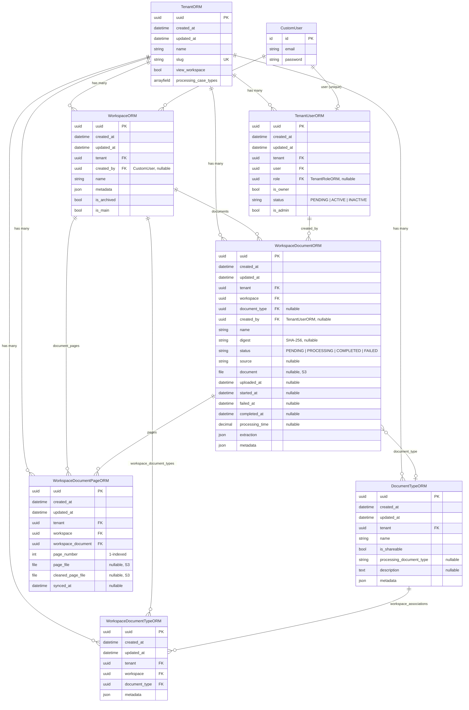

# Workspace ERD - Modelos relacionados a WorkspaceORM

## Resumen de relaciones

| Tabla origen | Tabla destino | Tipo | Campo FK | on_delete |
|---|---|---|---|---|
| `WorkspaceORM` | `TenantORM` | Many-to-One | `tenant` | CASCADE |
| `WorkspaceORM` | `CustomUser` | Many-to-One | `created_by` | SET_NULL |
| `WorkspaceDocumentORM` | `WorkspaceORM` | Many-to-One | `workspace` | CASCADE |
| `WorkspaceDocumentORM` | `DocumentTypeORM` | Many-to-One | `document_type` | SET_NULL |
| `WorkspaceDocumentORM` | `TenantUserORM` | Many-to-One | `created_by` | SET_NULL |
| `WorkspaceDocumentORM` | `TenantORM` | Many-to-One | `tenant` | CASCADE |
| `WorkspaceDocumentPageORM` | `WorkspaceORM` | Many-to-One | `workspace` | CASCADE |
| `WorkspaceDocumentPageORM` | `WorkspaceDocumentORM` | Many-to-One | `workspace_document` | CASCADE |
| `WorkspaceDocumentPageORM` | `TenantORM` | Many-to-One | `tenant` | CASCADE |
| `WorkspaceDocumentTypeORM` | `WorkspaceORM` | Many-to-One | `workspace` | CASCADE |
| `WorkspaceDocumentTypeORM` | `DocumentTypeORM` | Many-to-One | `document_type` | CASCADE |
| `WorkspaceDocumentTypeORM` | `TenantORM` | Many-to-One | `tenant` | CASCADE |

## Tablas de DB

| Modelo | `db_table` |
|---|---|
| `TenantORM` | `tenants` |
| `TenantUserORM` | `tenant_users` |
| `DocumentTypeORM` | `document_types` |
| `WorkspaceORM` | `workspaces` |
| `WorkspaceDocumentORM` | `workspace_documents` |
| `WorkspaceDocumentPageORM` | `workspace_document_pages` |
| `WorkspaceDocumentTypeORM` | `workspaces_document_types` |

## Constraints e Indexes

- **`WorkspaceDocumentPageORM`**: `UNIQUE(workspace_document, page_number)`
- **`TenantUserORM`**: `UNIQUE(user)`, `UNIQUE(user, tenant)`
- **`WorkspaceORM`**: Index en `(tenant, is_archived, -created_at)`
- **`WorkspaceDocumentORM`**: Index en `(workspace, status, -uploaded_at)` y `(tenant, workspace, -uploaded_at)`
- **`WorkspaceDocumentORM`**: ordering por `-uploaded_at`
- **`WorkspaceDocumentPageORM`**: ordering por `(workspace_document, page_number)`

## Notas para migrar

- Todos los modelos usan **UUID como PK** (no auto-increment)
- Todos tienen `created_at` (auto_now_add) y `updated_at` (auto_now)
- Todos los modelos del workspace tienen FK redundante a `tenant` (desnormalizado para queries directas)
- Archivos (`document`, `page_file`, `cleaned_page_file`) se almacenan en **S3** con paths como: `workspaces/ws_{uuid}/documents/...`
- `WorkspaceDocumentTypeORM` actua como tabla intermedia (M2M manual) entre Workspace y DocumentType
- `digest` en WorkspaceDocumentORM es SHA-256 para deduplicacion de archivos
- `extraction` es un JSONField que guarda datos estructurados del procesamiento