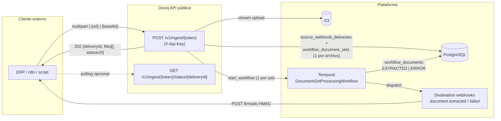
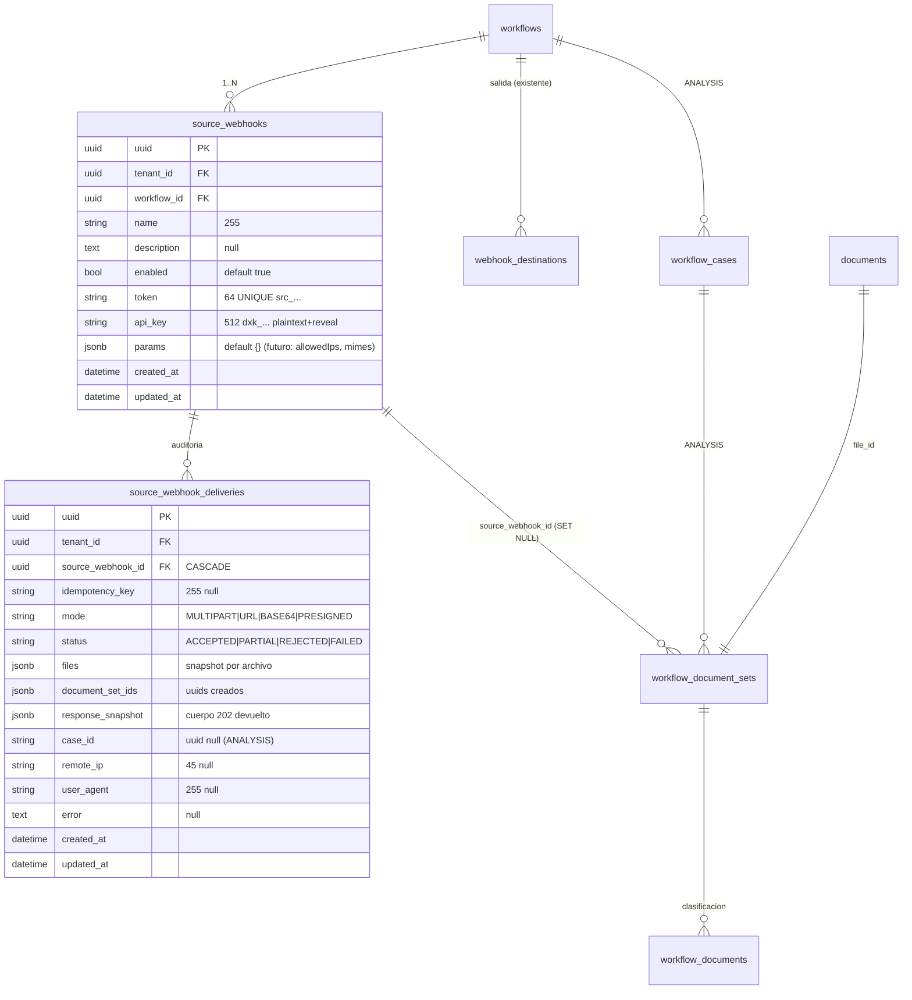
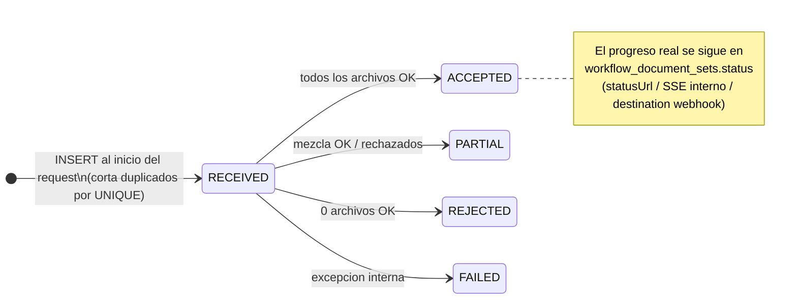
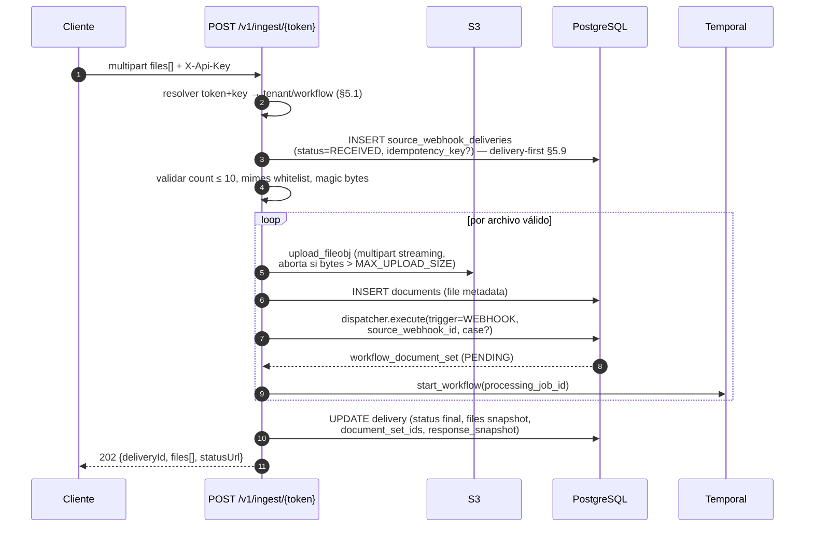
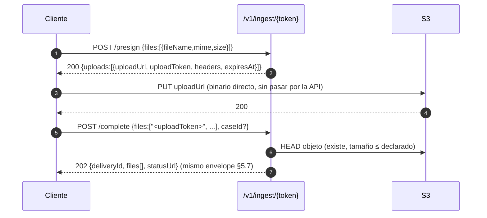
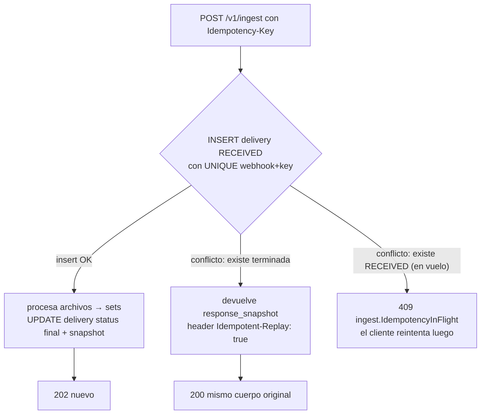
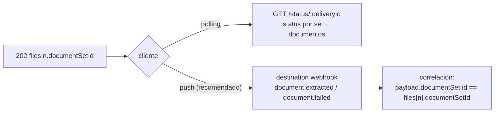
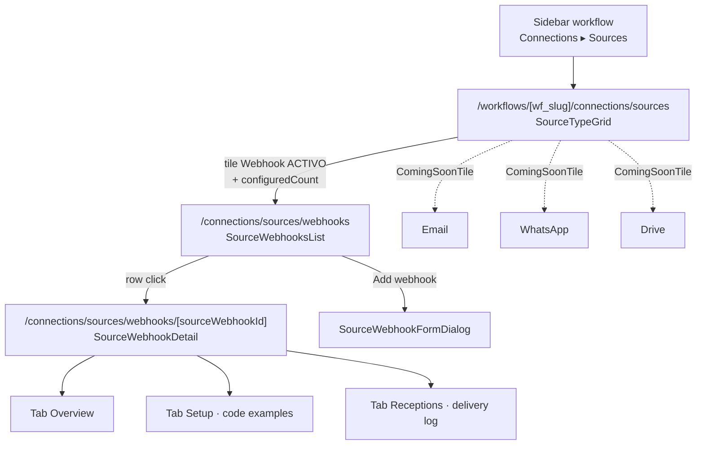

# Spec: Webhooks de entrada (`source_webhooks`)

> Estado: **diseño cerrado** (decisiones §3, todas resueltas con el usuario o de autor; abiertas en §3.4).
> Hermano de entrada del spec `product/specs/source-webhooks/standard-webhooks.md` (webhooks de salida) y pieza
> de la mitad **Orígenes** del spec `product/specs/connections/spec.md`.
> Versión HTML navegable: `product/specs/source-webhooks/_archive/spec.html`.

---

## 1. Objetivo

Permitir que **sistemas externos empujen documentos** a un workflow de Doxiq vía HTTP
(estilo *inbound webhook* de n8n): cada workflow expone una **URL de ingesta dedicada**
protegida por **API key**, capaz de recibir los documentos como **binario (multipart)**,
como **URL pública descargable**, o como **base64**, y un flujo **presign de dos pasos**
para archivos muy grandes.

Al recibir archivos válidos, la plataforma:

1. Sube cada archivo a S3 (streaming, sin cargarlo entero en RAM).
2. Crea **un `workflow_document_set` por archivo** (el modelo existente es 1 set = 1 archivo).
3. Despacha el pipeline Temporal existente (`DocumentSetProcessingWorkflow`: OCR →
   clasificación → persistencia de `workflow_documents` → extracción → validación).
4. Responde **202 inmediato** con los IDs y una **status URL** consultable.
5. El resultado final puede llegar al cliente por sus **destination webhooks** ya
   existentes (`document.extracted` / `document.failed`).



---

## 2. Contexto del codebase (qué EXISTE y qué FALTA)

> Verificado contra el código el 2026-06-03 (branch `dev`).

### 2.1 Lo que ya existe y se reutiliza

| Pieza | Dónde | Relevancia |
|---|---|---|
| **Dispatcher de sets** `WorkflowDocumentSetDispatcher` | `backend/src/workflows/application/document_sets/dispatcher.py` | Punto de entrada único para crear sets + lanzar Temporal. Acepta `trigger` (`WorkflowDocumentSetTrigger`) y `created_by_id`. Idempotente por `processing_job_id` (`build_job_id(case_id, file_id)` = `CASE#<hex>_FILE#<hex>`; STANDARD usa `workflow_id` en lugar de case). Valida: con `workflow_case_id` ⇒ workflow ANALYSIS y case existente; sin él ⇒ STANDARD. |
| **Pipeline Temporal** `DocumentSetProcessingWorkflow` | `backend/src/workflows/presentation/workflows/document_set_processing.py` | 5 pasos (extract_text → classify_pages → persist_documents → extract_fields → validate_extraction), checkpoints PG→Redis, estados del set `PENDING/RUNNING/PROCESSING/COMPLETED/PARTIAL/FAILED`. |
| **Storage S3** `S3FileRepository` + `POST /documents/upload` | `backend/src/storage/` | Tabla `documents` (uuid, tenant_id, file_name, mime, size, s3_key). S3 key = `{tenant_id}/{file_id}/{safe_filename}` (`safe_storage_key_name`). Whitelist MIME `ALLOWED_UPLOAD_MIMES` (pdf/jpeg/jpg/png), `MAX_UPLOAD_SIZE` = 100 MB. Presigned **GET** existe (1 h); presigned **PUT** NO existe. |
| **Destination webhooks** (espejo de salida) | `backend/src/workflows/{application,presentation}/webhook_destinations/`, tabla `webhook_destinations` + `workflow_events` | Patrón completo a imitar: multi-destino por workflow, `secret` `whsec_` plaintext + reveal/regenerate, delivery log con replay, presenters que ocultan secrets (`hasSecret`), permisos view/update. |
| **Connections / Orígenes (UI)** | `frontend/src/presentation/workflows/connections/source-type-grid.tsx` y rutas `app/(protected)/workflows/[wf_slug]/connections/sources/*` | Grid de orígenes con tiles `ComingSoonTile` (Email/WhatsApp/Drive). El tile **Webhook** de este spec será el **primer origen activo**. Destinos ya tienen el patrón list/detail/dialog a clonar. |
| **Cases (ANALYSIS)** `WorkflowCaseCreator` | `backend/src/workflows/application/workflow_cases/creator.py` | `WorkflowCase{uuid, tenant_id, workflow_id, name(1–255), status=DRAFT, created_by}`. `POST /v1/workflows/{id}/cases` existente. |
| **Rate limiting** | `backend/src/common/infrastructure/dependencies/rate_limit.py` | `create_rate_limit_dependency(limit, window, strategy, key_func)` sobre Redis. Presets (`RateLimitPublic` = 20/min por IP+path). |
| **SSE / status en vivo** | `GET .../document-sets` + canal Redis `workflow:{id}:document_sets:events` | La UI interna ya muestra el progreso del set; los sets creados por webhook aparecen ahí automáticamente. |
| **Validación SSRF** | helpers de `webhook_destinations` (validación de URL de destino) | Reutilizar para el modo `{url}` de ingesta. |

### 2.2 Lo que FALTA (gaps que este spec cierra)

1. **🔴 No existe NINGÚN endpoint público de escritura.** Toda la API exige
   `Authorization: Bearer` (JWT) + header `X-Tenant` (slug) — `get_authenticated_user` +
   `get_required_tenant`. Los únicos endpoints sin sesión son login, google-login e
   invitaciones token-gated. Además `workflows_router` tiene un guard a nivel router
   (`dependencies=[Depends(verify_workflow_access)]`), por lo que la ingesta **no puede
   colgar de ese router**: necesita un **router público nuevo** (`/v1/ingest`).
2. **🔴 No hay resolución de tenant sin header.** Un tercero no envía `X-Tenant`. El
   token de la URL + API key deben resolver **tenant + workflow** por sí solos.
3. **🔴 El upload actual carga TODO el archivo en RAM** (`await file.read()` en
   `upload_file.py`) — incompatible con "archivos grandes". Hace falta un camino de
   **streaming a S3** (y presigned PUT para >100 MB).
4. **🔴 No existen modos `{url}` ni `{base64}`**: no hay código que descargue una URL
   remota a S3 ni que decodifique base64.
5. **🟡 No hay API keys por workflow/tenant** (solo `ADMIN_API_KEY` global y
   `tenant.webhook_signature_key` para FIRMAR salida). El modelo de credencial inbound
   es nuevo.
6. **🟡 `ConnectionProvider.WEBHOOK` solo tiene capability `SEND`** en
   `PROVIDER_CAPABILITIES` (`common/domain/enums/connections.py`); el grid de Orígenes
   no tiene tile webhook.
7. **🟡 `WorkflowDocumentSetTrigger`** = `USER/RETRY/ORPHAN_SWEEPER/SYSTEM` — falta un
   valor para distinguir sets nacidos por webhook en la UI.
8. **🟡 No hay rastro de auditoría de ingesta** (quién llamó, cuándo, qué archivos,
   resultado) — se introduce `source_webhook_deliveries`.

---

## 3. Decisiones

### 3.1 Resueltas (confirmadas con el usuario)

| # | Decisión | Valor elegido |
|---|---|---|
| 1 | **Modelado vs Connections** | **Binding directo por workflow**: tabla nueva `source_webhooks` (estilo `WorkflowSourceBinding` del spec connections pero sin `ConnectionAccount` org — un webhook inbound no aporta credenciales org reutilizables). Aparece como tipo de origen en la página **Orígenes** del workflow. Varios webhooks por workflow (igual que `webhook_destinations`). |
| 2 | **Autenticación** | **URL opaca + API key**: `POST /v1/ingest/{token}` (token no adivinable, `src_…`) **+** header `X-Api-Key: dxk_…` por webhook. Doble defensa; la key rota sin cambiar URL y viceversa. |
| 3 | **Modos de ingesta** | **Los 3 modos + presign**: multipart streaming, JSON `{url}` (descarga server-side con SSRF guard), JSON `{base64}` (límite menor), y flujo two-step `presign → PUT S3 → complete` para archivos muy grandes. |
| 4 | **Respuesta** | **202 async + status URL**: respuesta inmediata `{deliveryId, files[{documentSetId,…}], statusUrl}`; el resultado llega por polling al status o por destination webhooks. Sin modo síncrono. |
| 5 | **Alcance de workflow** | **STANDARD + ANALYSIS**. Para ANALYSIS el request lleva `caseId` (case existente) o `caseName` (find-or-create, §7.3). STANDARD rechaza campos de case. |
| 6 | **Almacenamiento de la API key** | **Plaintext + reveal** (consistente con `webhook_destinations.secret`): columna `String(512)`, endpoints reveal/regenerate, presenter expone solo `hasApiKey`. *(Trade-off aceptado: una fuga de DB expone keys activas; mitigación futura: cifrado en reposo — §3.4.)* |
| 7 | **Multi-archivo** | **Múltiples archivos por llamada**: multipart con N partes `files`, JSON con array `files[]`. **Cada archivo crea SU document_set** (modelo 1 set = 1 archivo); la respuesta lista los N resultados con éxito/error individual. Tope `SOURCE_WEBHOOK_MAX_FILES_PER_REQUEST` (default 10). |
| 8 | **Lenguajes de ejemplos en la UI** | **cURL, Python, Node.js (JavaScript), TypeScript, Go, C#, Java** (§10). |

### 3.2 Resueltas (decisión técnica del autor)

9. **Router público dedicado** `/v1/ingest/{token}/…`, registrado en `config/main.py`
   **fuera** de `workflows_router` (que guarda con `verify_workflow_access`). Sin JWT,
   sin `X-Tenant`: una dependencia nueva resuelve `token → SourceWebhook → tenant_id +
   workflow_id` y valida `X-Api-Key` en tiempo constante (`hmac.compare_digest`).
10. **Formato de credenciales**: token URL = `src_{secrets.token_urlsafe(24)}`
    (columna `token String(64) UNIQUE`); API key = `dxk_{secrets.token_urlsafe(32)}`
    (columna `api_key String(512)`). Prefijos distintos de `whsec_` (firma de salida)
    para que el soporte identifique el tipo de credencial a simple vista.
11. **Modo `{url}` se descarga inline** (durante el request) con **streaming a S3**,
    timeout `SOURCE_WEBHOOK_URL_FETCH_TIMEOUT` (60 s/archivo), tope de bytes durante el
    stream y validación SSRF (https/http públicos; bloquear IPs privadas, loopback,
    link-local y metadata). Mantiene la API simple (la respuesta 202 ya trae los sets);
    para archivos enormes la doc recomienda presign.
12. **Streaming multipart**: el endpoint NO hace `await file.read()`. FastAPI ya
    *spoolea* a disco las partes >1 MB; el nuevo use case sube con
    `s3_client.upload_fileobj` (multipart upload de boto3) contando bytes — si supera el
    tope, aborta el multipart upload y rechaza ese archivo con 413 (parcial).
13. **Presign**: `POST …/presign` devuelve por archivo una **presigned PUT URL** (15 min)
    + un **`uploadToken` firmado stateless** (HMAC con `JWT_SECRET_KEY`, payload
    `{s3Key, fileName, mime, size, webhookId, exp}`). `POST …/complete` verifica firma +
    `HEAD` del objeto (existencia y tamaño ≤ declarado±tolerancia; si excede el tope se
    borra el objeto) y recién entonces crea `documents` + sets. No requiere tabla extra.
    Tope `SOURCE_WEBHOOK_MAX_PRESIGNED_FILE_SIZE` (default 5 GB, límite de un PUT S3).
14. **Idempotencia a nivel delivery, con patrón delivery-first**: header opcional
    **`Idempotency-Key`** (≤255 chars). El endpoint **inserta la fila
    `source_webhook_deliveries` ANTES de procesar archivos** (status `RECEIVED`,
    con la key si vino); `UNIQUE(source_webhook_id, idempotency_key)` corta ahí
    cualquier duplicado/carrera **antes** de crear ningún set. Ante repetición de una
    delivery terminada se devuelve el **snapshot de la respuesta original**
    (`response_snapshot` JSONB) con header `Idempotent-Replay: true`; si la original
    sigue `RECEIVED` (en vuelo) ⇒ 409 `ingest.IdempotencyInFlight`. (La idempotencia
    por set ya existe vía `processing_job_id`, pero cada ingesta genera `file_id`
    nuevo ⇒ sin este header cada retry del cliente crearía sets nuevos.)
15. **Trazabilidad**: nuevo valor `WEBHOOK` en `WorkflowDocumentSetTrigger` + columna
    `source_webhook_id UUID NULL` (FK SET NULL) en `workflow_document_sets`. La UI de
    document sets puede mostrar badge "vía webhook".
16. **Validación de contenido**: además del whitelist `ALLOWED_UPLOAD_MIMES`, se
    validan **magic bytes** (`%PDF`, `\x89PNG`, `\xFF\xD8\xFF`) en los primeros bytes —
    es superficie pública, no se confía en el `Content-Type` declarado.
17. **Rate limit por webhook**: `create_rate_limit_dependency` con
    `key_func = "ingest:{token}"`, default `SOURCE_WEBHOOK_RATE_LIMIT_PER_MINUTE` = 60
    (+ el límite IP global existente). 429 con headers `X-RateLimit-*` ya estándar.
18. **`ingestUrl` lo compone el backend** (presenter) con
    `settings.PUBLIC_INGEST_BASE_URL` — el frontend nunca conoce el host del backend
    (regla BFF de CLAUDE.md).
19. **Catálogo Orígenes**: `PROVIDER_CAPABILITIES[WEBHOOK]` pasa a `{SEND, RECEIVE}`
    (el provider describe el *tipo*; la dirección la da el binding). No se crean
    `ConnectionAccount`s para source webhooks (decisión §3.1.1).
20. **Workflow del cliente para enterarse del resultado**: documentado explícitamente
    que la pareja natural es un **destination webhook** suscrito a
    `document.extracted`/`document.failed`; la correlación es
    `files[].documentSetId == payload.documentSet.id` del evento de salida.

### 3.3 Heredadas (no re-litigar)

- Payload de eventos de salida, firma HMAC Svix, reintentos: `product/specs/source-webhooks/standard-webhooks.md` (cerrado 1–24).
- Estructura Orígenes/Destinos, sidebar, permisos `manage_connections` vs admin de workflow: `product/specs/connections/spec.md`.
- 1 archivo ⇒ 1 set ⇒ N `workflow_documents` clasificados: `product/plans/sse-events/upload-document.md` (D1–D7).

### 3.4 Abiertas (no bloqueantes)

- **Cifrado en reposo** de `api_key` (y de los secrets existentes) — mejora transversal.
- **Quotas por tenant** (archivos/día, GB/mes) — necesita modelo de billing.
- **Allowlist de IPs** por webhook (`params.allowedIps`) — fase 2.
- **MIME types extra** (docx, xlsx) — depende del pipeline, no de este spec.
- **Firma de respuesta** del status endpoint — hoy basta con la API key.
- **Sweeper de deliveries `RECEIVED` colgadas** (crash a mitad de request): job que las
  marque `FAILED` tras N minutos, liberando la `Idempotency-Key` (§5.9).

---

## 4. Modelo de datos



### 4.1 `source_webhooks` (NUEVA)

ORM: `backend/src/common/database/models/source_webhook.py` —
`SourceWebhookORM(Base, UUIDTenantTimestampMixin)`, tabla `source_webhooks`.
Dominio: `backend/src/common/domain/models/source_webhook.py`.

| Campo | Tipo (ORM) | Notas |
|---|---|---|
| `uuid` / `tenant_id` / timestamps | mixin | igual que `webhook_destinations` |
| `workflow_id` | UUID FK `workflows.uuid`, **CASCADE**, not null | varios webhooks por workflow |
| `name` | `String(255)`, not null | ej. "Ingesta SAP" |
| `description` | `Text`, nullable | |
| `enabled` | `Boolean`, not null, server_default `true` | gate de ingesta |
| `token` | `String(64)`, not null, **UNIQUE** | `src_{token_urlsafe(24)}`; segmento de la URL pública |
| `api_key` | `String(512)`, not null | `dxk_{token_urlsafe(32)}`; plaintext + reveal (decisión §3.1.6) |
| `params` | `JSONB`, not null, server_default `{}` | extensión futura (allowedIps, mime overrides) |

Índices: `ix_source_webhooks_workflow (workflow_id)`,
`ix_source_webhooks_tenant_created (tenant_id, created_at)`,
unique implícito en `token` (lookup de la ruta pública).

### 4.2 `source_webhook_deliveries` (NUEVA — auditoría de ingesta)

Registro **append-only** de cada llamada aceptada o rechazada-con-auth-válida (los 401/404
de credenciales NO crean filas; sí los 4xx de validación de archivos). Se inserta
**al inicio del request** con status `RECEIVED` y se actualiza al final
(**delivery-first**, §5.9) — garantiza que la idempotencia corta duplicados antes de
crear sets. Alimenta la pestaña **Receptions** de la UI (§9) y la idempotencia (§5.9).

| Campo | Tipo (ORM) | Notas |
|---|---|---|
| `uuid` / `tenant_id` / timestamps | mixin | |
| `source_webhook_id` | UUID FK `source_webhooks.uuid`, **CASCADE**, not null | |
| `idempotency_key` | `String(255)`, nullable | header `Idempotency-Key` |
| `mode` | `String(12)`, not null | `SourceWebhookIngestMode`: `MULTIPART/URL/BASE64/PRESIGNED` |
| `status` | `String(10)`, not null | `SourceWebhookDeliveryStatus` (§4.4) |
| `files` | `JSONB`, not null | snapshot por archivo: `[{fileName, size, mime, fileId?, documentSetId?, processingJobId?, error?}]` |
| `document_set_ids` | `JSONB`, not null, default `[]` | para componer el status endpoint |
| `response_snapshot` | `JSONB`, not null | cuerpo 202/400 devuelto (replay idempotente) |
| `case_id` | UUID, nullable | case resuelto (ANALYSIS) |
| `remote_ip` | `String(45)`, nullable | auditoría |
| `user_agent` | `String(255)`, nullable | auditoría |
| `error` | `Text`, nullable | solo `FAILED` |

Constraints/índices:
- **UNIQUE parcial** `(source_webhook_id, idempotency_key) WHERE idempotency_key IS NOT NULL`.
- `ix_swd_webhook_created (source_webhook_id, created_at)` — log de la UI.
- `ix_swd_tenant_created (tenant_id, created_at)`.

### 4.3 Cambios a tablas existentes

| Tabla | Cambio |
|---|---|
| `workflow_document_sets` | + `source_webhook_id UUID NULL` FK `source_webhooks.uuid` **SET NULL** + índice `(source_webhook_id, created_at)` |
| — enum (string) | `WorkflowDocumentSetTrigger` += `WEBHOOK = "WEBHOOK"` (columna ya es `String(20)`, sin migración de tipo) |
| `PROVIDER_CAPABILITIES` | `WEBHOOK: {SEND}` → `{SEND, RECEIVE}` (`common/domain/enums/connections.py`) |

### 4.4 Enums nuevos

`backend/src/common/domain/enums/source_webhooks.py`:

```python
class SourceWebhookIngestMode(BaseEnum):
    MULTIPART = "MULTIPART"
    URL = "URL"
    BASE64 = "BASE64"
    PRESIGNED = "PRESIGNED"

class SourceWebhookDeliveryStatus(BaseEnum):
    RECEIVED = "RECEIVED"   # fila creada al INICIO del request (delivery-first §5.9);
                            # si queda así tras un crash, es visible en el log como incompleta
    ACCEPTED = "ACCEPTED"   # todos los archivos validados; sets creados
    PARTIAL = "PARTIAL"     # ≥1 aceptado, ≥1 rechazado (mime/tamaño/descarga)
    REJECTED = "REJECTED"   # auth OK pero 0 archivos aceptados (4xx)
    FAILED = "FAILED"       # error interno tras aceptar (5xx)
```

> El **estado de procesamiento** NO vive aquí: vive en los sets
> (`PENDING/RUNNING/PROCESSING/COMPLETED/PARTIAL/FAILED`) y documentos
> (`EMPTY/UPLOADED/PROCESSING/EXTRACTED/ERROR`) como hoy. El delivery solo registra el
> resultado de la **recepción**.



### 4.5 Settings nuevos (`backend/src/common/settings.py`)

```python
PUBLIC_INGEST_BASE_URL: str | None = None          # ej. https://api.doxiq.app — compone ingestUrl
SOURCE_WEBHOOK_MAX_FILES_PER_REQUEST: int = 10
SOURCE_WEBHOOK_MAX_BASE64_FILE_SIZE: int = 25 * 1024 * 1024    # 25 MB decodificado
SOURCE_WEBHOOK_URL_FETCH_TIMEOUT: int = 60                      # s por archivo
SOURCE_WEBHOOK_MAX_PRESIGNED_FILE_SIZE: int = 5 * 1024**3       # 5 GB (limite PUT S3)
SOURCE_WEBHOOK_RATE_LIMIT_PER_MINUTE: int = 60                  # por token
```

Por archivo en multipart/URL aplica el `MAX_UPLOAD_SIZE` existente (100 MB), ahora
**enforzado en streaming** (no en RAM).

---

## 5. Superficie pública de ingesta

### 5.1 Resolución de identidad (dependencia nueva)

`backend/src/common/infrastructure/dependencies/source_webhook.py`:

```python
async def get_ingest_context(
    token: str,                                  # path param
    api_key: str | None = Header(alias="X-Api-Key"),
    domain_context: DomainContextDep,
) -> IngestContext:                              # {source_webhook, tenant_id, workflow}
    webhook = await repo.find_by_token(token)    # índice UNIQUE
    if webhook is None: raise SourceWebhookNotFoundError          # 404
    if not api_key or not hmac.compare_digest(api_key, webhook.api_key):
        raise InvalidSourceWebhookApiKeyError                      # 401
    if not webhook.enabled: raise SourceWebhookDisabledError       # 403
    workflow = await workflow_repo.find_by_id(webhook.workflow_id, webhook.tenant_id)
    return IngestContext(webhook=webhook, workflow=workflow)
```

- **Sin JWT, sin `X-Tenant`**: el token resuelve tenant/workflow (gap §2.2.2).
- Comparación **constante** de la key. **Igualación de timing obligatoria**: cuando el
  token no existe, la implementación DEBE ejecutar igualmente
  `hmac.compare_digest(api_key, DUMMY_KEY)` antes de responder 404, para que un
  atacante no pueda enumerar tokens válidos midiendo latencia (404 rápido vs 401 lento).
- Rate limit por token (decisión §3.2.17) como segunda dependencia del router.

### 5.2 Endpoints públicos

Router nuevo `ingest_router = APIRouter(prefix="/ingest", tags=["Ingest"])`
(`backend/src/workflows/presentation/ingest_router.py`), registrado en
`config/main.py` **sin** dependencias de auth de sesión.

| Método | Ruta | Propósito |
|---|---|---|
| `POST` | `/v1/ingest/{token}` | Ingesta principal: multipart **o** JSON (`{url}` / `{base64}`) |
| `POST` | `/v1/ingest/{token}/presign` | Paso 1 archivos grandes: presigned PUT + uploadToken |
| `POST` | `/v1/ingest/{token}/complete` | Paso 2: confirma uploads → crea sets |
| `GET`  | `/v1/ingest/{token}/status/{delivery_id}` | Estado de una recepción y sus sets |

Todos exigen `X-Api-Key`. Content negotiation del POST principal por `Content-Type`:
`multipart/form-data` → modo MULTIPART; `application/json` → URL o BASE64 según cada
item de `files[]` (por archivo: `url` XOR `contentBase64`; se permite mezclar).

### 5.3 Modo multipart (binario directo — recomendado hasta 100 MB/archivo)

```
POST /v1/ingest/{token}
Content-Type: multipart/form-data
X-Api-Key: dxk_...
Idempotency-Key: <opcional>

files: (binary) factura_001.pdf
files: (binary) remito_77.png
caseId | caseName: (opcional, solo ANALYSIS — form fields)
```

Flujo interno por archivo (sin cargar en RAM — decisión §3.2.12):



### 5.4 Modo URL (JSON)

```jsonc
POST /v1/ingest/{token}
Content-Type: application/json
X-Api-Key: dxk_...

{
  "files": [
    { "url": "https://storage.acme.com/docs/factura_001.pdf",
      "fileName": "factura_001.pdf",          // opcional: default = último segmento del path
      "mime": "application/pdf" },             // opcional: default = Content-Type de la descarga
    { "url": "https://storage.acme.com/docs/remito_77.png" }
  ],
  "caseId": null,                              // o "caseName" — solo ANALYSIS (§7.3)
}
```

- Descarga **inline** con `httpx.AsyncClient.stream()` → S3 `upload_fileobj` (nunca el
  archivo entero en RAM), timeout 60 s/archivo, corte si excede `MAX_UPLOAD_SIZE`.
- **SSRF guard obligatorio** (extiende el validador de `webhook_destinations`, que hoy
  solo valida la URL inicial): solo http/https; resolver DNS y rechazar IPs
  privadas/loopback/link-local/metadata (169.254.169.254). **Redirects manuales**:
  `follow_redirects=False` y seguir cada `Location` a mano (máx 3) re-validando ANTES
  de cada hop. **Anti DNS-rebinding**: conectar contra la IP ya resuelta y validada
  (pasarla al transport / `Host` header explícito), no re-resolver entre validación y
  conexión.
- Fallo de descarga de UN archivo ⇒ ese item con `error` (delivery `PARTIAL`), no
  aborta los demás.

### 5.5 Modo base64 (JSON — integraciones low-code)

```jsonc
{
  "files": [
    { "fileName": "factura_001.pdf",
      "mime": "application/pdf",
      "contentBase64": "JVBERi0xLjcKJ..." }    // ≤ 25 MB decodificado
  ]
}
```

- Límite menor (`SOURCE_WEBHOOK_MAX_BASE64_FILE_SIZE`, 25 MB): el JSON infla ~33% y el
  body completo se parsea en memoria. Decodificación incremental
  (`base64.b64decode` por chunks) hacia el stream de S3.
- Pensado para n8n/Zapier/Make y firmware que no puede hacer multipart.

### 5.6 Flujo presign (archivos muy grandes, hasta 5 GB)



- `uploadUrl`: presigned **PUT** (nuevo método `FileRepository.get_presigned_put_url`),
  expiración 15 min, `Content-Type` fijado.
- `uploadToken`: HMAC stateless (decisión §3.2.13) — sin tabla extra. En `/complete` la
  verificación es triple: (1) **firma** válida y no expirada; (2) **`webhookId` del
  payload == webhook resuelto por el token de la ruta** (un uploadToken emitido para
  otro webhook/tenant no sirve aquí); (3) `HEAD` del objeto: existe y tamaño ≤
  declarado — si excede el tope se **borra** y se rechaza el item.
- **Validación de contenido en presign**: como el PUT no pasa por la API, `/complete`
  hace un **`GET` con `Range: bytes=0-15`** del objeto y valida los magic bytes
  (§3.2.16) antes de crear `documents`; mismatch ⇒ borrar objeto + item 415.
- **El secreto de firma debe ser persistente**: `JWT_SECRET_KEY` (o el secreto dedicado
  que se use) NO puede regenerarse en cada arranque — invalidaría los uploadTokens en
  vuelo. Rotación solo explícita por operador.
- El S3 key sigue el patrón existente `{tenant_id}/{file_id}/{safe_filename}` con
  `file_id` generado en `/presign`.

### 5.7 Respuesta 202 (envelope común a §5.3–5.6)

```jsonc
HTTP/1.1 202 Accepted
{
  "deliveryId": "9f1c…",
  "status": "ACCEPTED",                        // ACCEPTED | PARTIAL
  "statusUrl": "https://api.doxiq.app/v1/ingest/src_8fK…/status/9f1c…",
  "workflow": { "id": "…", "name": "Facturación", "type": "STANDARD" },
  "case": null,                                // {id, name} si ANALYSIS
  "files": [
    {
      "fileName": "factura_001.pdf",
      "size": 482113,
      "mime": "application/pdf",
      "fileId": "…",
      "documentSetId": "…",
      "processingJobId": "CASE#…_FILE#…",
      "status": "PENDING",                     // estado inicial del set
      "error": null
    },
    {
      "fileName": "notas.txt",
      "size": 1024,
      "mime": "text/plain",
      "fileId": null, "documentSetId": null, "processingJobId": null,
      "status": null,
      "error": { "code": "storage.UnsupportedMime",
                 "message": "Unsupported file type 'text/plain'. Allowed: application/pdf, image/jpeg, image/jpg, image/png" }
    }
  ]
}
```

camelCase (presenters + `convert_to_camel_case`, convención del repo). Códigos:

**Regla normativa de códigos**: los rechazos **por archivo** (tamaño, MIME, magic
bytes, descarga fallida, upload no encontrado) son SIEMPRE **item-level** —
`files[n].error.code` lleva el código preciso (`storage.FileTooLarge`,
`storage.UnsupportedMime`, `ingest.FetchFailed`, `ingest.UploadNotFound`, …). El
código HTTP global depende solo del agregado: **202 si ≥1 aceptado, 400 si 0
aceptados** (incluido el caso de un único archivo demasiado grande). 413/415 a nivel
respuesta quedan reservados para condiciones de transporte (body que excede el límite
del servidor antes de poder parsear / `Content-Type` del request inválido).

| HTTP | Cuándo | Cuerpo / delivery |
|---|---|---|
| `202` | ≥1 archivo aceptado | envelope; delivery `ACCEPTED`/`PARTIAL` |
| `400` | 0 archivos aceptados / payload malformado / case inválido / >10 archivos | `{errors:[{code,message}]}` (+ `files[]` con errores item-level si aplica); delivery `REJECTED` |
| `401` | API key ausente/incorrecta | `ingest.InvalidApiKey` (sin delivery) |
| `403` | webhook `enabled=false` | `ingest.SourceDisabled` (sin delivery) |
| `404` | token inexistente / deliveryId ajeno | `ingest.NotFound` (sin delivery) |
| `409` | `Idempotency-Key` repetida con la original aún en vuelo (`RECEIVED`) / `caseName` ambiguo | `ingest.IdempotencyInFlight` / `ingest.AmbiguousCaseName` |
| `413` | body del request excede el límite de transporte (no parseable) | sin delivery |
| `415` | `Content-Type` del request no soportado (ni multipart ni JSON) | sin delivery |
| `422` | JSON inválido (pydantic) | estándar FastAPI |
| `429` | rate limit por token o IP | headers `X-RateLimit-*` |
| `500` | error interno tras crear la delivery | delivery `FAILED` con `error` |

### 5.8 Status endpoint (polling)

```
GET /v1/ingest/{token}/status/{deliveryId}
X-Api-Key: dxk_...
```

```jsonc
HTTP/1.1 200 OK
{
  "deliveryId": "9f1c…",
  "status": "ACCEPTED",                          // recepción (§4.4)
  "receivedAt": "2026-06-03T15:04:05Z",
  "files": [
    {
      "fileName": "factura_001.pdf",
      "documentSetId": "…",
      "processingJobId": "CASE#…_FILE#…",
      "status": "COMPLETED",                     // estado VIVO del set
      "startedAt": "…", "finishedAt": "…", "durationMs": 12000,
      "documents": [                             // workflow_documents del set
        { "id": "…", "name": "factura_001.pdf", "status": "EXTRACTED",
          "documentTypeId": "…", "documentIndex": 0,
          "pageRange": { "from": 1, "to": 2 } }
      ],
      "error": null
    }
  ]
}
```

- Compone `source_webhook_deliveries.files` + lookup vivo de los sets
  (`document_set_ids`) y sus documentos. **No** incluye `extraction` ni `plainText`
  (eso viaja por el destination webhook o la API autenticada) — mantiene el endpoint
  liviano y evita duplicar el contrato del evento de salida.
- **Scoping normativo**: la query de la delivery DEBE filtrar
  `uuid = :delivery_id AND source_webhook_id = :webhook.uuid AND tenant_id =
  :webhook.tenant_id` (el webhook resuelto por `get_ingest_context`); los lookups de
  sets/documentos también filtran `tenant_id`. `deliveryId` de otro webhook/tenant ⇒
  404 uniforme.

### 5.9 Idempotencia (header `Idempotency-Key`)

**Patrón delivery-first (normativo)**: la fila de `source_webhook_deliveries` se
inserta al INICIO del request (status `RECEIVED`, con la `Idempotency-Key` si vino),
**antes** de subir archivos o crear sets. Así el `UNIQUE(source_webhook_id,
idempotency_key)` corta duplicados y carreras **antes** de que exista ningún efecto
secundario (cero sets huérfanos). Al terminar, un `UPDATE` fija el status final +
`files` + `document_set_ids` + `response_snapshot`.



- Sin el header, cada llamada crea sets nuevos (cada archivo recibe `file_id` uuid4 ⇒
  `processing_job_id` distinto — comportamiento documentado).
- Si el proceso muere a mitad, la delivery queda `RECEIVED` (visible como incompleta en
  Receptions); los sets ya despachados siguen su curso normal y son visibles vía sets.
  Un retry del cliente con la misma key recibe 409 hasta que un operador o un sweeper
  futuro marque la delivery `FAILED` (TODO listado en §3.4).

---

## 6. Optimización para archivos grandes (resumen normativo)

| Camino | Tope/archivo | Memoria | Mecanismo |
|---|---|---|---|
| multipart | 100 MB (`MAX_UPLOAD_SIZE`) | O(chunk) | FastAPI spool ≥1 MB a disco → `upload_fileobj` multipart S3; conteo de bytes con aborto |
| `{url}` | 100 MB | O(chunk) | `httpx` stream → S3; `Content-Length` pre-check + corte durante stream |
| `{base64}` | 25 MB decodificado | O(body JSON) | decode incremental → stream S3 |
| presign | 5 GB | **0 en la API** | PUT directo del cliente a S3; la API solo firma y verifica |

Reglas:
1. **Prohibido `await file.read()`** en el camino de ingesta (el use case nuevo
   `StreamUploadFile` reemplaza ese patrón; el endpoint interno `/documents/upload`
   puede migrar después — fuera de alcance).
2. `upload_fileobj` con `TransferConfig(multipart_threshold=8MB, multipart_chunksize=8MB)`.
3. **Mecanismo de corte**: el conteo lo hace un *counting reader* que envuelve el file
   object y lanza `FileTooLargeError` al superar el tope; `upload_fileobj` propaga la
   excepción y boto3 aborta el multipart upload (verificar con `list_multipart_uploads`
   en tests que no queda basura; si quedara, `abort_multipart_upload` explícito en el
   `except`). El item se reporta con error 413 item-level.
4. boto3 es sync: cada subida corre en `asyncio.to_thread(...)` (patrón ya usado por
   `download_file_to_temp` en el worker) — incluye el abort, que también es bloqueante.
   Nunca llamar boto3 directo en el event loop (el `put_object` actual de
   `upload_file.py` ya tiene ese defecto; no replicarlo).

---

## 7. Integración con el pipeline

### 7.1 Despacho (reutilización del dispatcher)

Por cada archivo aceptado, el use case `IngestSourceWebhookFiles` invoca el
**`WorkflowDocumentSetDispatcher` existente** con:

```python
WorkflowDocumentSetDispatcher(
    tenant_id=ctx.webhook.tenant_id,
    workflow_id=ctx.webhook.workflow_id,
    file_id=document.uuid,                  # documents row recién creada
    workflow_case_id=case_id,               # None en STANDARD
    trigger=WorkflowDocumentSetTrigger.WEBHOOK,   # NUEVO valor
    created_by_id=None,                     # no hay usuario
    source_webhook_id=ctx.webhook.uuid,     # NUEVO kwarg → columna nueva
    force_restart=False,
    ...repos/temporal_client/task_queue como hoy
).execute()
```

- El dispatcher **no cambia su lógica**: solo acepta y persiste `source_webhook_id` y
  el nuevo trigger. Idempotencia por `processing_job_id` intacta.
- Workflow sin document types ⇒ comportamiento actual del dispatcher (warning + set que
  produce 0 documentos). La UI del webhook muestra advertencia preventiva (§9.3) — no
  se rechaza la ingesta (puede configurarse el doctype después y re-extraer).

### 7.2 STANDARD

- `caseId`/`caseName` presentes ⇒ **400** `ingest.CaseNotAllowed` (validación previa).
- El set corre el pipeline y el resultado llega vía destination webhooks/status URL.

### 7.3 ANALYSIS (resolución de case)

Orden de resolución (espejo de las validaciones del dispatcher):

1. **`caseId`** (UUID): el case debe existir en ese workflow/tenant ⇒ si no, 400
   `ingest.CaseNotFound`. Los N archivos del request van al MISMO case.
2. **`caseName`** (string 1–255): `find_by_name(workflow_id, name)` —
   - 1 match exacto ⇒ se reutiliza (permite al ERP agrupar envíos por expediente);
   - 0 matches ⇒ se **crea** vía `WorkflowCaseCreator` (`created_by=None`, status DRAFT);
   - \>1 matches ⇒ 409 `ingest.AmbiguousCaseName` (nombres no únicos hoy).
   Requiere método nuevo `WorkflowCaseRepository.find_by_name(workflow_id, tenant_id, name)`.
3. **Ninguno** ⇒ workflow ANALYSIS sin case ⇒ 400 `ingest.CaseRequired` (el dispatcher
   exige case para ANALYSIS).

> Nota: los webhooks de salida hoy son solo STANDARD; para ANALYSIS el cliente se
> entera por la API autenticada o el futuro spec de webhooks ANALYSIS
> (`analysis_run.completed` — ver memoria/spec aparte). El status endpoint (§5.8) sí
> cubre ambos tipos.

### 7.4 Notificación de resultado (cierre del ciclo)



La doc de la UI (§9.4) y los ejemplos (§10) muestran ambas vías.

---

## 8. API de gestión (autenticada — espejo de webhook-destinations)

Bajo `workflows_router` (hereda `verify_workflow_access`); permisos análogos:
**view** para leer, **update** para mutar (mismo criterio que webhook destinations).

| Método | Ruta | Función |
|---|---|---|
| `GET` | `/v1/workflows/{workflow_id}/source-webhooks` | listar |
| `POST` | `/v1/workflows/{workflow_id}/source-webhooks` | crear (genera `token` + `api_key`; responde **una vez** con `apiKey` e `ingestUrl`) |
| `GET` | `/v1/workflows/{workflow_id}/source-webhooks/{id}` | detalle |
| `PUT` | `/v1/workflows/{workflow_id}/source-webhooks/{id}` | actualizar `name/description/enabled` (PATCH-like, campos opcionales) |
| `DELETE` | `/v1/workflows/{workflow_id}/source-webhooks/{id}` | eliminar (CASCADE deliveries; sets quedan con FK NULL) |
| `POST` | `/v1/workflows/{workflow_id}/source-webhooks/{id}/api-key/reveal` | revela `apiKey` (permiso view, igual que reveal de destinos) |
| `POST` | `/v1/workflows/{workflow_id}/source-webhooks/{id}/api-key/regenerate` | rota `apiKey` (update) — invalida la anterior al instante |
| `POST` | `/v1/workflows/{workflow_id}/source-webhooks/{id}/token/regenerate` | rota `token` (update) — **cambia la URL**; confirm fuerte en UI |
| `GET` | `/v1/workflows/{workflow_id}/source-webhooks/{id}/deliveries` | log de recepciones; filtros `status`, `limit` (50, máx 200), `offset` |
| `GET` | `/v1/workflows/{workflow_id}/source-webhooks/{id}/deliveries/{delivery_id}` | detalle (incluye `files` snapshot + `documentSetIds`) |

**Presenter** (`SourceWebhookPresenter`):

```jsonc
{
  "uuid": "…", "workflowId": "…", "name": "Ingesta SAP",
  "description": null, "enabled": true,
  "ingestUrl": "https://api.doxiq.app/v1/ingest/src_8fK…",   // PUBLIC_INGEST_BASE_URL + token
  "hasApiKey": true,                                          // nunca la key en list/detail
  "createdAt": "…", "updatedAt": "…"
}
```

`create` / `*/regenerate` devuelven además `"apiKey": "dxk_…"` (patrón
`secret_dict` de destinos). Excepciones `DomainError` nuevas en
`workflows/domain/exceptions` (o módulo equivalente): `SourceWebhookNotFoundError`
(404), `InvalidSourceWebhookApiKeyError` (401), `SourceWebhookDisabledError` (403),
`IngestValidationError` (400) con códigos `ingest.*`.

---

## 9. Frontend (UI de configuración)

> Cumple `PRODUCT.md` / `DESIGN.md`: teal `oklch(0.59 0.095 180.54)` ≤10% de pantalla,
> Figtree + Geist Mono, near-flat (hairline rings, whisper shadows), "The Inspection
> Bench". Patrón **BFF obligatorio** — el cliente usa `authHttp` → proxy `/api/v1/*`
> (igual que `http-webhook-destination.ts`); nunca el host del backend.

### 9.1 Navegación



- **`SourceTypeGrid`**: el tile Webhook deja de ser `ComingSoonTile` → espejo exacto del
  `WebhookTile` de `destination-type-grid.tsx` (icono `Webhook` teal, contador
  `configuredCount`, link a la lista). Email/WhatsApp/Drive siguen coming-soon.
- Rutas nuevas:
  - `app/(protected)/workflows/[wf_slug]/connections/sources/webhooks/page.tsx`
  - `app/(protected)/workflows/[wf_slug]/connections/sources/webhooks/[sourceWebhookId]/page.tsx`
  - Ambas con `WorkflowAppShell` + `PageContent.Header(icon, title, subtitle, actions)`
    + `PageContent.Body` (patrón establecido).

### 9.2 Lista (`source-webhooks-list.tsx`)

Clon estructural de `webhook-destinations-list.tsx`: cards-row navegables (hairline
ring, hover well), leading icon, `name` + `ingestUrl` truncada en mono xs, badge
`ACTIVE/DISABLED` (success/secondary), columna "última recepción" (`createdAt` del
último delivery). `EmptyState` educativo con CTA "Add webhook". Header action: botón
primario "Add webhook" → `SourceWebhookFormDialog`.

### 9.3 Form dialog (`source-webhook-form-dialog.tsx`)

- Campos: `name` (requerido), `description` (textarea), `enabled` (switch).
- **Al crear** (única vez): pantalla de éxito dentro del dialog con
  - `ingestUrl` (input readOnly mono + botón Copy),
  - `apiKey` revelada (input mono + Copy + warning ámbar "guárdala ahora; podrás
    revelarla de nuevo desde el detalle"),
  - mini-snippet cURL ya armado.
- Advertencia (banner `Warning`) si el workflow no tiene document types configurados
  (§7.1): "Este workflow aún no tiene tipos de documento; los archivos recibidos no
  producirán documentos extraídos".

### 9.4 Detalle (`source-webhook-detail.tsx`) — tabs

**Tab Overview**
- `EndpointCard`: método `POST` + `ingestUrl` (mono, break-all, Copy); switch
  `enabled` inline; descripción.
- `ApiKeyCard` (patrón `SigningSecretCard` de destinos): input readOnly enmascarado
  `dxk_••••…`; botón Eye → mutation reveal → muestra + botón Copy (Check 2 s); botón
  Regenerate (RefreshCw, spin) con `AlertDialog` de confirmación ("las integraciones
  existentes dejarán de funcionar").
- `DangerZone`: Regenerate token (cambia la URL — `AlertDialog` con doble confirmación)
  y Delete.
- `LimitsCard` informativa: modos soportados, topes (10 archivos/request, 100 MB
  multipart/URL, 25 MB base64, 5 GB presign), MIME permitidos, rate limit.

**Tab Setup (ejemplos de código)** — el corazón DX (§10):
- Selector de **modo**: `ToggleGroup` [Multipart | URL | Base64 | Presign].
- Selector de **lenguaje**: `Tabs` [cURL | Python | Node.js | TypeScript | Go | C# | Java].
- `CodeSnippet` (componente nuevo `presentation/components/common/code-snippet.tsx`):
  bloque mono (Geist Mono), fondo `Muted`, ring hairline, botón Copy flotante,
  scroll-x, sin syntax-highlight pesado (regex simple o plano — no añadir dependencias).
- Los snippets se generan client-side con
  `application/lib/source-webhook-snippets.ts` →
  `buildSnippet(mode, language, { ingestUrl, workflowType }) : string`, interpolando la
  `ingestUrl` real y el placeholder `YOUR_API_KEY` (toggle "usar mi API key" disponible
  solo tras reveal explícito — nunca se auto-inyecta).
- Para ANALYSIS añade el form field/JSON `caseName` a los snippets automáticamente.
- Callout final: "¿Cómo recibo el resultado?" → link a Destinations + snippet de
  verificación de firma del evento `document.extracted` (referencia, no duplicado).

**Tab Receptions (delivery log)**
- Tabla (patrón Deliveries de destinos): filtros [All | Accepted | Partial | Rejected |
  Failed | Received]; columnas: Received at, Mode (badge mono), Files (n ok / n error),
  Status (badge: success/warning/destructive/secondary; `RECEIVED` = secondary con
  tooltip "recepción incompleta"), Idempotency key (mono xs, tooltip).
- Row expand / detail sheet: snapshot `files[]` con su error individual y **links a
  cada document set** (ruta existente de document sets del workflow) — ahí vive el
  estado vivo (SSE existente). Sin replay (la ingesta la reintenta el emisor).

### 9.5 Capa de datos frontend

| Pieza | Archivo nuevo |
|---|---|
| Entidad | `src/domain/entities/source-webhook.ts` (`SourceWebhook`, `SourceWebhookDelivery`, payloads) |
| Repo HTTP | `src/infrastructure/repositories/http-source-webhook.ts` (`authHttp`, base `/v1/workflows/{wf}/source-webhooks`) |
| Hooks | `src/application/hooks/queries/source-webhooks.ts`: `useSourceWebhooksQuery`, `useSourceWebhookQuery`, `useCreate/Update/DeleteSourceWebhookMutation`, `useRevealApiKeyMutation`, `useRegenerateApiKeyMutation`, `useRegenerateTokenMutation`, `useSourceWebhookDeliveriesQuery` |
| Snippets | `src/application/lib/source-webhook-snippets.ts` + tests |
| i18n | namespace `SourceWebhooks` (es/en), espejo de `WebhookDestinations` |

### 9.6 Accesibilidad / estados

Obligatorio (auditoría DESIGN.md): skeletons en lista/detalle, `EmptyState` educativo,
`aria-invalid` + mensajes en form, focus-visible rings, contraste AA, sin nesting de
cards, teal solo en CTA/active, `prefers-reduced-motion` para spins.

---

## 10. Ejemplos de código (contenido canónico de la pestaña Setup)

> Matriz completa en la UI: 4 modos × 7 lenguajes (el generador §9.5 produce todas las
> combinaciones). Aquí se especifican los canónicos; el resto deriva mecánicamente.
> `INGEST_URL` = `https://api.doxiq.app/v1/ingest/src_8fK3…`; key en header `X-Api-Key`.

### 10.1 cURL

```bash
# Multipart (binario directo) — varios archivos
curl -X POST "$INGEST_URL" \
  -H "X-Api-Key: $DOXIQ_API_KEY" \
  -H "Idempotency-Key: order-2026-0042" \
  -F "files=@factura_001.pdf" \
  -F "files=@remito_77.png"

# URL pública
curl -X POST "$INGEST_URL" \
  -H "X-Api-Key: $DOXIQ_API_KEY" -H "Content-Type: application/json" \
  -d '{"files":[{"url":"https://storage.acme.com/docs/factura_001.pdf"}]}'

# Base64
curl -X POST "$INGEST_URL" \
  -H "X-Api-Key: $DOXIQ_API_KEY" -H "Content-Type: application/json" \
  -d "{\"files\":[{\"fileName\":\"factura.pdf\",\"mime\":\"application/pdf\",\"contentBase64\":\"$(base64 -i factura.pdf)\"}]}"

# Presign (archivo grande)
UPLOAD=$(curl -s -X POST "$INGEST_URL/presign" \
  -H "X-Api-Key: $DOXIQ_API_KEY" -H "Content-Type: application/json" \
  -d '{"files":[{"fileName":"lote.pdf","mime":"application/pdf","size":734003200}]}')
curl -X PUT "$(echo "$UPLOAD" | jq -r '.uploads[0].uploadUrl')" \
  -H "Content-Type: application/pdf" --upload-file lote.pdf
curl -X POST "$INGEST_URL/complete" \
  -H "X-Api-Key: $DOXIQ_API_KEY" -H "Content-Type: application/json" \
  -d "{\"files\":[\"$(echo "$UPLOAD" | jq -r '.uploads[0].uploadToken')\"]}"

# Status
curl "$INGEST_URL/status/$DELIVERY_ID" -H "X-Api-Key: $DOXIQ_API_KEY"
```

### 10.2 Python (`requests`)

```python
import requests

INGEST_URL = "https://api.doxiq.app/v1/ingest/src_8fK3..."
HEADERS = {"X-Api-Key": "dxk_..."}

# Multipart — streaming desde disco, varios archivos
with open("factura_001.pdf", "rb") as f1, open("remito_77.png", "rb") as f2:
    r = requests.post(
        INGEST_URL,
        headers={**HEADERS, "Idempotency-Key": "order-2026-0042"},
        files=[
            ("files", ("factura_001.pdf", f1, "application/pdf")),
            ("files", ("remito_77.png", f2, "image/png")),
        ],
        # ANALYSIS: data={"caseName": "Expediente 2026-0042"},
        timeout=120,
    )
r.raise_for_status()
delivery = r.json()
print(delivery["deliveryId"], [f["documentSetId"] for f in delivery["files"]])

# URL pública
requests.post(INGEST_URL, headers=HEADERS, json={
    "files": [{"url": "https://storage.acme.com/docs/factura_001.pdf"}],
}, timeout=120)

# Polling del resultado
status = requests.get(f"{INGEST_URL}/status/{delivery['deliveryId']}",
                      headers=HEADERS, timeout=30).json()
```

### 10.3 Node.js (JavaScript, fetch nativo ≥18)

```javascript
import { openAsBlob } from "node:fs";

const INGEST_URL = "https://api.doxiq.app/v1/ingest/src_8fK3...";
const HEADERS = { "X-Api-Key": process.env.DOXIQ_API_KEY };

// Multipart
const form = new FormData();
form.append("files", await openAsBlob("factura_001.pdf"), "factura_001.pdf");
form.append("files", await openAsBlob("remito_77.png"), "remito_77.png");
// ANALYSIS: form.append("caseName", "Expediente 2026-0042");

const res = await fetch(INGEST_URL, {
  method: "POST",
  headers: { ...HEADERS, "Idempotency-Key": "order-2026-0042" },
  body: form,
});
if (!res.ok) throw new Error(`Ingest failed: ${res.status}`);
const delivery = await res.json();
console.log(delivery.deliveryId, delivery.files.map((f) => f.documentSetId));

// URL pública
await fetch(INGEST_URL, {
  method: "POST",
  headers: { ...HEADERS, "Content-Type": "application/json" },
  body: JSON.stringify({ files: [{ url: "https://storage.acme.com/docs/f.pdf" }] }),
});
```

### 10.4 TypeScript (tipos del contrato)

```typescript
interface IngestFileResult {
  fileName: string; size: number | null; mime: string | null;
  fileId: string | null; documentSetId: string | null;
  processingJobId: string | null; status: string | null;
  error: { code: string; message: string } | null;
}
interface IngestResponse {
  deliveryId: string;
  status: "ACCEPTED" | "PARTIAL";
  statusUrl: string;
  workflow: { id: string; name: string; type: "STANDARD" | "ANALYSIS" };
  case: { id: string; name: string } | null;
  files: IngestFileResult[];
}

const form = new FormData();
form.append("files", new Blob([buf], { type: "application/pdf" }), "factura.pdf");

const res = await fetch(INGEST_URL, {
  method: "POST",
  headers: { "X-Api-Key": apiKey },
  body: form,
});
const delivery: IngestResponse = await res.json();
```

### 10.5 Go

```go
package main

import (
    "io"; "mime/multipart"; "net/http"; "os"
)

func main() {
    pr, pw := io.Pipe()
    mw := multipart.NewWriter(pw)
    go func() {
        defer pw.Close(); defer mw.Close()
        f, _ := os.Open("factura_001.pdf"); defer f.Close()
        part, _ := mw.CreateFormFile("files", "factura_001.pdf")
        io.Copy(part, f) // streaming: el archivo nunca está entero en RAM
    }()

    req, _ := http.NewRequest("POST", ingestURL, pr)
    req.Header.Set("X-Api-Key", os.Getenv("DOXIQ_API_KEY"))
    req.Header.Set("Content-Type", mw.FormDataContentType())
    resp, err := http.DefaultClient.Do(req)
    if err != nil { panic(err) }
    defer resp.Body.Close() // 202 → decodificar JSON {deliveryId, files[]}
}
```

### 10.6 C# (.NET 8)

```csharp
using var http = new HttpClient();
http.DefaultRequestHeaders.Add("X-Api-Key",
    Environment.GetEnvironmentVariable("DOXIQ_API_KEY"));

using var form = new MultipartFormDataContent();
await using var fs = File.OpenRead("factura_001.pdf");
var file = new StreamContent(fs);   // streaming desde disco
file.Headers.ContentType = new("application/pdf");
form.Add(file, "files", "factura_001.pdf");

var res = await http.PostAsync(ingestUrl, form);
res.EnsureSuccessStatusCode();      // 202
var delivery = await res.Content.ReadFromJsonAsync<JsonElement>();
Console.WriteLine(delivery.GetProperty("deliveryId"));
```

### 10.7 Java (11+, `java.net.http`)

```java
var boundary = "----doxiq" + System.nanoTime();
var path = Path.of("factura_001.pdf");
var head = ("--" + boundary + "\r\n"
    + "Content-Disposition: form-data; name=\"files\"; filename=\"factura_001.pdf\"\r\n"
    + "Content-Type: application/pdf\r\n\r\n").getBytes();
var tail = ("\r\n--" + boundary + "--\r\n").getBytes();

var body = HttpRequest.BodyPublishers.concat(
    HttpRequest.BodyPublishers.ofByteArray(head),
    HttpRequest.BodyPublishers.ofFile(path),      // streaming
    HttpRequest.BodyPublishers.ofByteArray(tail));

var req = HttpRequest.newBuilder(URI.create(INGEST_URL))
    .header("X-Api-Key", System.getenv("DOXIQ_API_KEY"))
    .header("Content-Type", "multipart/form-data; boundary=" + boundary)
    .POST(body).build();

var res = HttpClient.newHttpClient().send(req, HttpResponse.BodyHandlers.ofString());
System.out.println(res.statusCode() + " " + res.body());   // 202 {deliveryId,...}
```

> Nota UI: `BodyPublishers.concat` requiere Java 16+; el generador emite la variante
> con `ofByteArrays` para targets 11–15.

---

## 11. Edge cases

- **Mezcla válidos/inválidos** (mime/tamaño/descarga): se aceptan los válidos, item-level
  `error` para el resto, delivery `PARTIAL`, HTTP 202.
- **Único archivo y excede el tope** ⇒ 400 con `files[0].error.code =
  storage.FileTooLarge` (regla de §5.7: el HTTP global solo refleja el agregado);
  delivery `REJECTED`.
- **0 archivos** en multipart o `files: []` ⇒ 400 `ingest.NoFiles`.
- **> 10 archivos** ⇒ 400 `ingest.TooManyFiles` (validado ANTES de procesar ninguno —
  determinista; la delivery queda `REJECTED` con el motivo).
- **Mismo archivo dos veces sin `Idempotency-Key`** ⇒ dos sets distintos (file_id nuevo).
  Documentado; la solución es el header.
- **`Idempotency-Key` repetida con payload distinto** ⇒ se devuelve el snapshot original
  igualmente (semántica Stripe); el cliente es responsable de la unicidad de su key.
- **Dos requests simultáneos con la misma `Idempotency-Key`** ⇒ delivery-first (§5.9):
  el segundo INSERT choca con el UNIQUE antes de crear nada; si la primera sigue en
  vuelo ⇒ 409 `ingest.IdempotencyInFlight`; si terminó ⇒ replay del snapshot.
- **Crash a mitad de proceso** ⇒ delivery queda `RECEIVED` (incompleta y visible);
  cero sets huérfanos invisibles — los despachados aparecen en la UI de sets.
- **`caseName` en STANDARD** ⇒ 400 `ingest.CaseNotAllowed`. **ANALYSIS sin case** ⇒ 400
  `ingest.CaseRequired`. **`caseName` ambiguo** ⇒ 409.
- **URL que redirige a IP privada** ⇒ rechazo SSRF en cualquier hop (máx 3 redirects).
- **URL sin `Content-Length`** ⇒ se permite, el corte ocurre durante el stream al
  superar el tope.
- **`Content-Type` mentiroso** (dice pdf, magic bytes no) ⇒ 415 item-level.
- **Cliente corta la conexión a mitad del multipart** ⇒ FastAPI aborta; `abort_multipart_upload`
  limpia S3; no se crea delivery.
- **Presign: PUT nunca llega / token expira** ⇒ `/complete` responde item error
  `ingest.UploadNotFound`; objetos huérfanos los limpia una lifecycle rule S3 (prefijo +
  24 h) — añadir a infra.
- **Presign: objeto más grande que lo declarado** ⇒ HEAD lo detecta, borra objeto, item 413.
- **Presign: contenido no coincide con el MIME declarado** ⇒ el `GET Range: bytes=0-15`
  de `/complete` (§5.6) detecta magic bytes inválidos, borra el objeto, item 415.
- **Presign: uploadToken de otro webhook** ⇒ `/complete` rechaza (payload `webhookId`
  ≠ webhook de la ruta), item `ingest.UploadNotFound` (404 uniforme, sin filtrar detalle).
- **Webhook deshabilitado a mitad de un flujo presign** ⇒ `/complete` 403.
- **Workflow eliminado** ⇒ FK CASCADE borra los source_webhooks; el token deja de
  resolver ⇒ 404.
- **Regeneración de api_key en carrera con ingesta en vuelo** ⇒ la request en curso ya
  validó; las siguientes fallan 401 (comportamiento esperado de rotación).
- **Temporal caído al despachar** ⇒ el dispatcher hace COMMIT del set antes de
  `start_workflow` (patrón actual); el `ORPHAN_SWEEPER` existente re-despacha sets
  PENDING huérfanos. El 202 sigue siendo veraz (set creado).
- **Tenancy**: todo lookup filtra `tenant_id` derivado del webhook; un `deliveryId` o
  `documentSetId` ajeno ⇒ 404.

---

## 12. Seguridad (consolidado)

| Vector | Mitigación |
|---|---|
| Adivinanza de URL | token `src_` 24 bytes urlsafe (≥128 bits) + API key obligatoria |
| Fuerza bruta de key | comparación constante + rate limit por token y por IP + 401 sin detalle |
| Enumeración de tokens por timing | dummy `compare_digest` también en la rama 404 (§5.1) — latencia uniforme |
| URL filtrada en logs de terceros | la key viaja en header, nunca en la URL; rotación de token disponible |
| SSRF (modo url) | validador de IPs privadas/loopback/metadata + redirects manuales re-validados + IP pinning anti DNS-rebinding + solo http(s) |
| Archivos maliciosos | whitelist MIME + magic bytes en TODOS los modos (presign: `GET Range` en `/complete`) + tope de tamaño en streaming + S3 (nunca FS local servible) |
| uploadToken forjado/reutilizado | HMAC con secreto persistente + expiración 15 min + binding a `webhookId` verificado contra la ruta |
| Path traversal en nombres | `safe_storage_key_name` existente (basename + NFC + control chars) |
| DoS por volumen | topes por request (10 archivos), rate limit por token, `MAX_UPLOAD_SIZE` streaming, base64 25 MB |
| Replay de requests | `Idempotency-Key` (opcional) — el replay devuelve snapshot, no re-procesa |
| Exposición de la key | presenter `hasApiKey`; reveal explícito con permiso; nunca en list; UI nunca auto-inyecta en snippets |
| Cross-tenant | tenant_id siempre derivado del webhook resuelto; jamás de input del cliente |
| Enumeración de deliveries | `deliveryId` UUID + scoping por webhook + 404 uniforme |

---

## 13. Plan de implementación

### Fase 0 — Fundaciones
1. Enums `source_webhooks.py` + `WorkflowDocumentSetTrigger.WEBHOOK` +
   `PROVIDER_CAPABILITIES[WEBHOOK] = {SEND, RECEIVE}`.
2. Settings §4.5. Helper `generate_source_webhook_token()` / `generate_source_webhook_api_key()`
   junto a `generate_webhook_secret()` (`common/application/helpers/webhooks/signing.py` o módulo hermano).
3. Storage: `FileRepository.get_presigned_put_url(s3_key, mime, expires_in)` +
   use case `StreamUploadFile` (upload_fileobj + conteo + abort) + helper magic bytes.

### Fase 1 — Modelos + migración
4. Dominio + ORM + builders + repos (`SourceWebhookRepository`,
   `SourceWebhookDeliveryRepository`) — espejo de webhook_destinations.
5. **Migración Alembic**: tablas `source_webhooks`, `source_webhook_deliveries`,
   columna `workflow_document_sets.source_webhook_id` + índices.
6. Dispatcher: kwarg `source_webhook_id` (persistencia passthrough).

### Fase 2 — Ingesta pública (núcleo)
7. Dependencia `get_ingest_context` + excepciones `ingest.*` + rate limit por token.
8. `ingest_router` + endpoint principal: parsing multipart/JSON, validaciones,
   streaming a S3, resolución de case (§7.3 con `find_by_name` nuevo), despacho por
   archivo, delivery + response_snapshot, idempotencia.
9. Registro del router en `config/main.py` (sin auth deps).

### Fase 3 — Presign + status
10. `/presign` (presigned PUT + uploadToken HMAC) y `/complete` (verify + HEAD + dispatch).
11. `/status/{delivery_id}` (composición delivery + sets + documentos).
12. Lifecycle rule S3 para uploads huérfanos (infra/docs devops).

### Fase 4 — API de gestión
13. Use cases CRUD + reveal/regenerate(key|token) + list deliveries; schemas
    `CamelCaseRequest`; presenters; rutas en `workflows/presentation/router.py`.

### Fase 5 — Frontend
14. Entidad + repo HTTP + hooks React Query (§9.5).
15. `SourceTypeGrid`: tile Webhook activo. Páginas lista + detalle (tabs Overview /
    Setup / Receptions). Form dialog con éxito one-time (URL + key).
16. `CodeSnippet` + `source-webhook-snippets.ts` (matriz 4×7) + tests de snapshots.
17. i18n `SourceWebhooks` (es/en).

### Fase 6 — Hardening + calidad
18. Tests backend: unit (token/key gen, magic bytes, SSRF, snippets de límites,
    uploadToken HMAC, case resolution), endpoint (modos × códigos de error, idempotencia,
    parcialidad, tenancy), e2e (multipart → set COMPLETED → evento de salida correlacionado;
    presign happy path).
19. Tests frontend: hooks, dialog one-time key, generador de snippets (golden files).
20. Docs públicas (`docs.llamit.ai/ingest`): modos, límites, idempotencia, status,
    correlación con destination webhooks.

---

## 14. Criterios de aceptación

1. Un workflow (STANDARD o ANALYSIS) puede crear ≥1 source webhook desde
   **Connections ▸ Sources ▸ Webhook**; al crear se muestran URL y API key una vez.
2. `POST /v1/ingest/{token}` con `X-Api-Key` válida acepta multipart, `{url}` y
   `{base64}`; cada archivo válido crea su `workflow_document_set` (+ case correcto en
   ANALYSIS) y dispara el pipeline; responde 202 con `deliveryId`, `documentSetId`s y
   `statusUrl`.
3. Archivos > 100 MB ingresan por el flujo presign hasta 5 GB sin pasar por la RAM de
   la API; ningún camino de ingesta hace `read()` completo en memoria.
4. Key/token inválidos ⇒ 401/404 sin filtrar información; webhook disabled ⇒ 403;
   mime/tamaño inválidos ⇒ error item-level con delivery `PARTIAL`/`REJECTED`.
5. `Idempotency-Key` repetida devuelve la respuesta original sin crear sets nuevos.
6. La pestaña Receptions lista las recepciones con filtros y enlaza a los document
   sets; los sets creados por webhook muestran trigger `WEBHOOK`.
7. La pestaña Setup genera ejemplos correctos y copiables en cURL, Python, Node.js,
   TypeScript, Go, C# y Java para los 4 modos, con la `ingestUrl` real.
8. El resultado del procesamiento llega por los destination webhooks existentes y es
   correlacionable por `documentSetId`; el status endpoint refleja el estado vivo.
9. Patrón BFF intacto: el frontend nunca llama al host del backend ni conoce
   `PUBLIC_INGEST_BASE_URL` por env del cliente (la URL viene del presenter).

---

## 15. Fuera de alcance (futuro)

- Orígenes Email / WhatsApp / Drive (spec connections fase 2 — reutilizarán
  `source_webhook_deliveries`-like auditoría y el mismo camino de dispatch).
- Webhooks de salida ANALYSIS (`analysis_run.completed`) — spec aparte ya acordado.
- Cifrado en reposo de credenciales; quotas de billing; allowlist de IPs; MIME extra;
  firma de payload entrante (HMAC del emisor) — listado §3.4.
- Migración del `/documents/upload` interno al camino streaming (recomendado, no
  requerido por este spec).
